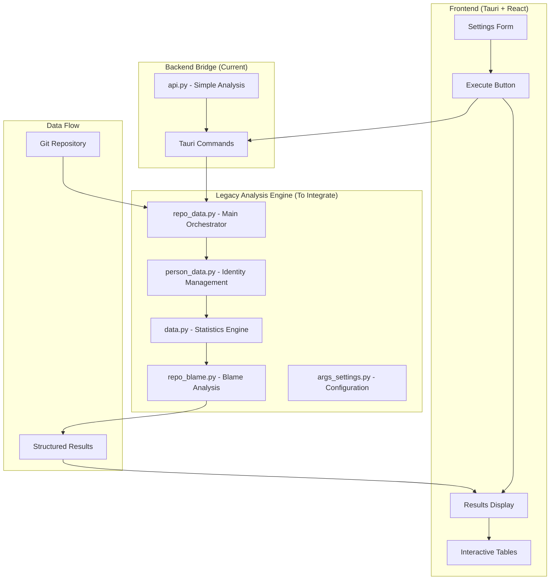
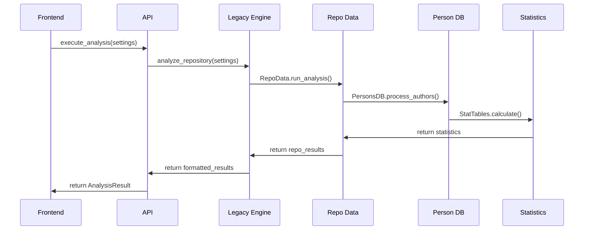

# Legacy Analysis Integration Plan

## Overview

This document outlines the architectural plan to integrate the sophisticated git analysis algorithms from `gitinspectorgui-old` into the new Tauri-based GitInspectorGUI, replacing the current simplified analysis implementation.

## Current State Analysis

### Current Implementation (Simplified)
- **Location**: `gitinspectorgui/python/gigui/api.py`
- **Approach**: Direct git command execution with basic parsing
- **Limitations**:
  - No person identity merging
  - Simplified statistics calculation
  - No blame analysis integration
  - Limited filtering capabilities
  - No performance optimizations

### Legacy Implementation (Sophisticated)
- **Location**: `gitinspectorgui-old/src/gigui/`
- **Key Components**:
  - Advanced person identity management (`person_data.py`)
  - Comprehensive statistics calculation (`data.py`)
  - Repository analysis orchestration (`repo_data.py`)
  - Blame analysis integration (`repo_blame.py`)
  - Performance-optimized git operations

## Architecture Overview



## Integration Strategy

### Phase 1: Core Data Structures Migration
**Duration**: 2-3 days

#### 1.1 Type System Integration
- **Source**: `gitinspectorgui-old/src/gigui/typedefs.py`
- **Target**: `gitinspectorgui/python/gigui/typedefs.py` (already exists)
- **Action**: Enhance current types with legacy definitions

#### 1.2 Person Identity Management
- **Source**: `gitinspectorgui-old/src/gigui/person_data.py`
- **Target**: `gitinspectorgui/python/gigui/person_data.py` (new)
- **Key Features**:
  - Advanced author name normalization
  - Email pattern matching
  - Identity merging algorithms
  - Filter pattern support

#### 1.3 Statistics Engine
- **Source**: `gitinspectorgui-old/src/gigui/data.py`
- **Target**: `gitinspectorgui/python/gigui/data.py` (new)
- **Key Components**:
  - `Stat` class with comprehensive metrics
  - `CommitGroup` for aggregation
  - `PersonStat` for author statistics
  - Age calculation algorithms

### Phase 2: Repository Analysis Engine
**Duration**: 3-4 days

#### 2.1 Git Operations Layer
- **Source**: `gitinspectorgui-old/src/gigui/repo_base.py`
- **Target**: `gitinspectorgui/python/gigui/repo_base.py` (new)
- **Features**:
  - Optimized git command execution
  - Error handling and validation
  - Performance monitoring

#### 2.2 Blame Analysis Integration
- **Source**: `gitinspectorgui-old/src/gigui/repo_blame.py`
- **Target**: `gitinspectorgui/python/gigui/repo_blame.py` (new)
- **Features**:
  - Line-by-line attribution
  - Historical blame tracking
  - Performance optimizations

#### 2.3 Main Analysis Orchestrator
- **Source**: `gitinspectorgui-old/src/gigui/repo_data.py`
- **Target**: `gitinspectorgui/python/gigui/repo_data.py` (new)
- **Features**:
  - Complete analysis workflow
  - Statistics table generation
  - Percentage calculations
  - Result aggregation

### Phase 3: Configuration and Settings
**Duration**: 1-2 days

#### 3.1 Settings Integration
- **Source**: `gitinspectorgui-old/src/gigui/args_settings.py`
- **Target**: Enhance existing `Settings` dataclass
- **Features**:
  - Advanced filtering options
  - Performance tuning parameters
  - Exclusion patterns

#### 3.2 Utility Functions
- **Source**: `gitinspectorgui-old/src/gigui/utils.py`
- **Target**: `gitinspectorgui/python/gigui/utils.py` (new)
- **Features**:
  - Path manipulation
  - Percentage calculations
  - String formatting

### Phase 4: API Integration
**Duration**: 2-3 days

#### 4.1 Legacy Engine Wrapper
- **Target**: `gitinspectorgui/python/gigui/legacy_engine.py` (new)
- **Purpose**: Bridge between current API and legacy analysis
- **Features**:
  - Settings translation
  - Result format conversion
  - Error handling

#### 4.2 API Refactoring
- **Target**: `gitinspectorgui/python/gigui/api.py` (modify)
- **Changes**:
  - Replace simplified analysis with legacy engine calls
  - Maintain existing API contract
  - Add performance monitoring

## Implementation Details

### File Structure After Integration

```
gitinspectorgui/python/gigui/
├── __init__.py
├── api.py                 # Main API (refactored)
├── typedefs.py           # Enhanced type definitions
├── legacy_engine.py      # Legacy analysis wrapper (new)
├── person_data.py        # Person identity management (new)
├── data.py              # Statistics engine (new)
├── repo_base.py         # Git operations layer (new)
├── repo_blame.py        # Blame analysis (new)
├── repo_data.py         # Main analysis orchestrator (new)
├── utils.py             # Utility functions (new)
└── cli.py               # CLI interface (existing)
```

### Data Flow Architecture



### Key Integration Points

#### 1. Settings Translation
```python
# In legacy_engine.py
def translate_settings(gui_settings: Settings) -> Args:
    """Convert GUI settings to legacy Args format"""
    return Args(
        input_fstrs=gui_settings.input_fstrs,
        depth=gui_settings.depth,
        ex_authors=gui_settings.ex_authors,
        # ... map all settings
    )
```

#### 2. Result Format Conversion
```python
# In legacy_engine.py
def convert_results(repo_data: RepoData) -> RepositoryResult:
    """Convert legacy results to GUI format"""
    authors = []
    for author, pstat in repo_data.author2pstat.items():
        if author != "*":  # Exclude totals
            authors.append(AuthorStat(
                name=pstat.person.author,
                email=list(pstat.person.emails)[0],
                commits=len(pstat.stat.shas),
                insertions=pstat.stat.insertions,
                deletions=pstat.stat.deletions,
                files=len(pstat.fstrs),
                percentage=pstat.stat.percent_insertions,
                age=pstat.stat.age
            ))
    return RepositoryResult(...)
```

#### 3. Performance Optimizations
- **Caching**: Implement result caching for repeated analyses
- **Streaming**: Process large repositories in chunks
- **Parallel Processing**: Utilize multiprocessing for multiple repositories

## Migration Strategy

### Backward Compatibility
- Maintain existing API contract
- Ensure frontend requires no changes
- Preserve development mode functionality

### Testing Strategy
1. **Unit Tests**: Test each migrated component
2. **Integration Tests**: Verify end-to-end functionality
3. **Performance Tests**: Compare with legacy implementation
4. **Regression Tests**: Ensure no functionality loss

### Rollback Plan
- Keep current implementation as fallback
- Feature flag for legacy engine usage
- Gradual migration with A/B testing

## Expected Benefits

### Accuracy Improvements
- **Person Identity Merging**: Correctly handle multiple author identities
- **Advanced Statistics**: More accurate commit, insertion, deletion counts
- **Blame Integration**: Precise line attribution and stability metrics

### Performance Improvements
- **Optimized Git Operations**: Reduced git command overhead
- **Efficient Data Structures**: Memory-optimized statistics storage
- **Parallel Processing**: Faster analysis for multiple repositories

### Feature Enhancements
- **Advanced Filtering**: Comprehensive exclusion patterns
- **Detailed Metrics**: Stability, age, and percentage calculations
- **Scalability**: Handle large repositories efficiently

## Risk Assessment

### High Risk
- **Complexity**: Legacy codebase is sophisticated and interdependent
- **Dependencies**: May require additional Python packages
- **Performance**: Initial integration may be slower than current implementation

### Medium Risk
- **API Changes**: Potential need for minor API modifications
- **Testing**: Comprehensive testing required for accuracy verification

### Low Risk
- **Frontend Impact**: No changes required to React components
- **Development Workflow**: Existing development mode preserved

## Timeline

| Phase | Duration | Dependencies | Deliverables |
|-------|----------|--------------|--------------|
| Phase 1 | 2-3 days | None | Core data structures |
| Phase 2 | 3-4 days | Phase 1 | Analysis engine |
| Phase 3 | 1-2 days | Phase 1 | Configuration system |
| Phase 4 | 2-3 days | Phases 1-3 | API integration |
| Testing | 2-3 days | Phase 4 | Validated implementation |

**Total Estimated Duration**: 10-15 days

## Success Criteria

1. **Functional Parity**: All current features work with legacy engine
2. **Accuracy Improvement**: More precise statistics than current implementation
3. **Performance Maintenance**: No significant performance degradation
4. **Code Quality**: Clean, maintainable integration code
5. **Documentation**: Comprehensive documentation of changes

## Next Steps

1. **Approval**: Review and approve this architectural plan
2. **Environment Setup**: Prepare development environment with legacy codebase
3. **Phase 1 Implementation**: Begin with core data structures migration
4. **Iterative Development**: Implement phases with continuous testing
5. **Integration Testing**: Comprehensive testing before deployment

---

*This plan provides a structured approach to integrating the sophisticated analysis algorithms from gitinspectorgui-old while maintaining the modern Tauri-based architecture and development workflow.*