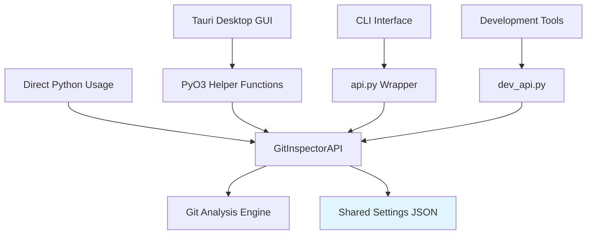
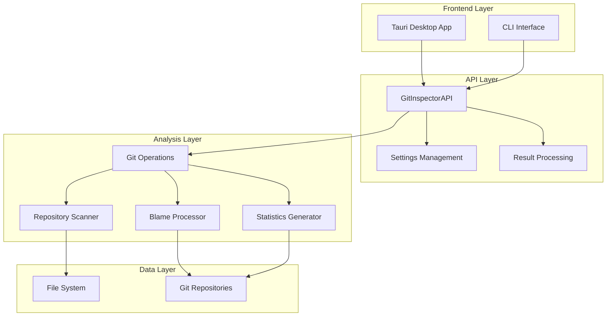

# API Layer

The GitInspectorGUI API layer provides a clean, unified interface for git repository analysis functionality. Located in `python/gigui/api/` and accessible via `api.py`, it serves as the primary integration point between the frontend and the Python analysis engine.

## Overview

The API layer abstracts the complexity of git analysis operations into a simple, consistent interface. It handles settings management, analysis execution, and result formatting while providing both command-line and programmatic access to the underlying analysis engine.

## Integration with Desktop Application

The API functions are called directly from the Tauri desktop frontend via PyO3 helper functions, eliminating network overhead. For technical details on this integration architecture, see [PyO3 Integration](../architecture/pyo3-integration.md).

**Key Components:**

-   **`gigui/api/main.py`** - Core API implementation (`GitInspectorAPI` class)
-   **`gigui/api/types.py`** - Data structures (`Settings`, `AnalysisResult`, etc.)
-   **`gigui/api/__init__.py`** - Public API exports
-   **`api.py`** - Command-line interface wrapper
-   **`dev_api.py`** - Development/testing interface

## Why is the API Needed?

### Abstraction Layer

The API provides a stable interface that isolates the frontend from the complexity of the underlying git analysis engine. This separation allows for:

-   **Clean Integration** - Simplified communication between Tauri frontend and Python backend
-   **Version Stability** - API contracts remain consistent even as internal implementations change
-   **Error Handling** - Centralized error management and user-friendly error messages
-   **Type Safety** - Well-defined data structures for reliable data exchange

### Multiple Access Patterns

GitInspectorGUI supports different usage patterns through the same API, with **GUI and CLI sharing identical options and parameters**:



### Settings Management

The API handles complex configuration management with **identical parameter sets
for GUI and CLI**:

-   **Unified Settings** - GUI and CLI share the same JSON settings file with 100+ configuration options
-   **Validation** - Ensures settings are complete and valid before analysis
-   **Defaults** - Provides sensible defaults for all configuration options
-   **Normalization** - Converts paths and patterns to consistent formats
-   **GUI/CLI Parity** - Changes made in GUI are immediately available to CLI and vice versa

## What Does the API Do?

### Core Functionality

The API provides six essential operations across **both GUI and CLI interfaces**:

| Function             | Purpose                   | GUI Access          | CLI Access     | Input         | Output           |
| -------------------- | ------------------------- | ------------------- | -------------- | ------------- | ---------------- |
| `execute_analysis()` | Repository analysis       | Run button          | Direct command | Settings JSON | Analysis results |
| `get_settings()`     | Retrieve current settings | Settings form       | `--show` flag  | None          | Settings JSON    |
| `save_settings()`    | Store settings            | Auto-save on change | `--save` flag  | Settings JSON | Success status   |
| `health_check()`     | Backend status            | Auto on startup     | Implicit       | None          | Health status    |
| `get_engine_info()`  | Engine capabilities       | About dialog        | `--version`    | None          | Engine metadata  |
| `get_blame_data()`   | Detailed blame analysis   | Results view        | File output    | Settings JSON | Blame data       |

### GUI/CLI Shared Parameters

The API ensures **complete parity between GUI and CLI interfaces**. All 100+ configuration options are accessible through both interfaces:

**Repository Settings:**

-   Input folder paths (GUI: text field + browse button, CLI: positional arguments)
-   Repository depth (GUI: number input, CLI: `--depth`)
-   Subfolder analysis (GUI: text field, CLI: `--subfolder`)

**File Analysis:**

-   File extensions (GUI: comma-separated input, CLI: `--extensions` or `-e`)
-   Include patterns (GUI: text field, CLI: `--include-files`)
-   Exclude patterns (GUI: multiple exclusion fields, CLI: `--ex-files`, `--ex-authors`, etc.)

**Output Formats:**

-   HTML/Excel generation (GUI: checkboxes, CLI: `--file-formats`)
-   Output file naming (GUI: dropdown, CLI: `--fix` option)
-   View settings (GUI: radio buttons, CLI: `--view`)

**Performance Options:**

-   Multithreading (GUI: checkbox, CLI: `--multithread`)
-   Memory limits (GUI: advanced settings, CLI: memory flags)
-   Processing optimization (GUI: auto-configured, CLI: manual flags)

**Example showing identical functionality:**

```bash
# CLI command
gitinspectorgui /repo --extensions py js --ex-authors "bot*" --multithread

# Equivalent GUI settings
Repository Path: /repo
Extensions: py, js
Exclude Authors: bot*
Multithreading: ✓ enabled
```

### Data Structures

The API defines robust data types for reliable communication:

```python
# Settings Configuration
@dataclass
class Settings:
    input_fstrs: list[str]              # Repository paths
    extensions: list[str]               # File extensions to analyze
    ex_authors: list[str]               # Authors to exclude
    n_files: int                        # Maximum files to process
    since: str                          # Date range start
    until: str                          # Date range end
    multithread: bool                   # Enable multithreading
    # ... 50+ additional configuration options

# Analysis Results
@dataclass
class AnalysisResult:
    success: bool                       # Analysis completion status
    repositories: list[RepositoryResult] # Per-repository results
    error: str                          # Error message if failed
    performance_stats: dict             # Execution metrics

# Repository Data
@dataclass
class RepositoryResult:
    name: str                           # Repository name
    path: str                           # Repository path
    authors: list[AuthorStat]           # Author statistics
    files: list[FileStat]               # File statistics
    blame_data: list[BlameEntry]        # Line-by-line attribution
    commit_count: int                   # Total commits analyzed
```

## How Does It Work?

### Architecture Overview

The API follows a layered architecture that separates concerns and enables flexible integration:



### Request Processing Flow

1. **Request Reception**

    ```python
    def execute_analysis(settings_json: str) -> str:
        # Parse and validate JSON input
        settings_dict = json.loads(settings_json)
        settings = Settings(**settings_dict)
    ```

2. **Settings Validation**

    ```python
    # Apply defaults and normalize paths
    settings.normalize_paths()
    if not settings.input_fstrs:
        raise ValidationError("No repositories specified")
    ```

3. **Analysis Execution**

    ```python
    # Process each repository
    repositories = []
    for repo_path in settings.input_fstrs:
        repo_result = self._analyze_repository(repo_path, settings)
        repositories.append(repo_result)
    ```

4. **Result Assembly**
    ```python
    # Package results with metadata
    result = AnalysisResult(
        success=True,
        repositories=repositories,
        performance_stats=self._get_performance_stats()
    )
    return result.model_dump_json()
    ```

### Integration Patterns

#### Desktop GUI (Tauri + React + PyO3)

```typescript
// Frontend communicates via PyO3 helper functions
import { invoke } from "@tauri-apps/api/core";

// Settings from GUI form automatically converted to API format
const result = await invoke<AnalysisResult>("execute_analysis", {
    settings: JSON.stringify({
        input_fstrs: ["/path/to/repo"], // From GUI path input
        extensions: ["py", "js"], // From GUI extensions field
        ex_authors: ["bot*"], // From GUI exclusion field
        multithread: true, // From GUI checkbox
    }),
});
```

#### Command Line Interface

```bash
# CLI shares exact same parameter set as GUI
gitinspectorgui /path/to/repo \
    --extensions py js \
    --ex-authors "bot*" \
    --multithread

# Settings automatically saved to shared JSON file
# Changes visible immediately in GUI when reopened
```

#### Direct Python Usage

```python
# Direct API usage
from gigui.api import GitInspectorAPI, Settings

api = GitInspectorAPI()
settings = Settings(input_fstrs=["/path/to/repo"])
result = api.execute_analysis(settings)
```

### Error Handling Strategy

The API implements comprehensive error handling with automatic conversion for frontend integration:

```python
def execute_analysis(settings: Settings) -> AnalysisResult:
    try:
        # Validate inputs
        self._validate_repositories(settings.input_fstrs)

        # Execute analysis
        return self._perform_analysis(settings)

    except ValidationError as e:
        return AnalysisResult(
            success=False,
            error=f"Invalid settings: {e.message}",
            repositories=[]
        )
    except RepositoryError as e:
        return AnalysisResult(
            success=False,
            error=f"Repository access failed: {e.message}",
            repositories=[]
        )
    except Exception as e:
        logger.error(f"Unexpected error: {e}")
        return AnalysisResult(
            success=False,
            error=f"Analysis failed: {str(e)}",
            repositories=[]
        )
```

### Performance Optimization

The API includes intelligent performance optimization based on repository characteristics:

```python
def configure_for_repository(self, repo_path: str, settings: Settings):
    """Optimize settings based on repository size."""
    repo_stats = self._analyze_repository_size(repo_path)

    if repo_stats.commit_count > 10000:
        # Large repository optimizations
        settings.multithread = True
        settings.git_log_chunk_size = 200
        settings.memory_limit_mb = 2048
        settings.max_thread_workers = min(8, cpu_count())
    else:
        # Small repository optimizations
        settings.multithread = False
        settings.git_log_chunk_size = 50
        settings.memory_limit_mb = 512
```

## Development Workflow

### Testing the API

The API includes development tools for testing and debugging:

```bash
# Test basic functionality
python dev_api.py get_settings

# Test analysis execution
python dev_api.py execute_analysis '{"input_fstrs": ["/path/to/repo"]}'

# Test with custom settings
echo '{"input_fstrs": ["/tmp/test-repo"], "extensions": ["py"]}' | python api.py execute_analysis
```

### Adding New Functionality

To extend the API with new features:

1. **Define data structures** in `types.py`
2. **Implement functionality** in `main.py`
3. **Add CLI support** in `api.py`
4. **Update frontend integration** in PyO3 helper functions
5. **Add tests** for new functionality

### Debugging and Monitoring

The API provides extensive logging and performance monitoring:

```python
# Enable detailed logging
logging.basicConfig(level=logging.DEBUG)

# Monitor performance
from gigui.performance_monitor import profiler

@profiler.profile
def execute_analysis(self, settings: Settings):
    # Analysis implementation with automatic profiling
    pass
```

## Integration with GitInspectorGUI

The API serves as the central integration point for all GitInspectorGUI functionality, ensuring **seamless GUI/CLI interoperability**:

-   **Desktop GUI** - Tauri frontend calls API via PyO3 helper functions, GUI settings automatically persist to shared JSON
-   **CLI Tool** - Command-line interface wraps API, reads/writes same settings file as GUI
-   **Settings Synchronization** - Changes in GUI immediately affect CLI behavior and vice versa
-   **Consistent Results** - Identical analysis engine produces same results regardless of interface
-   **Development Tools** - Testing and debugging tools use API directly for validation

This unified approach guarantees that users get the same functionality and results whether they use the graphical interface or command line, with settings seamlessly shared between both modes of operation.

## Related Documentation

-   **[Architecture Overview](../architecture/overview.md)** - System design context
-   **[GUI Guide](../user-docs/gui.md)** - Complete GUI interface documentation
-   **[CLI Guide](../user-docs/cli.md)** - Full command-line reference
-   **[Development Workflow](../development/development-workflow.md)** - Core development patterns
