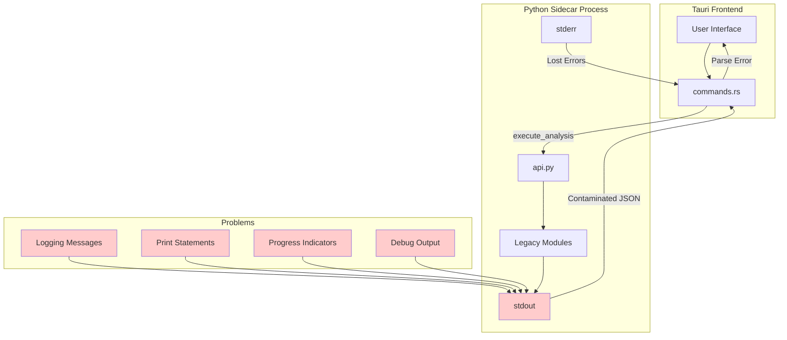
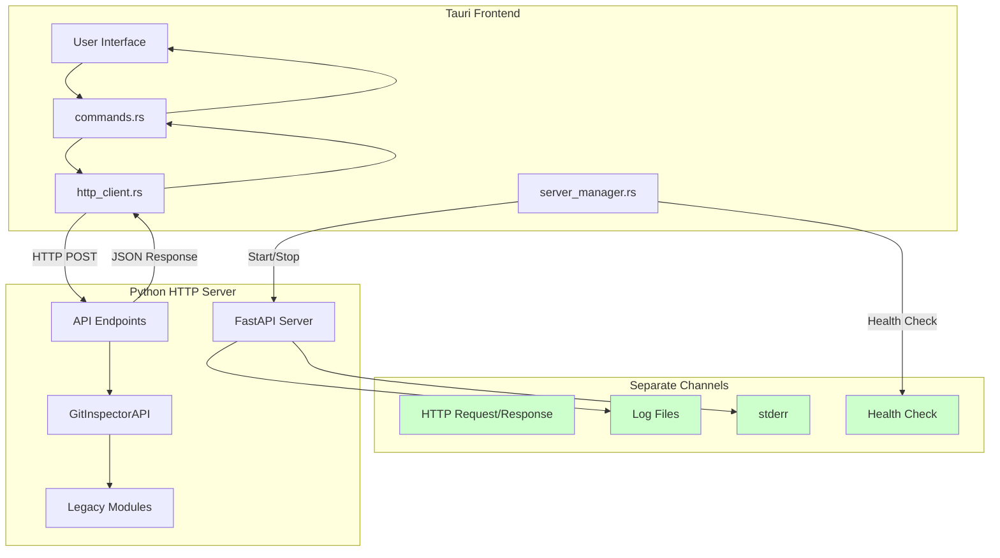
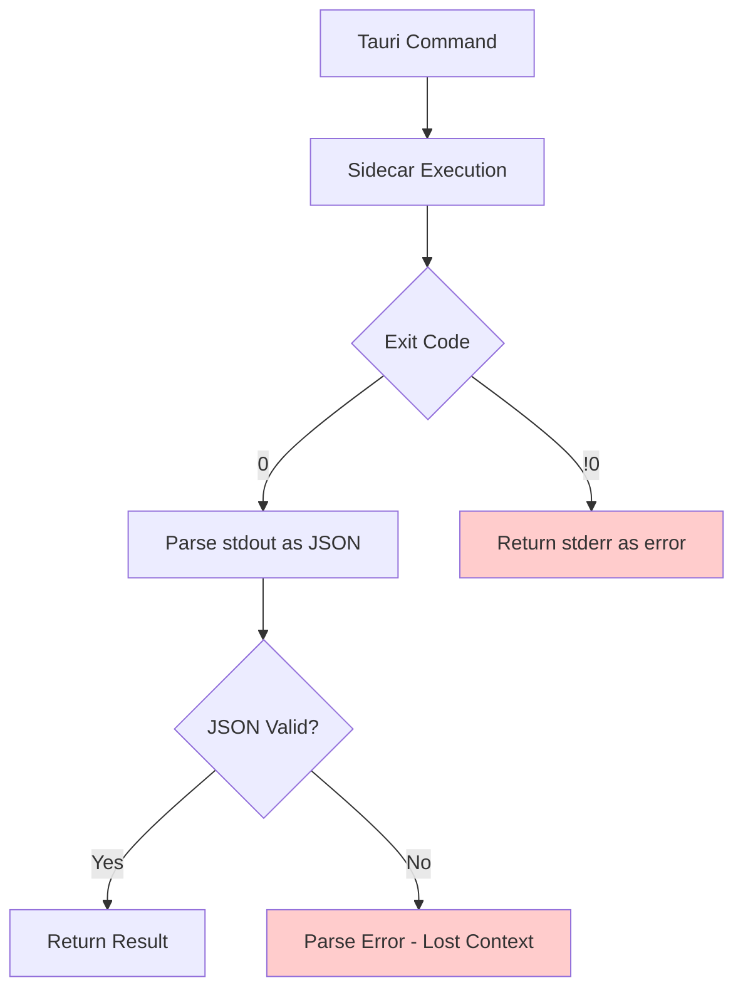
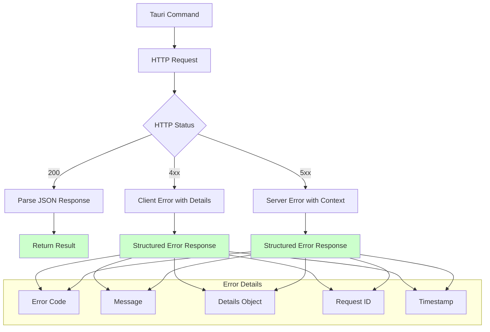
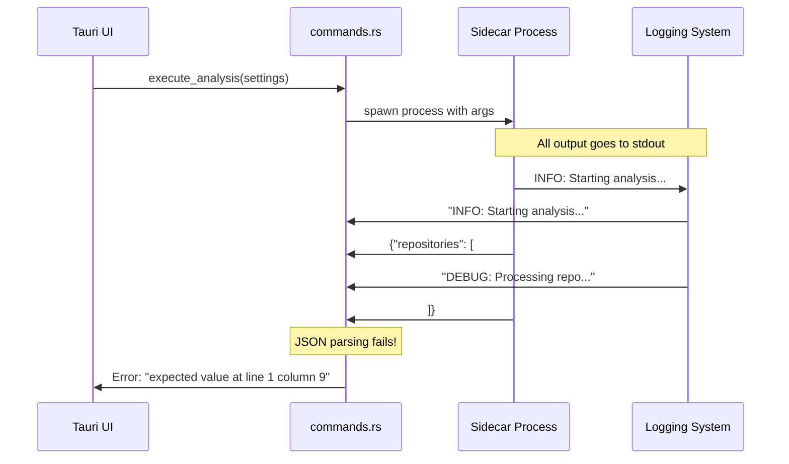
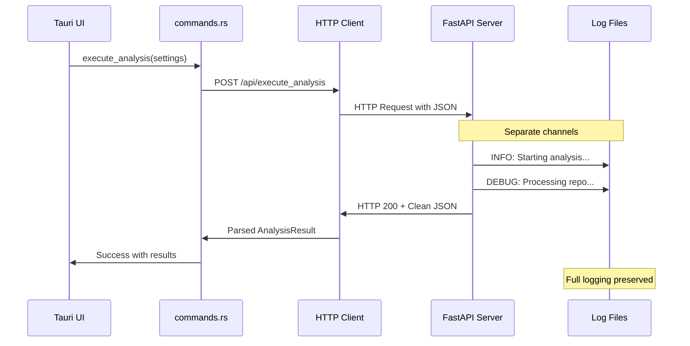
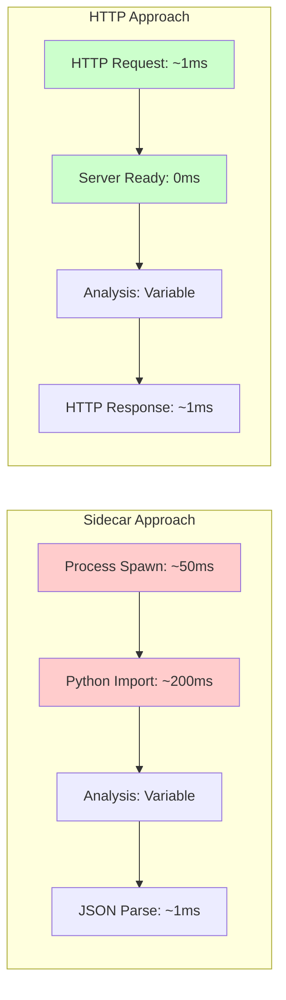
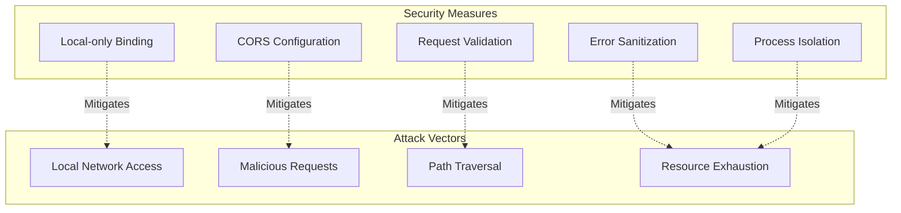

# Architecture Diagrams

## Current Architecture (Problematic)

### Current Problems
- **Single Channel**: stdout used for both data and logging
- **Fragile Parsing**: Any contamination breaks JSON parsing
- **Lost Errors**: stderr gets discarded
- **Hard to Debug**: Can't log without breaking communication
- **Maintenance Burden**: Easy to accidentally break with innocent changes

## New HTTP Architecture (Robust)

### New Architecture Benefits
- **Dedicated Channels**: HTTP for data, files/stderr for logging
- **Robust Protocol**: HTTP status codes, headers, structured errors
- **Full Logging**: Complete debugging capability
- **Easy Testing**: Standard HTTP tools (curl, Postman, etc.)
- **Maintainable**: Clear separation of concerns

## Migration Strategy

```mermaid
graph LR
    subgraph "Phase 1: Foundation"
        A1[Create FastAPI Server]
        A2[Pydantic Models]
        A3[Basic Endpoints]
    end
    
    subgraph "Phase 2: Integration"
        B1[Tauri HTTP Client]
        B2[Server Management]
        B3[Feature Flag]
    end
    
    subgraph "Phase 3: Testing"
        C1[Unit Tests]
        C2[Integration Tests]
        C3[Performance Tests]
    end
    
    subgraph "Phase 4: Migration"
        D1[Default to HTTP]
        D2[Remove Sidecar]
        D3[Cleanup]
    end
    
    A1 --> A2 --> A3
    A3 --> B1 --> B2 --> B3
    B3 --> C1 --> C2 --> C3
    C3 --> D1 --> D2 --> D3
```

## Error Handling Comparison

### Current Error Handling (Limited)

### New Error Handling (Rich)

## Data Flow Comparison

### Current Data Flow (Fragile)

### New Data Flow (Robust)

## Performance Considerations

### HTTP Overhead Analysis

**Performance Benefits:**
- **Faster Startup**: Server stays warm, no process spawn overhead
- **Faster Imports**: Python modules loaded once
- **Better Caching**: Server can cache expensive operations
- **Concurrent Requests**: Multiple analyses can run in parallel

## Security Considerations

**Security Features:**
- **Local Binding**: Server only accepts connections from localhost
- **CORS**: Restricted to Tauri origins
- **Input Validation**: Pydantic models validate all inputs
- **Error Sanitization**: No sensitive information in error responses
- **Process Isolation**: Server runs in separate process

This architecture provides a robust, maintainable, and secure foundation for the GitInspectorGUI application while completely eliminating the stdout contamination issues.