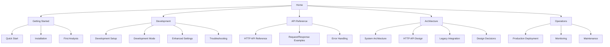

# MkDocs Conversion Plan for GitInspectorGUI Documentation

## Overview

Convert the existing comprehensive documentation into a developer-focused MkDocs site with a logical user journey structure that prioritizes understanding and implementation over status tracking.

## Proposed Structure



## Content Reorganization Strategy

### 1. **Getting Started** (New Developer Onboarding)

-   **Quick Start Guide** - Extract from main README
-   **Installation & Setup** - Streamlined setup process
-   **Your First Analysis** - Hands-on tutorial

### 2. **Development** (Active Development Workflow)

-   **Development Environment** - From `development/DEVELOPMENT_MODE.md`
-   **API Sidecar Setup** - From `development/API_SIDECAR.md` (if still relevant)
-   **Enhanced Settings** - From `development/ENHANCED_SETTINGS_GUIDE.md`
-   **Troubleshooting** - Consolidated from various diagnostic docs

### 3. **API Reference** (Implementation Details)

-   **HTTP API Reference** - Enhanced version of `api/HTTP_API_REFERENCE.md`
-   **Request/Response Examples** - Practical code examples
-   **Error Handling Guide** - Common issues and solutions

### 4. **Architecture** (Design Understanding)

-   **System Overview** - High-level architecture from `architecture/ARCHITECTURE_PLAN_SUMMARY.md`
-   **HTTP API Design** - From `architecture/HTTP_API_IMPLEMENTATION_PLAN.md`
-   **Legacy Integration** - From `architecture/LEGACY_INTEGRATION_PLAN.md`
-   **Design Decisions** - Rationale behind architectural choices

### 5. **Operations** (Deployment & Maintenance)

-   **Production Deployment** - From `deployment/PRODUCTION_DEPLOYMENT_GUIDE.md`
-   **Monitoring & Logging** - Operational concerns
-   **Maintenance Procedures** - Ongoing operational tasks

## Technical Implementation Plan

### Phase 1: MkDocs Setup

#### 1.1 Create `mkdocs.yml` configuration

```yaml
site_name: GitInspectorGUI Documentation
site_description: Developer-focused documentation for GitInspectorGUI HTTP API
site_url: https://your-domain.com/docs

theme:
    name: material
    palette:
        - scheme: default
          primary: blue
          accent: blue
          toggle:
              icon: material/brightness-7
              name: Switch to dark mode
        - scheme: slate
          primary: blue
          accent: blue
          toggle:
              icon: material/brightness-4
              name: Switch to light mode
    features:
        - navigation.tabs
        - navigation.sections
        - navigation.expand
        - search.highlight
        - search.share
        - content.code.copy
        - content.action.edit
        - content.tabs.link

plugins:
    - search:
          lang: en
    - mermaid2

markdown_extensions:
    - pymdownx.highlight:
          anchor_linenums: true
    - pymdownx.inlinehilite
    - pymdownx.snippets
    - pymdownx.superfences:
          custom_fences:
              - name: mermaid
                class: mermaid
                format: !!python/name:pymdownx.superfences.fence_code_format
    - pymdownx.tabbed:
          alternate_style: true
    - admonition
    - pymdownx.details
    - pymdownx.mark
    - pymdownx.caret
    - pymdownx.keys
    - pymdownx.tilde
    - attr_list
    - md_in_html

nav:
    - Home: index.md
    - Getting Started:
          - Quick Start: getting-started/quick-start.md
          - Installation: getting-started/installation.md
          - First Analysis: getting-started/first-analysis.md
    - Development:
          - Environment Setup: development/environment-setup.md
          - Development Mode: development/development-mode.md
          - Enhanced Settings: development/enhanced-settings.md
          - Blame Tabs Implementation: development/blame-tabs-implementation.md
          - Troubleshooting: development/troubleshooting.md
    - API Reference:
          - HTTP API Reference: api/reference.md
          - Examples: api/examples.md
          - Error Handling: api/error-handling.md
    - Architecture:
          - System Overview: architecture/overview.md
          - HTTP API Design: architecture/http-api-design.md
          - Legacy Integration: architecture/legacy-integration.md
          - Design Decisions: architecture/design-decisions.md
          - Development with Docs: architecture/development_with_docs_architecture.md
          - Technology Exploration: architecture/redesign.md
    - Implementation:
          - HTTP Client Integration: implementation/http-client-integration.md
    - Operations:
          - Production Deployment: operations/deployment.md
          - Monitoring: operations/monitoring.md
          - Maintenance: operations/maintenance.md

repo_url: https://gitlab.com/your-username/gitinspectorgui
edit_uri: edit/main/docs/

extra:
    social:
        - icon: fontawesome/brands/gitlab
          link: https://gitlab.com/your-username/gitinspectorgui
```

#### 1.2 Install dependencies

```bash
pip install mkdocs-material pymdown-extensions mkdocs-mermaid2-plugin
```

### Phase 2: Content Migration & Reorganization

#### 2.1 Create new directory structure

```
docs/
├── index.md (new homepage)
├── getting-started/
│   ├── quick-start.md
│   ├── installation.md
│   └── first-analysis.md
├── development/
│   ├── environment-setup.md
│   ├── development-mode.md
│   ├── enhanced-settings.md
│   ├── blame-tabs-implementation.md
│   └── troubleshooting.md
├── api/
│   ├── reference.md
│   ├── examples.md
│   └── error-handling.md
├── architecture/
│   ├── overview.md
│   ├── http-api-design.md
│   ├── legacy-integration.md
│   ├── design-decisions.md
│   ├── development_with_docs_architecture.md
│   └── redesign.md
├── operations/
│   ├── deployment.md
│   ├── monitoring.md
│   └── maintenance.md
└── mkdocs.yml
```

#### 2.2 Content transformation mapping

| New Location                                | Source Files                                   | Transformation Notes                  |
| ------------------------------------------- | ---------------------------------------------- | ------------------------------------- |
| `index.md`                                  | `README.md` (main), `docs/README.md`           | Create developer-focused landing page |
| `getting-started/quick-start.md`            | `../README.md`                                 | Extract quick start section           |
| `getting-started/installation.md`           | `development/DEVELOPMENT_MODE.md`              | Focus on installation steps           |
| `getting-started/first-analysis.md`         | New content                                    | Create hands-on tutorial              |
| `development/environment-setup.md`          | `development/DEVELOPMENT_MODE.md`              | Development environment details       |
| `development/development-mode.md`           | `development/DEVELOPMENT_MODE.md`              | Development workflow                  |
| `development/enhanced-settings.md`          | `development/ENHANCED_SETTINGS_GUIDE.md`       | Settings configuration                |
| `development/troubleshooting.md`            | `development/diagnostics/*`                    | Consolidated troubleshooting          |
| `api/reference.md`                          | `api/HTTP_API_REFERENCE.md`                    | Enhanced API documentation            |
| `api/examples.md`                           | `api/HTTP_API_REFERENCE.md`                    | Extract and expand examples           |
| `api/error-handling.md`                     | `api/HTTP_API_REFERENCE.md`                    | Error handling section                |
| `architecture/overview.md`                  | `architecture/ARCHITECTURE_PLAN_SUMMARY.md`    | High-level architecture               |
| `architecture/http-api-design.md`           | `architecture/HTTP_API_IMPLEMENTATION_PLAN.md` | API design details                    |
| `architecture/legacy-integration.md`        | `architecture/LEGACY_INTEGRATION_PLAN.md`      | Legacy system integration             |
| `architecture/design-decisions.md`          | `architecture/IPC_ARCHITECTURE_ANALYSIS.md`    | Design rationale                      |
| `development/blame-tabs-implementation.md`  | `../BLAME_TABS_IMPLEMENTATION_PLAN.md`         | UI implementation details             |
| `implementation/http-client-integration.md` | `../HTTP_CLIENT_INTEGRATION_SUMMARY.md`        | HTTP client implementation            |
| `operations/deployment.md`                  | `deployment/PRODUCTION_DEPLOYMENT_GUIDE.md`    | Production deployment                 |
| `operations/monitoring.md`                  | `deployment/PRODUCTION_DEPLOYMENT_GUIDE.md`    | Monitoring section                    |
| `operations/maintenance.md`                 | New content                                    | Maintenance procedures                |

### Phase 3: Enhancement & Optimization

#### 3.1 Developer-focused improvements

-   **Interactive code examples** with copy buttons
-   **Copy-paste ready commands** for all procedures
-   **Quick reference sections** for common tasks
-   **Troubleshooting flowcharts** using Mermaid diagrams
-   **Code snippets** with syntax highlighting
-   **Tabbed content** for different environments/scenarios

#### 3.2 Navigation optimization

-   **Logical flow** from setup to advanced topics
-   **Cross-references** between related sections
-   **Quick access** to common developer tasks
-   **Search functionality** for finding specific information
-   **Edit links** for easy contribution

## Content Filtering Strategy

### Include (Developer-Focused)

-   ✅ Setup and configuration procedures
-   ✅ API documentation with examples
-   ✅ Architecture explanations and diagrams
-   ✅ Troubleshooting guides
-   ✅ Code examples and snippets
-   ✅ Design rationale and decisions
-   ✅ Development workflows
-   ✅ Production deployment guides

### Exclude/Archive (Status-Focused)

-   ❌ Phase completion summaries (`implementation/PHASE*_COMPLETION_SUMMARY.md`)
-   ❌ Implementation status reports (`implementation/HTTP_API_STATUS_SUMMARY.md`)
-   ❌ Historical rollback procedures (`operations/rollback/`)
-   ❌ Outdated implementation plans (`archive/`)
-   ❌ Legacy API sidecar documentation (`development/API_SIDECAR.md`)
-   ❌ Diagnostic reports specific to past issues
-   ❌ Development progress tracking

### Root Directory Cleanup

Files to be moved to docs structure and removed from root:

-   📁 `BLAME_TABS_IMPLEMENTATION_PLAN.md` → `docs/development/blame-tabs-implementation.md`
-   📁 `HTTP_CLIENT_INTEGRATION_SUMMARY.md` → `docs/implementation/http-client-integration.md`

### Archive Location

Create `docs/archive/` directory for historical documents that may be referenced but don't belong in the main documentation flow.

## Implementation Steps

### Step 1: Backup and Preparation

1. Create backup of current `docs/` directory
2. Install MkDocs and dependencies
3. Create initial `mkdocs.yml` configuration

### Step 2: Structure Creation

1. Create new directory structure
2. Create placeholder files for all new pages
3. Set up basic navigation

### Step 3: Content Migration

1. Move root directory files to docs structure:
    - `BLAME_TABS_IMPLEMENTATION_PLAN.md` → `docs/development/blame-tabs-implementation.md`
    - `HTTP_CLIENT_INTEGRATION_SUMMARY.md` → `docs/implementation/http-client-integration.md`
2. Transform and migrate content according to mapping table
3. Update internal links and references
4. Enhance code examples and formatting

### Step 4: Root Directory Cleanup

1. Remove migrated files from root directory:
    - Delete `BLAME_TABS_IMPLEMENTATION_PLAN.md`
    - Delete `HTTP_CLIENT_INTEGRATION_SUMMARY.md`
2. Verify no references to old file locations remain

### Step 5: Testing and Refinement

1. Test local MkDocs build
2. Verify all links and navigation
3. Review content flow and developer experience
4. Optimize for search and discoverability

### Step 6: Deployment Setup

1. Configure build and deployment pipeline
2. Set up hosting (GitHub Pages, GitLab Pages, or custom)
3. Test production deployment

## Benefits of This Approach

### For Developers

-   **Clear learning path** from beginner to advanced
-   **Task-oriented organization** matching development workflow
-   **Rich code examples** with copy functionality
-   **Fast search** and navigation
-   **Mobile-friendly** documentation

### For Maintainers

-   **Easy content updates** with markdown
-   **Version control integration** for tracking changes
-   **Automated builds** and deployment
-   **Contributor-friendly** with edit links
-   **SEO optimized** for discoverability

### For the Project

-   **Professional appearance** with modern documentation site
-   **Better developer onboarding** experience
-   **Reduced support burden** with comprehensive guides
-   **Improved project credibility** with quality documentation

## Timeline Estimate

-   **Phase 1 (Setup)**: 2-4 hours
-   **Phase 2 (Migration)**: 8-12 hours
-   **Phase 3 (Enhancement)**: 4-6 hours
-   **Total**: 14-22 hours

## Success Metrics

-   ✅ All existing documentation content preserved and accessible
-   ✅ Improved navigation and discoverability
-   ✅ Developer-focused user journey implemented
-   ✅ Modern, professional documentation site
-   ✅ Easy maintenance and contribution workflow
-   ✅ Mobile-responsive design
-   ✅ Fast search functionality

---

**Plan Status**: Ready for Implementation
**Target Audience**: Developers and Technical Contributors
**Focus**: Ease of Use and Practical Implementation
**Architecture**: MkDocs with Material Theme
