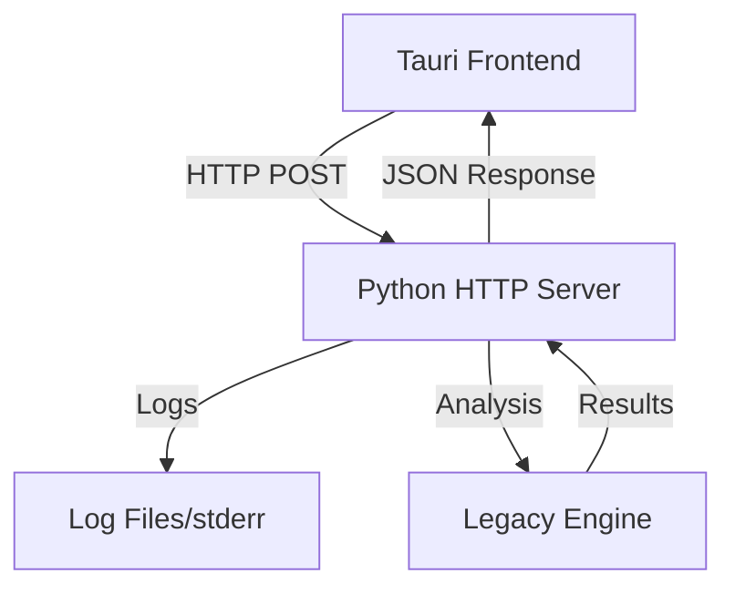

# IPC Architecture Design Decisions

## Architecture Evolution

### Previous Architecture Challenges
The original implementation used stdout-based JSON communication between Tauri and Python, which had several limitations:

- **Fragile parsing**: Any logging or print statements would break JSON parsing
- **Mixed concerns**: Data transport mixed with human-readable output
- **Limited debugging**: Debugging required disabling logging
- **Error handling**: Limited to stderr with no structured error responses

### Current HTTP-based Architecture

The system now uses a robust HTTP-based API server architecture that addresses these challenges:



## Design Benefits

### Robust Communication
- **HTTP Protocol**: Built-in error handling, status codes, headers
- **Structured Responses**: JSON-based request/response format
- **Error Handling**: Rich HTTP status codes and detailed error responses

### Developer Experience
- **Full Logging**: Complete logging capability without interference
- **Debuggable**: Easy to test with curl, Postman, or other HTTP tools
- **Testable**: Can test API independently of Tauri frontend

### Architecture Qualities
- **Standard Protocol**: Well-understood HTTP protocol with excellent tooling
- **Cross-platform**: Works identically on all platforms
- **Scalable**: Can handle multiple concurrent requests
- **Future-Proof**: Easy to extend with authentication, rate limiting, etc.

## Current Implementation

#### Python HTTP Server
```python
from fastapi import FastAPI, HTTPException
from fastapi.middleware.cors import CORSMiddleware
import uvicorn
import logging

# Full logging capability!
logging.basicConfig(level=logging.INFO)
logger = logging.getLogger(__name__)

app = FastAPI(title="GitInspectorGUI API", version="1.0.0")

@app.post("/api/execute_analysis")
async def execute_analysis(settings: Settings) -> AnalysisResult:
    logger.info(f"Starting analysis for {len(settings.input_fstrs)} repositories")
    
    try:
        api = GitInspectorAPI()
        result = api.execute_analysis(settings)
        logger.info(f"Analysis completed: {len(result.repositories)} repositories")
        return result
    except Exception as e:
        logger.error(f"Analysis failed: {e}", exc_info=True)
        raise HTTPException(status_code=500, detail=str(e))

@app.get("/health")
async def health_check():
    return {"status": "healthy", "version": "1.0.0"}
```

#### Tauri HTTP Client
```rust
use reqwest;
use serde_json;

#[command]
pub async fn execute_analysis(settings: Settings) -> Result<AnalysisResult, String> {
    let client = reqwest::Client::new();
    
    let response = client
        .post("http://127.0.0.1:8080/api/execute_analysis")
        .json(&settings)
        .timeout(Duration::from_secs(300)) // 5 minute timeout
        .send()
        .await
        .map_err(|e| format!("HTTP request failed: {}", e))?;
    
    match response.status() {
        reqwest::StatusCode::OK => {
            let result: AnalysisResult = response.json().await
                .map_err(|e| format!("JSON parsing failed: {}", e))?;
            Ok(result)
        }
        status => {
            let error_text = response.text().await.unwrap_or_default();
            Err(format!("Server error {}: {}", status, error_text))
        }
    }
}
```

## Error Handling Architecture

### Structured Error Responses
The HTTP architecture provides rich error handling capabilities:

```python
from enum import Enum
from pydantic import BaseModel

class ErrorCode(str, Enum):
    VALIDATION_ERROR = "validation_error"
    REPOSITORY_NOT_FOUND = "repository_not_found"
    ANALYSIS_FAILED = "analysis_failed"
    INTERNAL_ERROR = "internal_error"

class ErrorResponse(BaseModel):
    error_code: ErrorCode
    message: str
    details: Optional[Dict[str, Any]] = None
    timestamp: datetime
    request_id: str

@app.exception_handler(ValidationError)
async def validation_exception_handler(request: Request, exc: ValidationError):
    return JSONResponse(
        status_code=400,
        content=ErrorResponse(
            error_code=ErrorCode.VALIDATION_ERROR,
            message="Invalid request parameters",
            details={"validation_errors": exc.errors()},
            timestamp=datetime.utcnow(),
            request_id=str(uuid.uuid4())
        ).dict()
    )
```

### Error Handling Benefits
- **Structured Responses**: Consistent error format across all endpoints
- **Rich Context**: Detailed error information with request IDs for tracking
- **HTTP Status Codes**: Standard HTTP status codes for different error types
- **Debugging Support**: Full error context without stdout contamination

## Future Extensibility

The HTTP-based architecture provides a foundation for future enhancements:

- **Authentication**: Easy to add API keys or OAuth when needed
- **Rate Limiting**: Built-in support for request throttling
- **Monitoring**: Standard HTTP metrics and logging
- **Caching**: HTTP caching headers for performance optimization
- **Versioning**: API versioning through URL paths or headers

## Summary

The current HTTP-based IPC architecture successfully addresses the fragility issues of the previous stdout-based approach while providing a robust, maintainable, and extensible foundation for the application. The design emphasizes developer experience, reliability, and future-proof extensibility.