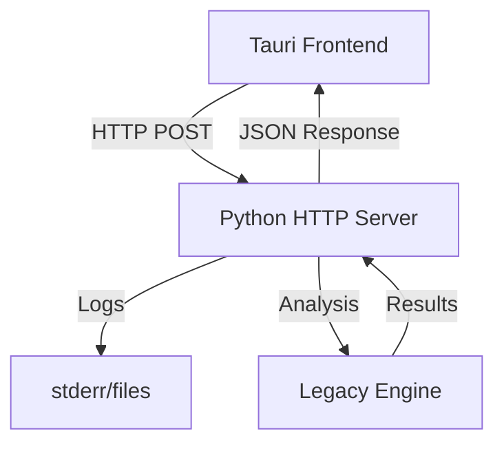

# Architecture Design Decisions

## IPC Evolution: stdout → HTTP

### Previous Issues

-   **Fragile JSON parsing** - Any print/log statements broke communication
-   **Mixed output streams** - Data and logs interfered with each other
-   **Limited error handling** - Only stderr available for errors
-   **Debugging conflicts** - Logging disabled JSON parsing

### Current HTTP Architecture



## Key Benefits

### Communication

-   **HTTP protocol** - Built-in error handling, status codes
-   **Structured responses** - Clean JSON request/response
-   **Concurrent requests** - Multiple operations supported
-   **Standard tooling** - curl, Postman testing

### Development

-   **Full logging** - No output stream conflicts
-   **Independent testing** - API testable without frontend
-   **Rich error context** - Detailed error responses
-   **Cross-platform** - Identical behavior everywhere

## Implementation

### Python Server (FastAPI)

```python
from fastapi import FastAPI, HTTPException
import logging

logging.basicConfig(level=logging.INFO)
app = FastAPI(title="GitInspectorGUI API")

@app.post("/api/execute_analysis")
async def execute_analysis(settings: Settings) -> AnalysisResult:
    try:
        api = GitInspectorAPI()
        return api.execute_analysis(settings)
    except Exception as e:
        logging.error(f"Analysis failed: {e}")
        raise HTTPException(status_code=500, detail=str(e))
```

### Tauri Client (Rust)

```rust
#[command]
pub async fn execute_analysis(settings: Settings) -> Result<AnalysisResult, String> {
    let response = reqwest::Client::new()
        .post("http://127.0.0.1:8000/api/execute_analysis")
        .json(&settings)
        .timeout(Duration::from_secs(300))
        .send()
        .await?;

    match response.status() {
        StatusCode::OK => Ok(response.json().await?),
        status => Err(format!("Server error {}: {}", status, response.text().await?))
    }
}
```

## Error Handling

### Structured Errors

```python
class ErrorResponse(BaseModel):
    error_code: str
    message: str
    details: Optional[Dict] = None
    timestamp: datetime
    request_id: str

@app.exception_handler(ValidationError)
async def validation_handler(request, exc):
    return JSONResponse(
        status_code=400,
        content=ErrorResponse(
            error_code="validation_error",
            message="Invalid parameters",
            details={"errors": exc.errors()},
            timestamp=datetime.utcnow(),
            request_id=str(uuid.uuid4())
        ).dict()
    )
```

## Future Extensions

-   **Authentication** - API keys, OAuth integration
-   **Rate limiting** - Request throttling
-   **Caching** - HTTP cache headers
-   **Monitoring** - Standard HTTP metrics
-   **API versioning** - URL path or header versioning

## Summary

HTTP-based IPC provides robust, maintainable communication with full logging, structured errors, and standard tooling support. Eliminates stdout fragility while enabling future extensibility.
