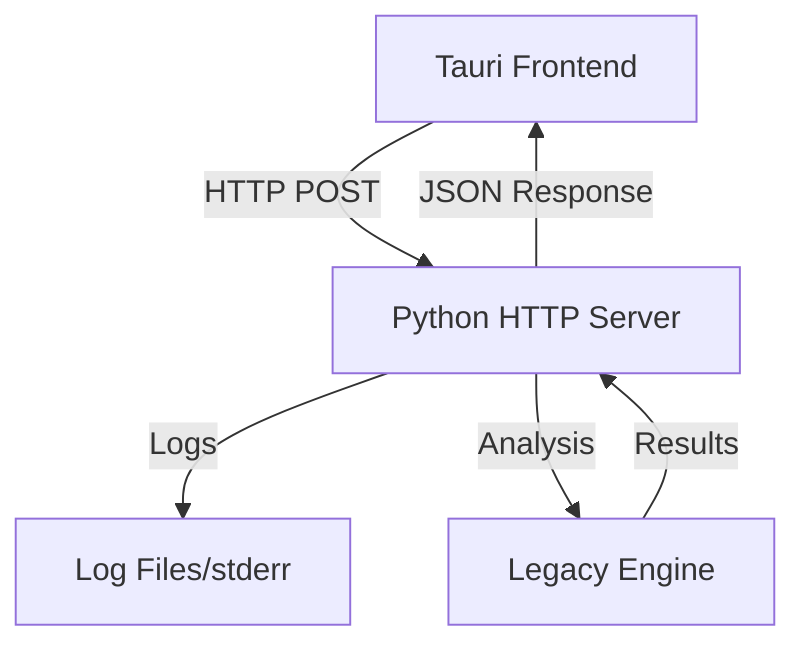
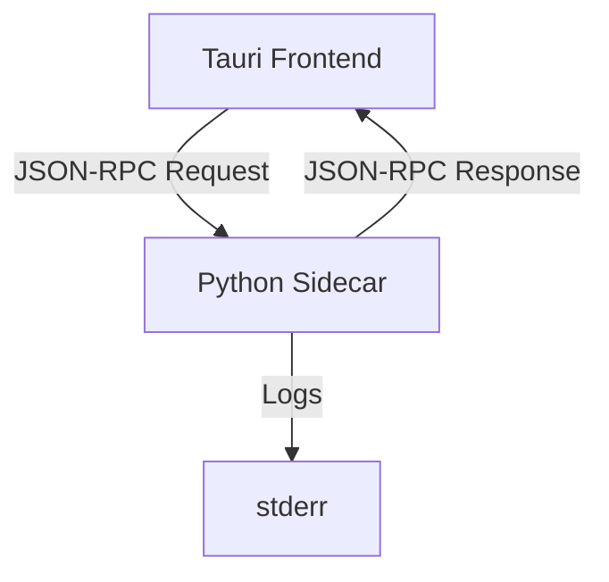

# IPC Architecture Analysis & Improvement Plan

## Current Architecture Problems

### 1. Fragile stdout-based JSON Communication
**Current Implementation:**
- Tauri executes Python sidecar as subprocess
- Python writes JSON directly to stdout
- Tauri parses stdout as JSON
- Any contamination (logging, print statements, progress indicators) breaks parsing

**Critical Issues:**
```rust
// commands.rs:184-185 - Fragile parsing point
let stdout = &output.stdout;
let result: AnalysisResult = serde_json::from_str(&stdout)
    .map_err(|e| format!("Failed to parse sidecar response: {}", e))?;
```

**Contamination Sources Found:**
1. Logging messages from multiple modules
2. CLI JSON output with indentation
3. Progress indicators (`log_space()`, `log_dot()`)
4. Debug print statements
5. Legacy module logging

### 2. Mixed Concerns
- Data transport mixed with human-readable output
- Debugging requires disabling logging
- Error handling limited to stderr (which gets lost)
- No structured error responses

### 3. Development & Maintenance Issues
- Hard to debug sidecar issues
- Easy to accidentally break with innocent print statements
- No versioning or protocol negotiation
- Limited error context

## Proposed Architecture Solutions

### Option A: HTTP-based API Server (Recommended)

#### Architecture Overview


#### Benefits
- **Robust**: HTTP has built-in error handling, status codes, headers
- **Debuggable**: Full logging capability without interference
- **Standard**: Well-understood protocol with excellent tooling
- **Testable**: Easy to test with curl, Postman, etc.
- **Scalable**: Can handle multiple concurrent requests
- **Cross-platform**: Works identically on all platforms

#### Implementation Plan
1. **Phase 1**: Create FastAPI server alongside existing sidecar
2. **Phase 2**: Update Tauri commands to use HTTP
3. **Phase 3**: Add proper error handling and logging
4. **Phase 4**: Remove sidecar dependency

### Option B: JSON-RPC over stdio

#### Architecture Overview


#### Benefits
- Keeps existing sidecar model
- Structured protocol prevents contamination
- Allows logging to stderr
- Standard JSON-RPC error handling

#### Implementation
```json
// Request
{"jsonrpc": "2.0", "method": "execute_analysis", "params": {...}, "id": 1}

// Success Response
{"jsonrpc": "2.0", "result": {...}, "id": 1}

// Error Response
{"jsonrpc": "2.0", "error": {"code": -1, "message": "Analysis failed"}, "id": 1}
```

### Option C: Named Pipes/Unix Sockets

#### Benefits
- Dedicated communication channels
- Better performance than HTTP for local communication
- Complete separation of data and logs

#### Drawbacks
- Platform-specific implementation
- More complex setup
- Limited tooling for debugging

## Recommendation: HTTP-based API Server

### Why HTTP is the Best Choice

1. **Immediate Problem Resolution**: Completely eliminates stdout contamination
2. **Developer Experience**: Full logging and debugging capabilities
3. **Industry Standard**: HTTP is universally understood and supported
4. **Future-Proof**: Easy to extend with authentication, rate limiting, etc.
5. **Testing**: Can test API independently of Tauri
6. **Error Handling**: Rich HTTP status codes and error responses

### Migration Strategy

#### Phase 1: Parallel Implementation
- Keep existing sidecar working
- Add HTTP server as alternative
- Feature flag to switch between modes

#### Phase 2: HTTP-First Development
- New features use HTTP API
- Existing features gradually migrated
- Comprehensive testing

#### Phase 3: Sidecar Deprecation
- Remove sidecar dependency
- Clean up Tauri configuration
- Update documentation

### Technical Implementation Details

#### Python HTTP Server
```python
from fastapi import FastAPI, HTTPException
from fastapi.middleware.cors import CORSMiddleware
import uvicorn
import logging

# Full logging capability!
logging.basicConfig(level=logging.INFO)
logger = logging.getLogger(__name__)

app = FastAPI(title="GitInspectorGUI API", version="1.0.0")

@app.post("/api/execute_analysis")
async def execute_analysis(settings: Settings) -> AnalysisResult:
    logger.info(f"Starting analysis for {len(settings.input_fstrs)} repositories")
    
    try:
        api = GitInspectorAPI()
        result = api.execute_analysis(settings)
        logger.info(f"Analysis completed: {len(result.repositories)} repositories")
        return result
    except Exception as e:
        logger.error(f"Analysis failed: {e}", exc_info=True)
        raise HTTPException(status_code=500, detail=str(e))

@app.get("/health")
async def health_check():
    return {"status": "healthy", "version": "1.0.0"}
```

#### Tauri HTTP Client
```rust
use reqwest;
use serde_json;

#[command]
pub async fn execute_analysis(settings: Settings) -> Result<AnalysisResult, String> {
    let client = reqwest::Client::new();
    
    let response = client
        .post("http://127.0.0.1:8080/api/execute_analysis")
        .json(&settings)
        .timeout(Duration::from_secs(300)) // 5 minute timeout
        .send()
        .await
        .map_err(|e| format!("HTTP request failed: {}", e))?;
    
    match response.status() {
        reqwest::StatusCode::OK => {
            let result: AnalysisResult = response.json().await
                .map_err(|e| format!("JSON parsing failed: {}", e))?;
            Ok(result)
        }
        status => {
            let error_text = response.text().await.unwrap_or_default();
            Err(format!("Server error {}: {}", status, error_text))
        }
    }
}
```

### Error Handling Improvements

#### Current Error Handling Issues
- Limited error context
- stderr gets lost in sidecar model
- No structured error responses
- Hard to distinguish error types

#### HTTP Error Handling
```python
from enum import Enum
from pydantic import BaseModel

class ErrorCode(str, Enum):
    VALIDATION_ERROR = "validation_error"
    REPOSITORY_NOT_FOUND = "repository_not_found"
    ANALYSIS_FAILED = "analysis_failed"
    INTERNAL_ERROR = "internal_error"

class ErrorResponse(BaseModel):
    error_code: ErrorCode
    message: str
    details: Optional[Dict[str, Any]] = None
    timestamp: datetime
    request_id: str

@app.exception_handler(ValidationError)
async def validation_exception_handler(request: Request, exc: ValidationError):
    return JSONResponse(
        status_code=400,
        content=ErrorResponse(
            error_code=ErrorCode.VALIDATION_ERROR,
            message="Invalid request parameters",
            details={"validation_errors": exc.errors()},
            timestamp=datetime.utcnow(),
            request_id=str(uuid.uuid4())
        ).dict()
    )
```

## Implementation Timeline

### Week 1: Foundation
- [ ] Create FastAPI server structure
- [ ] Implement basic health check endpoint
- [ ] Add execute_analysis endpoint
- [ ] Basic error handling

### Week 2: Integration
- [ ] Update Tauri commands to support HTTP
- [ ] Add feature flag for HTTP vs sidecar
- [ ] Comprehensive error handling
- [ ] Logging configuration

### Week 3: Testing & Polish
- [ ] Unit tests for HTTP API
- [ ] Integration tests
- [ ] Performance testing
- [ ] Documentation updates

### Week 4: Migration
- [ ] Default to HTTP mode
- [ ] Remove sidecar dependencies
- [ ] Clean up configuration
- [ ] Final testing

## Risk Assessment

### Low Risk
- HTTP implementation is straightforward
- Can maintain backward compatibility during migration
- Well-established patterns and libraries

### Medium Risk
- Need to ensure HTTP server starts reliably
- Port conflicts in development
- Cross-platform compatibility

### Mitigation Strategies
- Automatic port selection if default port busy
- Graceful fallback to sidecar if HTTP fails
- Comprehensive testing on all platforms
- Clear migration documentation

## Conclusion

The HTTP-based API server approach provides the most robust, maintainable, and developer-friendly solution to the current IPC fragility issues. It completely eliminates stdout contamination problems while providing superior debugging, testing, and error handling capabilities.

The migration can be done incrementally with minimal risk, and the resulting architecture will be much more maintainable and extensible for future development.