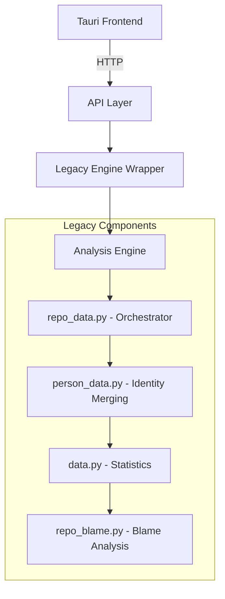
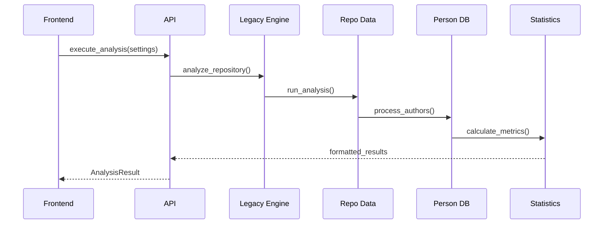

# Legacy Analysis Integration

## Overview

Integration of sophisticated git analysis algorithms from `gitinspectorgui-old` into the
modern Tauri architecture.

## Architecture



## Integration Components

### File Structure

```
python/gigui/
├── api.py              # Legacy API (deprecated)
├── legacy_engine.py    # Integration wrapper
├── person_data.py      # Author identity merging
├── data.py            # Statistics calculation
├── repo_data.py       # Analysis orchestrator
├── repo_blame.py      # Blame analysis
├── repo_base.py       # Git operations
└── utils.py           # Utilities
```

### Key Features

- **Person identity merging** - Handles multiple author identities
- **Advanced statistics** - Comprehensive metrics calculation
- **Blame integration** - Line-by-line attribution
- **Performance optimization** - Efficient git operations
- **Filtering capabilities** - Author/file/commit exclusions

## Data Flow



## Implementation

### Settings Translation

```python
def translate_settings(gui_settings: Settings) -> Args:
    """Convert GUI settings to legacy format"""
    return Args(
        input_fstrs=gui_settings.input_fstrs,
        depth=gui_settings.depth,
        ex_authors=gui_settings.ex_authors,
        # Map all GUI settings to legacy Args
    )
```

### Result Conversion

```python
def convert_results(repo_data: RepoData) -> RepositoryResult:
    """Convert legacy results to GUI format"""
    authors = []
    for author, pstat in repo_data.author2pstat.items():
        if author != "*":  # Skip totals
            authors.append(AuthorStat(
                name=pstat.person.author,
                email=list(pstat.person.emails)[0],
                commits=len(pstat.stat.shas),
                insertions=pstat.stat.insertions,
                deletions=pstat.stat.deletions,
                files=len(pstat.fstrs),
                percentage=pstat.stat.percent_insertions
            ))
    return RepositoryResult(authors=authors, ...)
```

## Dependency Management

### uv + pyproject.toml

```toml
[project]
name = "gitinspectorgui"
dependencies = [
    "gitpython>=3.1.44",
    "psutil>=7.0.0",
    # Legacy analysis dependencies
]

[tool.uv]
dev-dependencies = [
    "pytest>=7.4.0",
    "black>=23.0.0",
    "mypy>=1.7.0"
]
```

### Commands

- `uv sync` - Install dependencies
- `uv add <package>` - Add new dependency
- `uv run python -m gigui.api` - Run analysis engine
