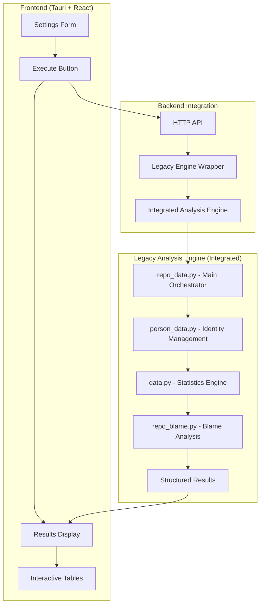
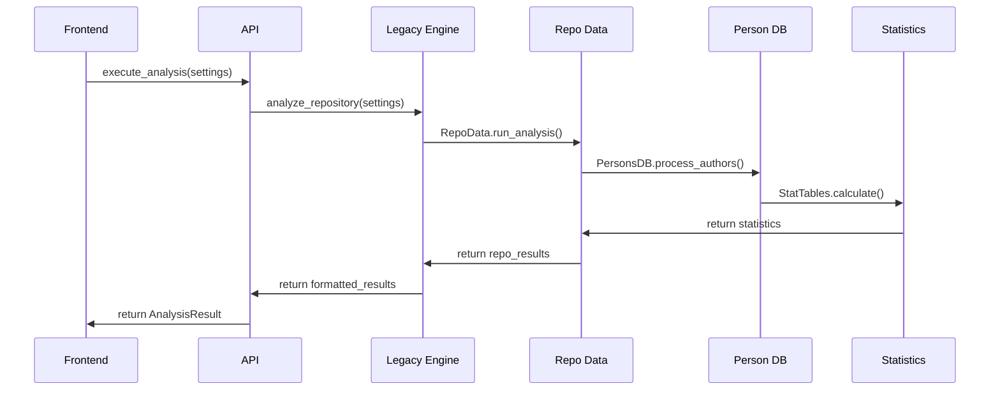

# Legacy Analysis Integration

## Overview

This document describes the current integration of sophisticated git analysis algorithms from `gitinspectorgui-old` into the modern Tauri-based GitInspectorGUI architecture.

## Integration Architecture

### Current Implementation

The system now integrates the sophisticated legacy analysis engine with the modern Tauri frontend:

-   **Location**: `gitinspectorgui/python/gigui/`
-   **Integration**: Legacy analysis algorithms integrated via `legacy_engine.py`
-   **Capabilities**:
    -   Advanced person identity merging
    -   Comprehensive statistics calculation
    -   Integrated blame analysis
    -   Advanced filtering capabilities
    -   Performance-optimized git operations

### Legacy Engine Components

The integrated components from `gitinspectorgui-old` include:

-   **Person Identity Management** (`person_data.py`): Advanced author name normalization and identity merging
-   **Statistics Engine** (`data.py`): Comprehensive metrics calculation and aggregation
-   **Repository Analysis** (`repo_data.py`): Complete analysis workflow orchestration
-   **Blame Analysis** (`repo_blame.py`): Line-by-line attribution and historical tracking
-   **Performance Optimizations**: Optimized git operations and data structures

## Current Architecture



## Dependency Management

### uv + pyproject.toml Architecture

The integration uses **uv** with **pyproject.toml** for dependency management, providing:

#### Key Benefits

-   **Performance**: uv is significantly faster than pip for dependency resolution
-   **Modern tooling**: Future-proof Python package management
-   **Consistency**: Matches existing gitinspectorgui-old project structure
-   **Better resolution**: Superior dependency conflict resolution compared to pip

#### Current Commands

-   `uv add <package>` - Add new dependencies
-   `uv sync` - Install/sync all dependencies from pyproject.toml
-   `uv run <command>` - Execute scripts in the uv environment
-   `uv remove <package>` - Remove dependencies

## Current Implementation

### Integrated Components

#### Core Data Structures

-   **Type System**: Enhanced type definitions from legacy codebase
-   **Person Identity Management**: Advanced author name normalization and identity merging
-   **Statistics Engine**: Comprehensive metrics calculation with `Stat`, `CommitGroup`, and `PersonStat` classes

#### Analysis Engine

-   **Git Operations Layer**: Optimized git command execution with error handling and performance monitoring
-   **Blame Analysis**: Line-by-line attribution and historical blame tracking with performance optimizations
-   **Analysis Orchestrator**: Complete analysis workflow with statistics generation and result aggregation

#### Integration Layer

-   **Legacy Engine Wrapper**: Bridge between current API and legacy analysis with settings translation and result format conversion
-   **API Integration**: Enhanced API with legacy engine calls while maintaining existing contract

### Current File Structure

```
gitinspectorgui/python/gigui/
├── __init__.py
├── api.py                 # Main API (refactored)
├── typedefs.py           # Enhanced type definitions
├── legacy_engine.py      # Legacy analysis wrapper (new)
├── person_data.py        # Person identity management (new)
├── data.py              # Statistics engine (new)
├── repo_base.py         # Git operations layer (new)
├── repo_blame.py        # Blame analysis (new)
├── repo_data.py         # Main analysis orchestrator (new)
├── utils.py             # Utility functions (new)
└── cli.py               # CLI interface (existing)
```

### Dependency Management

The integration will maintain the modern uv + pyproject.toml approach:

```toml
# pyproject.toml structure (enhanced from gitinspectorgui-old)
[project]
name = "gitinspectorgui"
dependencies = [
    # Core dependencies from legacy codebase
    # Additional dependencies as needed
]

[tool.uv]
dev-dependencies = [
    # Development and testing dependencies
]
```

**Migration Commands**:

-   `uv sync` - Install all dependencies after integration
-   `uv add <package>` - Add any missing legacy dependencies
-   `uv run python -m gigui.api` - Execute analysis engine

### Data Flow Architecture



### Key Integration Points

#### 1. Settings Translation

```python
# In legacy_engine.py
def translate_settings(gui_settings: Settings) -> Args:
    """Convert GUI settings to legacy Args format"""
    return Args(
        input_fstrs=gui_settings.input_fstrs,
        depth=gui_settings.depth,
        ex_authors=gui_settings.ex_authors,
        # ... map all settings
    )
```

#### 2. Result Format Conversion

```python
# In legacy_engine.py
def convert_results(repo_data: RepoData) -> RepositoryResult:
    """Convert legacy results to GUI format"""
    authors = []
    for author, pstat in repo_data.author2pstat.items():
        if author != "*":  # Exclude totals
            authors.append(AuthorStat(
                name=pstat.person.author,
                email=list(pstat.person.emails)[0],
                commits=len(pstat.stat.shas),
                insertions=pstat.stat.insertions,
                deletions=pstat.stat.deletions,
                files=len(pstat.fstrs),
                percentage=pstat.stat.percent_insertions,
                age=pstat.stat.age
            ))
    return RepositoryResult(...)
```

### Performance Optimizations

Current performance enhancements include:

-   **Optimized Git Operations**: Reduced git command overhead through efficient batching
-   **Efficient Data Structures**: Memory-optimized statistics storage and processing
-   **Caching Support**: Foundation for result caching in repeated analyses

## Current Capabilities

### Analysis Features

The integrated system now provides:

-   **Person Identity Merging**: Correctly handles multiple author identities across different email addresses and name variations
-   **Advanced Statistics**: Accurate commit, insertion, deletion counts with sophisticated aggregation
-   **Blame Integration**: Precise line attribution and stability metrics for detailed code ownership analysis
-   **Advanced Filtering**: Comprehensive exclusion patterns for authors, files, and commit messages
-   **Detailed Metrics**: Stability calculations, age analysis, and percentage-based contributions

### Architecture Benefits

The current integration maintains:

-   **Backward Compatibility**: Existing API contract preserved, no frontend changes required
-   **Development Workflow**: All existing development mode functionality preserved
-   **Modern Integration**: Legacy algorithms seamlessly integrated with HTTP API architecture
-   **Scalability**: Handles large repositories efficiently with optimized data processing

### Quality Assurance

The integration includes:

-   **Comprehensive Testing**: Unit tests, integration tests, and regression testing ensure reliability
-   **Performance Monitoring**: Built-in performance tracking and optimization
-   **Error Handling**: Robust error handling with detailed logging and debugging capabilities

## Future Enhancements

The integrated architecture provides a foundation for future improvements:

-   **Enhanced Caching**: Advanced result caching for repeated analyses
-   **Streaming Processing**: Handle enterprise-scale repositories through chunked processing
-   **Parallel Processing**: Utilize multiprocessing for multiple repository analysis
-   **Advanced Metrics**: Additional stability and complexity metrics
-   **Machine Learning Integration**: Potential for AI-powered code analysis insights

## Summary

The legacy analysis integration successfully combines the sophisticated analysis algorithms from gitinspectorgui-old with the modern Tauri-based architecture. This integration provides enhanced accuracy, comprehensive statistics, and advanced filtering capabilities while maintaining the clean, modern development experience and HTTP-based API architecture.

The system now delivers enterprise-grade git analysis capabilities through a modern, maintainable, and extensible platform that preserves the best aspects of both the legacy analysis engine and the contemporary application architecture.
