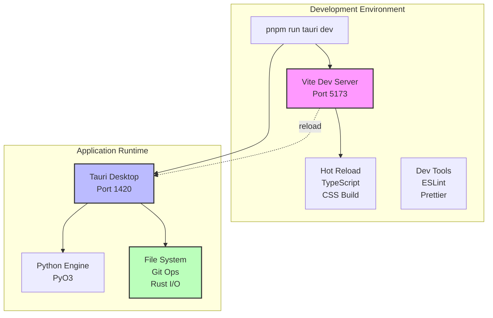
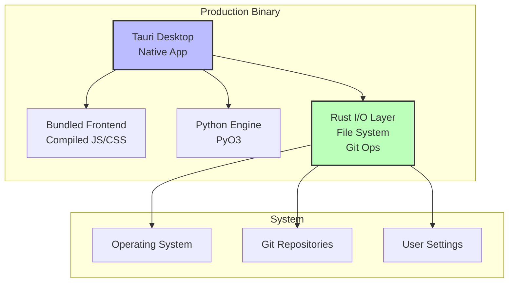

# Node.js Development vs Rust Production Architecture

This document explains how GitInspectorGUI uses Node.js exclusively for development
tooling while delivering a production application with no Node.js dependencies.

## What Node.js is Needed For

Node.js is required only for **development tooling** - the specific tools that make
frontend development efficient:

- **Vite Dev Server**: Serves the frontend during development with hot reload
- **TypeScript Compiler**: Compiles TypeScript to JavaScript (tsc command)
- **Package Management**: pnpm/npm tools for installing and managing dependencies
- **Code Quality Tools**: ESLint for linting, Prettier for formatting
- **Build Pipeline**: Bundling, optimization, and asset processing

End users never need Node.js installed. It's purely a developer dependency for building
and serving the frontend during development.

## Architecture Overview

### Development Mode: Node.js-Powered Tooling

In development mode, Node.js serves as the foundation for the development environment
but **never handles production logic**:



### Production Mode: Pure Rust/Python Runtime

In production, Node.js is completely eliminated - the application becomes a
self-contained binary:



## Why Node.js in Development Only?

### Development Benefits

**1. Modern Frontend Tooling**

- **Vite**: Extremely fast hot module replacement and build tooling
- **TypeScript**: Type-safe JavaScript with excellent IDE support
- **ESLint/Prettier**: Code quality and formatting tools
- **Package Management**: Access to npm ecosystem for development dependencies

**2. Developer Experience**

- **Hot Reload**: Changes appear instantly without full application restart
- **Source Maps**: Debugging with original TypeScript source code
- **Dev Server**: Separate development server for frontend code iteration
- **Build Pipeline**: Optimized bundling and asset processing

**3. Ecosystem Access**

- **UI Libraries**: React, shadcn/ui, Tailwind CSS
- **Development Tools**: Testing frameworks, linting, formatting
- **Build Tools**: Sophisticated asset processing and optimization

### Why Not Node.js in Production?

**1. Performance Concerns**

- **Bundle Size**: Node.js runtime adds ~50-100MB to application size
- **Memory Usage**: JavaScript V8 engine requires significant memory overhead
- **Startup Time**: Node.js initialization adds application startup latency
- **Resource Usage**: Dual runtime (Node.js + embedded Python) inefficient

**2. Security Benefits**

- **Attack Surface**: Eliminates Node.js runtime vulnerabilities in production
- **Dependency Management**: No npm dependencies in production binary
- **Sandboxing**: Native Tauri security model without Node.js process

**3. Distribution Advantages**

- **Single Binary**: No need to bundle Node.js runtime or node_modules
- **Platform Integration**: Native OS integration without Node.js layer
- **Self-Contained**: Zero external dependencies for end users

## Technical Implementation Details

### Development Build Process

```bash
# Start development environment with Node.js tooling
pnpm run tauri dev
```

**Key Point**: Node.js only provides frontend tooling - all business logic and I/O
operations are handled by Rust/PyO3.

### Production Build Process

```bash
# Build production binary (eliminates Node.js)
pnpm run tauri build
```

## Bundle Size Comparison

### With Node.js (hypothetical)

```
Application Bundle:
├── Node.js Runtime: ~80MB
├── node_modules: ~200MB
├── Python Runtime: ~50MB
├── Application Code: ~20MB
└── Total: ~350MB
```

### Current Rust-Only Production

```
Application Bundle:
├── Tauri Binary: ~15MB
├── Python Runtime: ~50MB
├── Application Code: ~5MB
└── Total: ~70MB
```

**Result**: 5x smaller production bundle by eliminating Node.js runtime.

## Security Model

### Development Security

- Node.js dev server runs with development permissions
- Tauri app runs with user permissions
- All sensitive operations (file access, git operations) handled by Rust
- PyO3 provides secure Python execution environment

### Production Security

- Single binary with minimal attack surface
- No Node.js runtime vulnerabilities
- Native OS security model via Tauri
- Embedded Python provides sandboxed analysis environment

## Performance Characteristics

### Development Performance

- **Hot Reload**: ~100-500ms for frontend changes
- **Full Restart**: ~2-3 seconds for backend changes
- **Memory Usage**: ~200-300MB (Node.js + Tauri + Python)
- **I/O Performance**: Native speed (handled by Rust)

### Production Performance

- **Startup Time**: ~500ms-1s
- **Memory Usage**: ~100-150MB (Tauri + Python only)
- **I/O Performance**: Native speed (pure Rust)
- **Analysis Speed**: Same as development (same Python engine)

## Summary

| Aspect                   | Development Mode                 | Production Mode                 |
| ------------------------ | -------------------------------- | ------------------------------- |
| **Frontend Tooling**     | Node.js (Vite, TypeScript, etc.) | Compiled static assets          |
| **Runtime Dependencies** | Node.js + Rust + Python          | Rust + Python only              |
| **Bundle Size**          | N/A (development)                | ~70MB (no Node.js)              |
| **Business Logic & I/O** | Always handled by Rust + Python  | Always handled by Rust + Python |

**Key Insight**: Node.js provides excellent development tooling but is completely
eliminated in production. All system interactions always flow through Rust, ensuring
consistent behavior between development and production modes.
