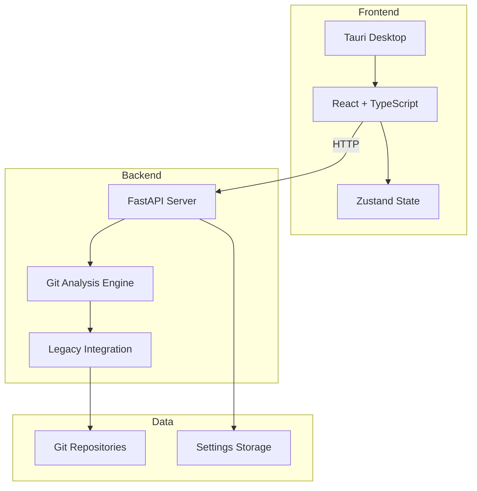
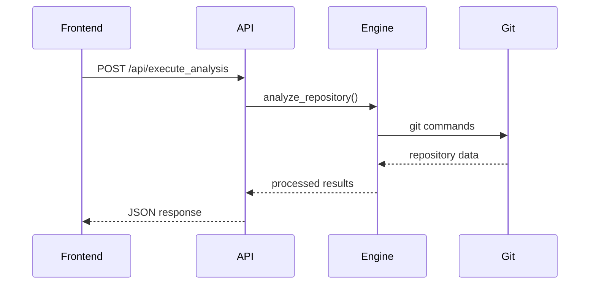
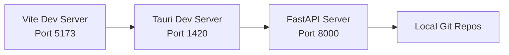

# System Architecture Overview

Modern HTTP API architecture with Tauri desktop frontend and Python backend.

## For Python Developers

If you're unfamiliar with the frontend technologies, see the **[Technology Primer](../technology-primer.md)** first. This document explains how the Python backend you'll work with connects to the desktop frontend.

**Key concept**: The Python backend runs as an HTTP server, and the desktop frontend makes HTTP requests to it. You can develop and test the Python backend independently.

## Architecture

## Core Components

### Frontend Stack

-   **Tauri** - Cross-platform desktop framework
-   **React 18** - Modern UI with hooks
-   **TypeScript** - Type safety
-   **Vite** - Fast build tool
-   **Tailwind CSS** - Utility-first styling
-   **Zustand** - Lightweight state management

### Backend Stack

-   **FastAPI** - Modern Python web framework
-   **Pydantic** - Data validation
-   **Uvicorn** - ASGI server
-   **GitPython** - Git operations
-   **Legacy Engine** - Sophisticated analysis algorithms

## API Design

### Key Endpoints

-   `GET /health` - Server health check
-   `POST /api/execute_analysis` - Repository analysis
-   `GET/POST /api/settings` - Settings management
-   `GET /api/engine_info` - Engine capabilities

### Communication

-   **Protocol** - HTTP/JSON
-   **Validation** - Pydantic models
-   **Error handling** - Standard HTTP status codes
-   **Documentation** - Auto-generated OpenAPI

## Data Flow

## Design Principles

### Separation of Concerns

-   **Frontend** - UI, state management, visualization
-   **Backend** - Git analysis, data processing, persistence
-   **Communication** - Clean HTTP API boundary

### Performance

-   **Async operations** - Non-blocking I/O
-   **Parallel processing** - Multi-threaded analysis
-   **Efficient data structures** - Memory optimization
-   **Caching** - Result and operation caching

### Reliability

-   **Error handling** - Comprehensive error types
-   **Input validation** - Type-safe requests
-   **Logging** - Structured logging with levels
-   **Health monitoring** - Performance metrics

## Development vs Production

!!! info "Detailed Development Architecture"
For comprehensive information about development setup, port usage, and multi-server architecture, see **[Development Architecture](../development/development-architecture.md)** (which includes development vs production comparison).

### Development Mode (3 Servers)

-   **3 separate servers** on ports 5173, 1420, 8000
-   Hot module replacement and auto-reload
-   Comprehensive debugging tools
-   Independent service development

### Production Build (1 Server)

-   **Single bundled application**
-   Embedded Python backend (port 8000 only)
-   Optimized performance
-   Local-only communication

## Technology Rationale

### Why HTTP API?

**Previous stdout-based IPC issues:**

-   Fragile JSON parsing
-   Mixed output streams
-   Limited debugging
-   Process management complexity

**HTTP API benefits:**

-   Standard protocol with tooling
-   Robust error handling
-   Easy testing and debugging
-   Clean separation of concerns

### Stack Choices

**Tauri + React:**

-   Native performance with web tech
-   Cross-platform compatibility
-   Rich ecosystem
-   Modern development experience

**FastAPI + Python:**

-   Excellent git libraries
-   Fast development
-   Strong typing
-   Automatic documentation

## Performance Architecture

### Analysis Optimization

-   **Parallel processing** - Configurable worker count
-   **Memory efficiency** - Optimized data structures
-   **Git operation batching** - Reduced command overhead
-   **Incremental analysis** - Large repository support

### Frontend Optimization

-   **Virtual scrolling** - Large dataset handling
-   **Component memoization** - Expensive calculation caching
-   **Lazy loading** - Progressive component loading
-   **State efficiency** - Minimal re-renders

## Monitoring

### Logging

-   **Levels** - DEBUG, INFO, WARNING, ERROR, CRITICAL
-   **Structured** - JSON format for analysis
-   **Destinations** - Console (dev), files (prod)

### Health Checks

-   **Basic health** - `/health` endpoint
-   **Performance metrics** - Request times, memory usage
-   **Error tracking** - Failure rates and types

## Summary

HTTP-based architecture provides robust, maintainable foundation with clean separation between desktop frontend and analysis backend. Designed for performance, reliability, and future extensibility.
