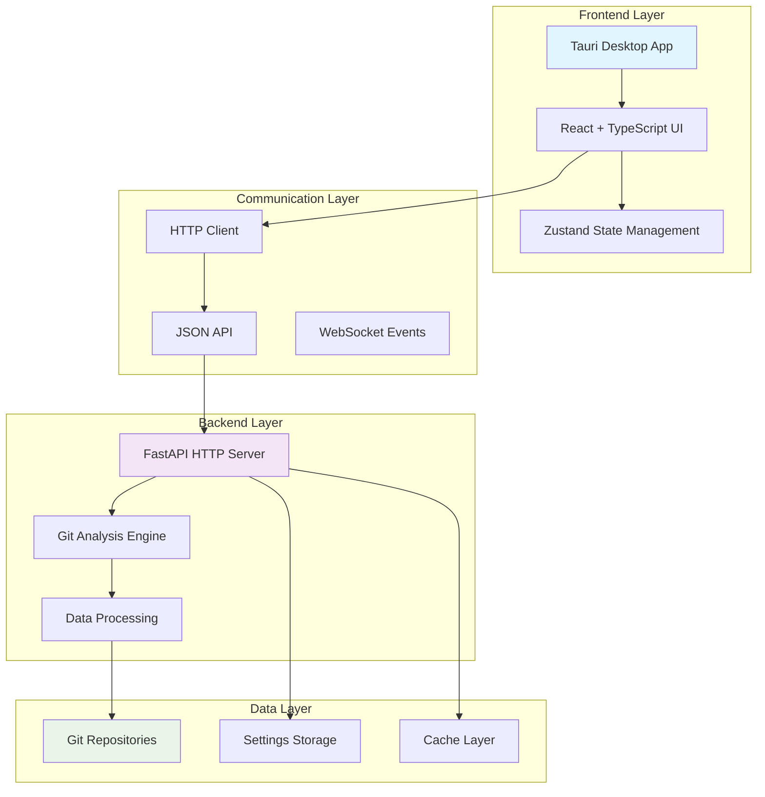
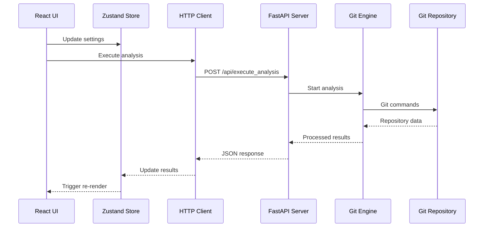
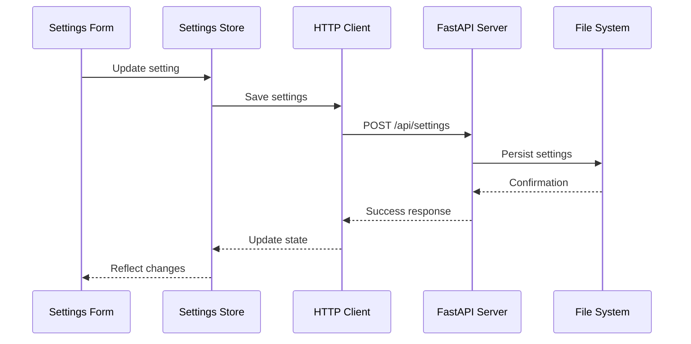
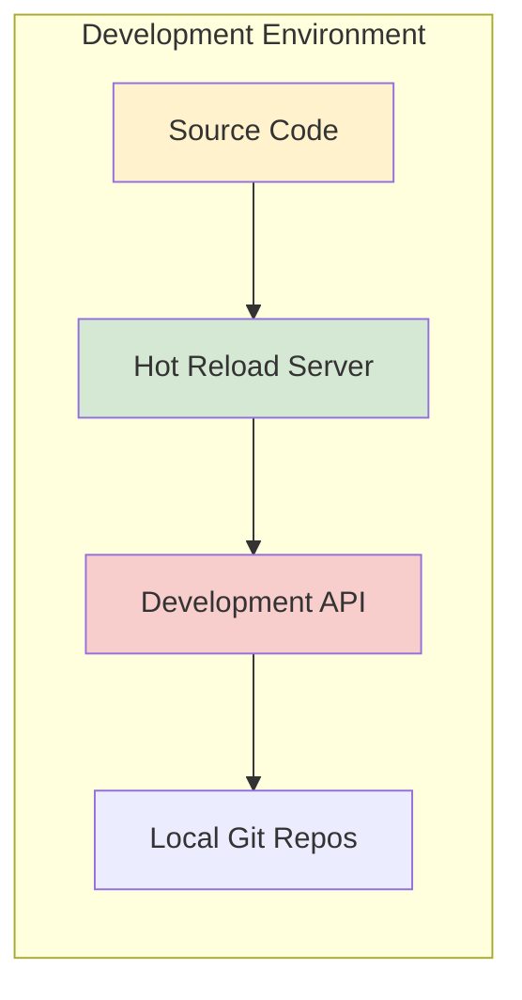
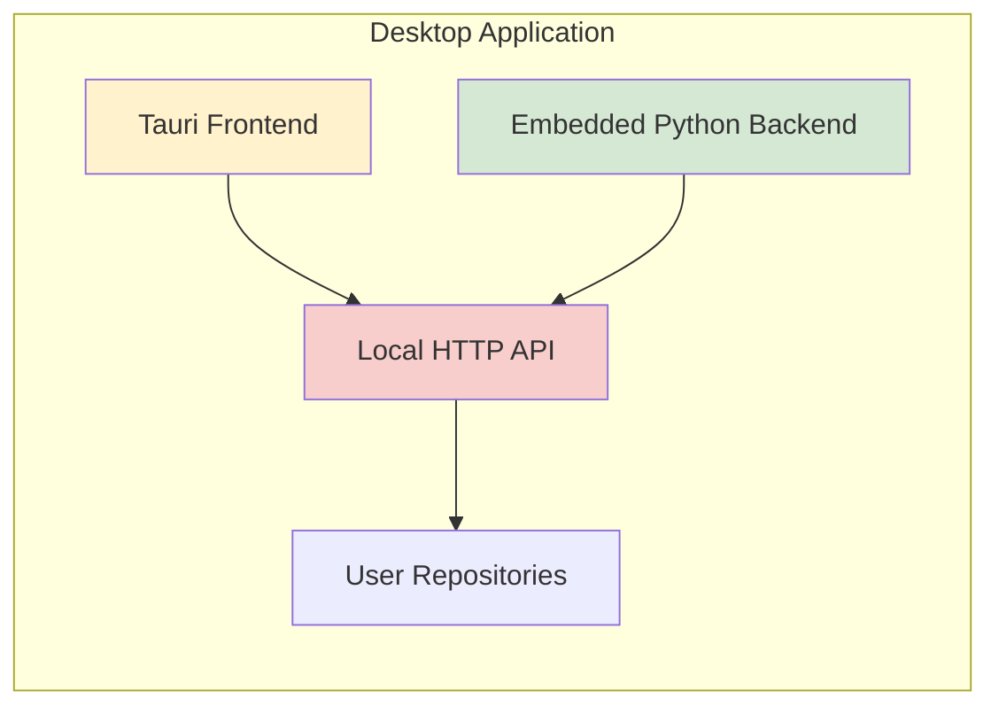

# System Architecture Overview

Comprehensive overview of GitInspectorGUI's HTTP API architecture and design principles.

## Architecture Summary

GitInspectorGUI uses a modern, decoupled architecture with HTTP-based communication between the frontend and backend components:

## Core Components

### 1. Frontend (Tauri + React)

**Technology Stack:**

-   **Tauri**: Cross-platform desktop framework
-   **React 18**: Modern UI library with hooks
-   **TypeScript**: Type-safe JavaScript
-   **Vite**: Fast build tool and dev server
-   **Tailwind CSS**: Utility-first CSS framework
-   **Zustand**: Lightweight state management

**Key Features:**

-   Native desktop performance
-   Cross-platform compatibility (Windows, macOS, Linux)
-   Modern React patterns with functional components
-   Type-safe API integration
-   Responsive design with Tailwind CSS

### 2. Backend (Python HTTP API)

**Technology Stack:**

-   **FastAPI**: Modern Python web framework
-   **Pydantic**: Data validation and serialization
-   **Uvicorn**: ASGI server for production
-   **GitPython**: Git repository interaction
-   **Asyncio**: Asynchronous processing

**Key Features:**

-   RESTful API design
-   Automatic OpenAPI documentation
-   Async/await support for performance
-   Comprehensive error handling
-   Built-in request validation

### 3. Communication Protocol

**HTTP API Design:**

-   RESTful endpoints with clear semantics
-   JSON request/response format
-   Standard HTTP status codes
-   Comprehensive error responses
-   Request/response validation

**Key Endpoints:**

-   `GET /health` - Server health check
-   `POST /api/execute_analysis` - Repository analysis
-   `GET/POST /api/settings` - Settings management
-   `GET /api/engine_info` - Engine capabilities
-   `GET /api/performance_stats` - Performance metrics

## Design Principles

### 1. Separation of Concerns

**Frontend Responsibilities:**

-   User interface and interaction
-   State management and caching
-   Input validation and formatting
-   Result visualization and filtering

**Backend Responsibilities:**

-   Git repository analysis
-   Data processing and aggregation
-   Settings persistence
-   Performance optimization

### 2. Scalability and Performance

**Horizontal Scaling:**

-   Stateless API design
-   Process-based parallelization
-   Configurable resource limits
-   Efficient memory management

**Vertical Scaling:**

-   Multi-threaded analysis
-   Async I/O operations
-   Intelligent caching strategies
-   Resource monitoring

### 3. Reliability and Robustness

**Error Handling:**

-   Comprehensive error types
-   Graceful degradation
-   Retry mechanisms
-   Detailed logging

**Data Integrity:**

-   Input validation
-   Type safety
-   Atomic operations
-   Consistent state management

## Data Flow Architecture

### 1. Analysis Request Flow

### 2. Settings Management Flow

## Performance Architecture

### 1. Analysis Performance

**Optimization Strategies:**

-   Parallel processing with configurable worker count
-   Incremental analysis for large repositories
-   Intelligent caching of git operations
-   Memory-efficient data structures

**Performance Monitoring:**

-   Real-time progress tracking
-   Resource usage metrics
-   Performance statistics API
-   Bottleneck identification

### 2. Frontend Performance

**Optimization Techniques:**

-   Virtual scrolling for large datasets
-   Lazy loading of components
-   Memoization of expensive calculations
-   Efficient state updates

**User Experience:**

-   Progressive loading indicators
-   Responsive design patterns
-   Smooth animations and transitions
-   Keyboard shortcuts and accessibility

## Application Architecture

### 1. Development Mode

**Components:**

-   Vite development server with HMR
-   FastAPI with auto-reload
-   Local file system access
-   Development debugging tools

### 2. Built Application

**Components:**

-   Compiled Tauri desktop application
-   Bundled Python HTTP server
-   Local-only communication
-   Direct file system access

## Technology Decisions

### 1. Why HTTP API Architecture?

**Previous Architecture Issues:**

-   Stdout-based IPC was fragile
-   JSON parsing failures from mixed output
-   Limited debugging capabilities
-   Process management complexity

**HTTP API Benefits:**

-   Clean separation of concerns
-   Standard protocol with excellent tooling
-   Robust error handling
-   Easy testing and debugging
-   Industry-standard approach

### 2. Technology Stack Rationale

**Frontend (Tauri + React):**

-   ✅ Native performance with web technologies
-   ✅ Cross-platform compatibility
-   ✅ Rich ecosystem and community
-   ✅ Type safety with TypeScript
-   ✅ Modern development experience

**Backend (FastAPI + Python):**

-   ✅ Excellent git integration libraries
-   ✅ Fast development and prototyping
-   ✅ Strong typing with Pydantic
-   ✅ Automatic API documentation
-   ✅ High performance with async support

## Future Enhancements

### 1. Performance Improvements

**Planned Optimizations:**

-   Enhanced caching strategies for large repositories
-   Improved memory management for massive codebases
-   Better parallel processing algorithms
-   Incremental analysis capabilities

### 2. Feature Extensions

**Potential Additions:**

-   Plugin architecture for custom analysis
-   Advanced visualization capabilities
-   Export formats (PDF, CSV, etc.)
-   Integration with external development tools

## Monitoring and Observability

### 1. Logging Architecture

**Log Levels and Categories:**

-   **DEBUG**: Detailed execution flow
-   **INFO**: General operational information
-   **WARNING**: Potential issues or degraded performance
-   **ERROR**: Error conditions requiring attention
-   **CRITICAL**: Severe errors affecting functionality

**Log Destinations:**

-   Console output for development
-   File-based logging for production
-   Structured JSON logging for analysis
-   Performance metrics collection

### 2. Health Monitoring

**Health Check Endpoints:**

-   `/health` - Basic server health
-   `/api/performance_stats` - Performance metrics
-   `/api/engine_info` - Engine capabilities

**Metrics Tracked:**

-   Request/response times
-   Memory usage patterns
-   Analysis completion rates
-   Error frequencies and types

This architecture provides a solid foundation for GitInspectorGUI's current needs while maintaining flexibility for future enhancements and scaling requirements.
