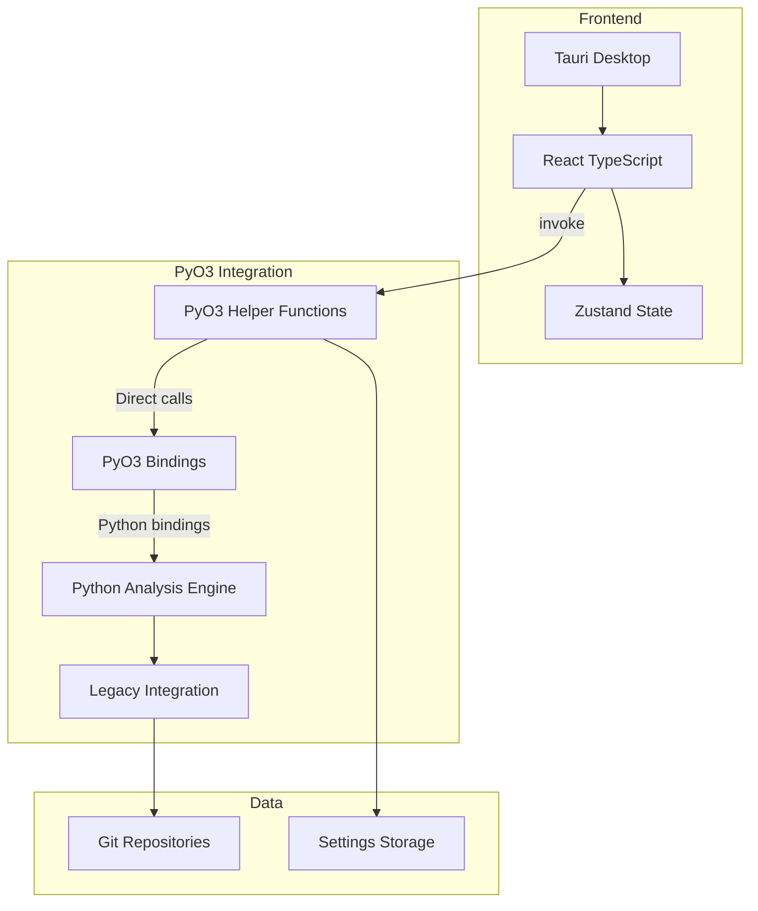
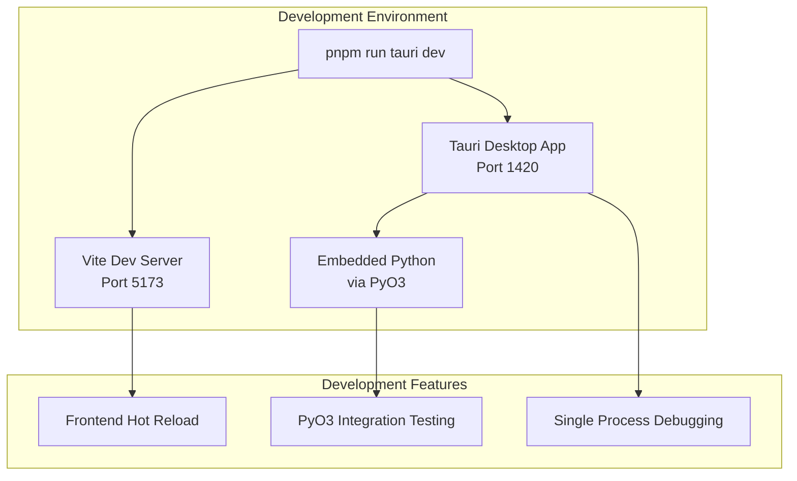
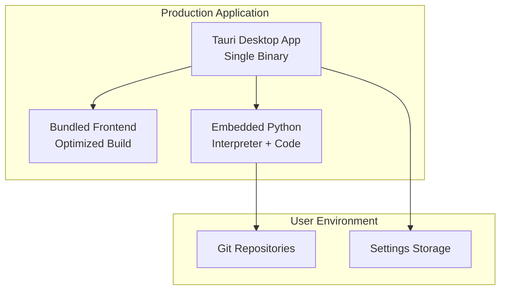

# System Architecture Overview

Modern simplified architecture with Tauri desktop frontend and embedded Python backend
via PyO3 helper function integration.

## For Python Developers

If you're unfamiliar with the frontend technologies, see the
**[Technology Primer](../technology-primer.md)** first. This document explains how the
Python backend you'll work with integrates directly into the desktop application.

**Key concept**: The Python backend runs embedded within the Tauri application, enabling
direct function calls without network communication. You can develop and test the Python
analysis logic independently.

> **PyO3 Integration Details**: For comprehensive information about the PyO3 helper
> function architecture, see [PyO3 Integration Architecture](pyo3-integration.md).

## Architecture

## Core Components

### Frontend Stack

- **Tauri** - Cross-platform desktop framework
- **React 18** - Modern UI with hooks
- **TypeScript** - Type safety
- **Vite** - Fast build tool
- **Tailwind CSS** - Utility-first styling
- **Zustand** - Lightweight state management

### Backend Stack

- **PyO3 Helper Functions** - Simplified direct PyO3 integration
- **PyO3** - Rust bindings for Python interpreter
- **Python Analysis Engine** - Git analysis and data processing
- **Pydantic** - Data validation and type safety
- **GitPython** - Git operations
- **Legacy Engine** - Sophisticated analysis algorithms

## Integration Design

### Key Functions

- `execute_analysis()` - Repository analysis via PyO3 helpers
- `get_settings()` / `save_settings()` - Settings management
- `get_engine_info()` - Engine capabilities
- `health_check()` - Backend health monitoring
- `get_blame_data()` - Blame analysis

### Communication

- **Protocol** - Direct Python function calls via PyO3 helper functions
- **API** - `invoke()` interface for frontend integration
- **Validation** - JSON-based data exchange with type safety
- **Error handling** - Automatic Python exception to JavaScript error conversion
- **GIL Management** - Automatic Global Interpreter Lock handling via PyO3

## Data Flow

## Design Principles

### Separation of Concerns

- **Frontend** - UI, state management, visualization
- **Backend** - Git analysis, data processing, persistence
- **Communication** - PyO3 helper function call boundary

### Performance

- **Direct integration** - No IPC overhead via PyO3 helpers
- **Parallel processing** - Multi-threaded analysis
- **Efficient data structures** - Memory optimization
- **Caching** - Result and operation caching

### Reliability

- **Error handling** - Automatic PyO3 error conversion
- **Input validation** - JSON-based type safety
- **Logging** - Structured logging with levels
- **Performance monitoring** - Application-level metrics

## Development vs Production Architecture

!!! info "Development Workflows"

    For detailed development workflows and command reference, see **[Development Workflow](../development/development-workflow.md)** and **[Development Commands](../development/development-commands.md)**.

### Development Mode Architecture

**Development Characteristics**:

- **Single command start** - `pnpm run tauri dev` launches complete environment
- **Hot module replacement** - Frontend changes appear instantly
- **Embedded Python** - Direct PyO3 function calls for testing
- **Integrated debugging** - All components in single process
- **Fast iteration** - Python changes require app restart (2-3 seconds)

### Production Build Architecture

**Production Characteristics**:

- **Single executable** - Complete application in one binary
- **No external dependencies** - Python interpreter embedded
- **Optimized performance** - Direct function calls, no IPC
- **Cross-platform** - Native performance on all platforms
- **Zero configuration** - No server setup or network requirements

## Technology Rationale

### Why Direct PyO3 Integration?

**Previous HTTP API architecture (deprecated):**

- Network communication overhead
- Complex error handling across HTTP boundary
- Separate process management
- JSON serialization/deserialization costs

**Direct PyO3 integration benefits:**

- Zero IPC overhead with direct function calls
- Automatic error conversion between Python and JavaScript
- Single process deployment simplicity
- Simplified API with `invoke()` interface
- Clean abstractions over PyO3 complexity

### Stack Choices

**Tauri + React:**

- Native performance with web tech
- Cross-platform compatibility
- Rich ecosystem
- Modern development experience

**Direct PyO3 + Python:**

- Excellent git libraries
- Fast development
- Simplified PyO3 helper functions
- Embedded Python interpreter
- Direct function registration

## Performance Architecture

### Analysis Optimization

- **Parallel processing** - Configurable worker count
- **Memory efficiency** - Optimized data structures
- **Git operation batching** - Reduced command overhead
- **Incremental analysis** - Large repository support

### Frontend Optimization

- **Virtual scrolling** - Large dataset handling
- **Component memoization** - Expensive calculation caching
- **Lazy loading** - Progressive component loading
- **State efficiency** - Minimal re-renders

## Monitoring

### Logging

- **Levels** - DEBUG, INFO, WARNING, ERROR, CRITICAL
- **Structured** - JSON format for analysis
- **Destinations** - Console (dev), files (prod)

### Application Monitoring

- **Performance metrics** - Function call times, memory usage
- **Error tracking** - PyErr exception handling and logging
- **Python integration** - GIL usage and PyO3 performance
- **Application health** - Desktop app responsiveness

## Summary

Simplified direct PyO3 architecture provides robust, maintainable foundation with direct
integration between desktop frontend and embedded Python backend via our PyO3 helper
functions. Designed for performance, reliability, and simplified deployment with zero
network overhead while providing clean abstractions over PyO3 integration complexity.
