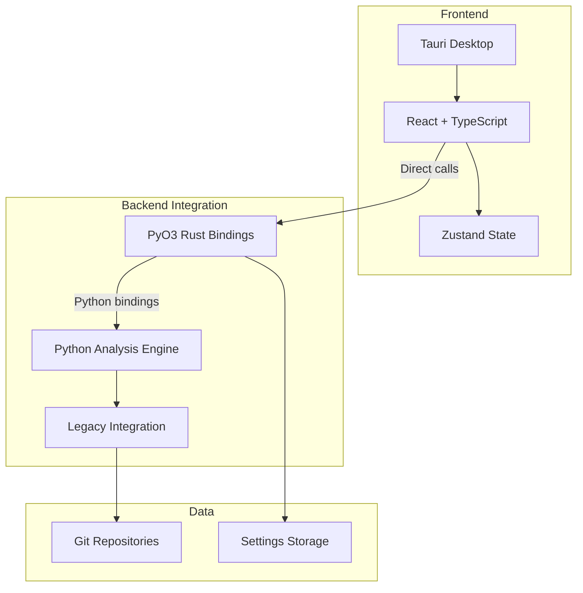
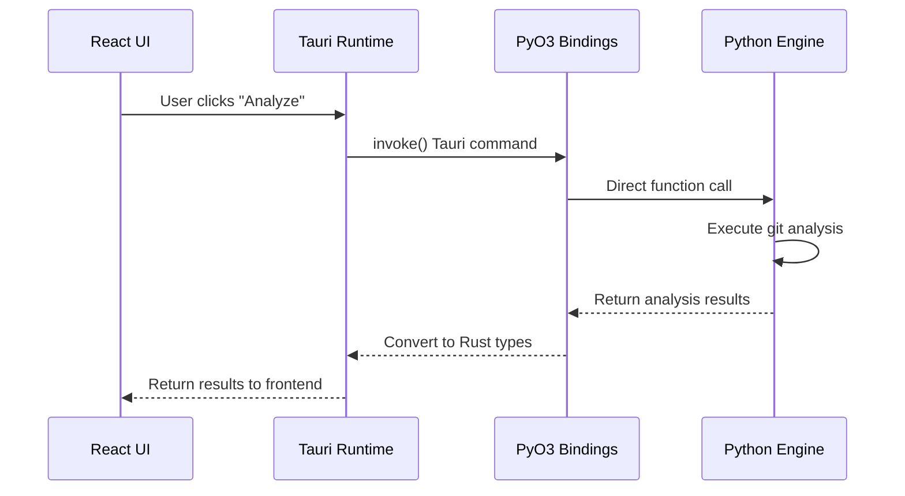

# System Architecture Overview

Modern PyO3-based architecture with Tauri desktop frontend and embedded Python backend.

## For Python Developers

If you're unfamiliar with the frontend technologies, see the **[Technology Primer](../technology-primer.md)** first. This document explains how the Python backend you'll work with integrates directly into the desktop application.

**Key concept**: The Python backend runs embedded within the Tauri application via PyO3 bindings, enabling direct function calls without network communication. You can develop and test the Python analysis logic independently.

## Architecture

## Core Components

### Frontend Stack

-   **Tauri** - Cross-platform desktop framework
-   **React 18** - Modern UI with hooks
-   **TypeScript** - Type safety
-   **Vite** - Fast build tool
-   **Tailwind CSS** - Utility-first styling
-   **Zustand** - Lightweight state management

### Backend Stack

-   **PyO3** - Rust bindings for Python interpreter
-   **Python Analysis Engine** - Git analysis and data processing
-   **Pydantic** - Data validation and type safety
-   **GitPython** - Git operations
-   **Legacy Engine** - Sophisticated analysis algorithms

## Integration Design

### Key Functions

-   `execute_analysis()` - Repository analysis via PyO3
-   `get_settings()` / `save_settings()` - Settings management
-   `get_engine_info()` - Engine capabilities
-   `get_performance_stats()` - Performance monitoring

### Communication

-   **Protocol** - Direct Python function calls via PyO3
-   **Validation** - Pydantic models for type safety
-   **Error handling** - PyResult<T> and PyErr types
-   **GIL Management** - Automatic Global Interpreter Lock handling

## Data Flow

## Design Principles

### Separation of Concerns

-   **Frontend** - UI, state management, visualization
-   **Backend** - Git analysis, data processing, persistence
-   **Communication** - Direct PyO3 function call boundary

### Performance

-   **Direct integration** - No IPC overhead via PyO3
-   **Parallel processing** - Multi-threaded analysis
-   **Efficient data structures** - Memory optimization
-   **Caching** - Result and operation caching

### Reliability

-   **Error handling** - PyResult<T> and PyErr types
-   **Input validation** - Type-safe Python objects
-   **Logging** - Structured logging with levels
-   **Performance monitoring** - Application-level metrics

## Development vs Production

!!! info "Detailed Development Architecture"

    For comprehensive information about development setup and PyO3 integration patterns, see **[Development Architecture](../development/development-architecture.md)**.

### Development Mode

-   **Single process** with embedded Python via PyO3
-   Hot module replacement for frontend changes
-   Python code changes require application restart
-   Direct function call debugging
-   Comprehensive development tools

### Production Build

-   **Single bundled application** with embedded Python interpreter
-   No network communication required
-   Optimized performance with direct function calls
-   Cross-platform deployment

## Technology Rationale

### Why PyO3 Direct Integration?

**Previous HTTP API limitations:**

-   Network communication overhead
-   Complex error handling across HTTP boundary
-   Separate process management
-   JSON serialization/deserialization costs

**PyO3 integration benefits:**

-   Zero IPC overhead with direct function calls
-   Native error propagation via PyResult<T>
-   Single process deployment simplicity
-   Type-safe Python object handling

### Stack Choices

**Tauri + React:**

-   Native performance with web tech
-   Cross-platform compatibility
-   Rich ecosystem
-   Modern development experience

**PyO3 + Python:**

-   Excellent git libraries
-   Fast development
-   Direct Rust-Python integration
-   Embedded Python interpreter

## Performance Architecture

### Analysis Optimization

-   **Parallel processing** - Configurable worker count
-   **Memory efficiency** - Optimized data structures
-   **Git operation batching** - Reduced command overhead
-   **Incremental analysis** - Large repository support

### Frontend Optimization

-   **Virtual scrolling** - Large dataset handling
-   **Component memoization** - Expensive calculation caching
-   **Lazy loading** - Progressive component loading
-   **State efficiency** - Minimal re-renders

## Monitoring

### Logging

-   **Levels** - DEBUG, INFO, WARNING, ERROR, CRITICAL
-   **Structured** - JSON format for analysis
-   **Destinations** - Console (dev), files (prod)

### Application Monitoring

-   **Performance metrics** - Function call times, memory usage
-   **Error tracking** - PyErr exception handling and logging
-   **Python integration** - GIL usage and PyO3 performance
-   **Application health** - Desktop app responsiveness

## Summary

PyO3-based architecture provides robust, maintainable foundation with direct integration between desktop frontend and embedded Python backend. Designed for performance, reliability, and simplified deployment with zero network overhead.
