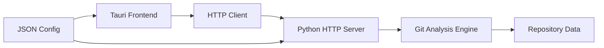

# Technology Stack

GitInspectorGUI technology stack and architectural decisions.

## Frontend

### Core Framework

-   **[Tauri 2.x](https://tauri.app/)** - Rust-based desktop framework
    -   System webview (no Chromium bundle)
    -   Native performance and security
    -   Auto-updater support
    -   Cross-platform (Windows, macOS, Linux)

### UI Stack

-   **React 18+** - Component framework
-   **TypeScript 5+** - Type safety
-   **Tailwind CSS 3+** - Utility-first styling
-   **shadcn/ui** - Component library
-   **Zustand 4+** - State management

### Data Tables

-   **TanStack Table v8** - Advanced table functionality
    -   Column filtering and sorting
    -   Virtual scrolling
    -   Row expansion
    -   Custom cell renderers

## Backend

### Core Runtime

-   **Python 3.13+** - Primary backend language
    -   `asyncio` for async operations
    -   `concurrent.futures` for parallel processing
    -   `multiprocessing` for CPU-intensive tasks

### CLI Framework

-   **argparse** - Command-line interface
-   **JSON Schema** - Configuration validation
-   **Shared settings** - CLI/GUI parity

### HTTP API

-   **FastAPI** or **Flask** - HTTP server framework
-   **JSON-RPC** - Structured communication protocol
-   **WebSocket** - Real-time updates (optional)

## Architecture

### Communication

-   **HTTP API** - REST endpoints for data exchange
-   **Tauri Commands** - Direct Rust ↔ Frontend calls
-   **Process Management** - Long-running Python processes
-   **JSON Configuration** - Shared settings between CLI/GUI

### Data Flow

## Package Management

### Frontend Dependencies

-   **pnpm 9+** - Fast, disk-efficient package manager
-   **Vite 5+** - Build tool and dev server
-   **ESLint + Prettier** - Code quality

### Backend Dependencies

-   **uv** - Fast Python package manager
-   **pyproject.toml** - Modern Python packaging
-   **Virtual environments** - Isolated dependencies

## Distribution

### Desktop Applications

-   **Tauri Bundler** - Native installers
    -   Windows: `.msi`, `.exe`
    -   macOS: `.dmg`, `.app`
    -   Linux: `.deb`, `.rpm`, `.AppImage`
-   **Auto-updater** - Seamless updates via GitHub releases

### CLI Distribution

-   **PyPI Package** - `pip install gitinspector-gui`
-   **Standalone Binaries** - PyInstaller/Nuitka builds
-   **Docker Images** - Containerized deployment

## Development Tools

### Design System

-   **Figma** - UI/UX design and prototyping
-   **Flowbite Components** - Pre-built UI components
-   **Storybook** - Component documentation

### AI Development

-   **Structured schemas** - JSON Schema for configuration
-   **Modular architecture** - Clear separation of concerns
-   **Template-based** - Reusable patterns and boilerplates

## Version Requirements

| Technology | Minimum Version | Current Stable |
| ---------- | --------------- | -------------- |
| Python     | 3.13+           | 3.13.5         |
| Node.js    | 22+             | 22.12 LTS      |
| Rust       | 1.85+           | 1.85.0         |
| Git        | 2.45+           | 2.47.1         |
| Tauri      | 2.0+            | 2.1.0          |

## Related Documentation

-   **[Development Environment](../development/environment-setup.md)** - Setup instructions
-   **[Package Management](../development/package-management-overview.md)** - Frontend dependencies
