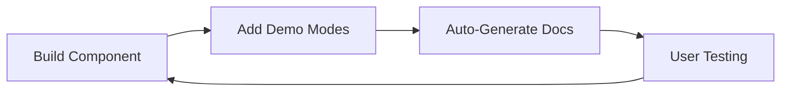

# Demo-Based GUI Development

## Overview

Development methodology where components include built-in demo modes for both development testing and interactive documentation.

## Core Concept

Components are built with integrated demo capabilities that serve dual purposes:

-   **Development** - Realistic testing with mock data
-   **Documentation** - Interactive examples for users

## Implementation

### Component Pattern

```typescript
interface ComponentProps {
    data?: RealData;
    demoMode?: boolean;
    demoScenario?: "basic" | "complex" | "error" | "loading";
}

export const AnalysisChart = ({
    data,
    demoMode,
    demoScenario,
}: ComponentProps) => {
    const chartData = demoMode ? generateDemoData(demoScenario) : data;

    return <div className="analysis-chart">{/* Implementation */}</div>;
};
```

### Demo Data Generation

```typescript
const generateDemoData = (scenario: string) => {
    switch (scenario) {
        case "basic":
            return { commits: 150, authors: 5, files: 25 };
        case "complex":
            return { commits: 5000, authors: 50, files: 500 };
        case "error":
            return null; // Trigger error state
        case "loading":
            return undefined; // Trigger loading state
        default:
            return { commits: 100, authors: 3, files: 15 };
    }
};
```

## Architecture

### Development Flow



### File Structure

```
src/
├── components/
│   ├── Chart.tsx           # Component with demo modes
│   └── Chart.stories.tsx   # Auto-generated stories
├── demo-data/
│   ├── scenarios.ts        # Demo scenarios
│   └── generators.ts       # Data generators
└── docs/
    └── interactive/        # Live demos
```

## Benefits

### Development

-   **Realistic testing** - Components tested with representative data
-   **Edge case coverage** - Multiple scenarios catch issues early
-   **Faster iteration** - Immediate visual feedback
-   **Consistent boundaries** - Clear component interfaces

### Documentation

-   **Always current** - Examples stay synchronized with code
-   **Interactive** - Users can try features before installation
-   **Realistic scenarios** - Demo data represents actual usage
-   **Progressive complexity** - Basic to advanced examples

## Integration

### Storybook Stories

```typescript
// Auto-generated from demo modes
export default {
    title: "Components/AnalysisChart",
    component: AnalysisChart,
};

export const Basic = () => <AnalysisChart demoMode demoScenario="basic" />;
export const Complex = () => <AnalysisChart demoMode demoScenario="complex" />;
export const Error = () => <AnalysisChart demoMode demoScenario="error" />;
export const Loading = () => <AnalysisChart demoMode demoScenario="loading" />;
```

### Testing Integration

```typescript
describe("AnalysisChart", () => {
    it("handles basic scenario", () => {
        const demoData = generateDemoData("basic");
        render(<AnalysisChart data={demoData} />);
        expect(screen.getByText("150 commits")).toBeInTheDocument();
    });

    it("handles error scenario", () => {
        render(<AnalysisChart demoMode demoScenario="error" />);
        expect(screen.getByText("No data available")).toBeInTheDocument();
    });
});
```

## Demo Scenarios

### Standard Scenarios

-   **basic** - Simple, typical usage
-   **complex** - Large dataset, stress testing
-   **error** - Error states and edge cases
-   **loading** - Loading and pending states
-   **empty** - No data scenarios

### Custom Scenarios

```typescript
const customScenarios = {
    "large-repo": { commits: 10000, authors: 100, files: 1000 },
    "single-author": { commits: 50, authors: 1, files: 10 },
    "many-files": { commits: 200, authors: 5, files: 500 },
};
```

## Workflow

### Component Development

1. **Build component** with real data interface
2. **Add demo modes** with realistic scenarios
3. **Generate documentation** from demo modes
4. **Deploy interactive demos** for user testing
5. **Collect feedback** to improve implementation

### AI Development Pattern

```typescript
// Enhanced prompt pattern for AI development
interface ComponentMeta {
    realDataInterface: DataInterface;
    demoScenarios: DemoScenario[];
    documentationExamples: DocExample[];
}

// AI builds with full context
export const Component = ({ data, demoMode, demoScenario }: Props) => {
    const displayData = demoMode ? generateDemoData(demoScenario) : data;
    return <Implementation data={displayData} />;
};
```

## Quality Assurance

### Consistency

-   **Single source of truth** - Same demo data across development, testing, docs
-   **Automatic synchronization** - Documentation updates with code changes
-   **Comprehensive coverage** - All component states documented

### Maintenance

-   **Reduced duplication** - No separate mock data for different purposes
-   **Feedback integration** - User interaction improves development quality
-   **Realistic testing** - Demo scenarios based on actual usage patterns

## Summary

Demo-based development creates components that are self-documenting and battle-tested from day one. Interactive documentation stays current with code while providing users hands-on experience before installation.
