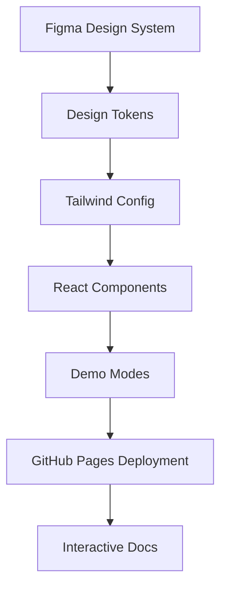
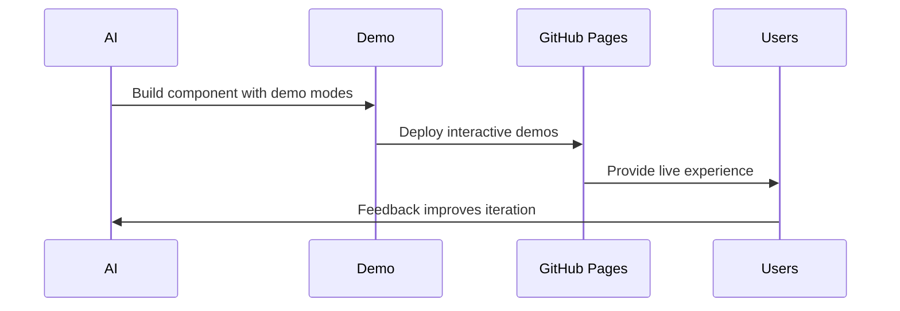

# Design System Integration

## Overview

Integration strategy for Figma design systems and GitHub Pages deployment with
demo-based development methodology.

> **Current Status**: The project currently uses GitHub Pages for experimental
> proof-of-concept demos. This document outlines the planned enhancement to a more
> powerful Figma-based design system with GitHub Pages deployment for enhanced
> interactive rapid prototyping capabilities.

## Current Implementation vs. Future Vision

### Current (Proof of Concept)

- **Platform**: GitHub Pages deployment
- **Demo**: Basic interactive demo with sample data
- **URL**: https://boost-edu-tools.github.io/gitinspectorgui/demo/
- **Purpose**: Validate core functionality and user experience concepts

### Future (Figma-Enhanced Design System)

- **Platform**: GitHub Pages (extended with Figma integration)
- **Design**: Figma-integrated design tokens and components
- **Demos**: Advanced interactive prototyping with realistic scenarios
- **Purpose**: Rapid iteration with design consistency and comprehensive user feedback

## GitHub Pages + Figma Integration Strategy

The current GitHub Pages deployment can be enhanced with Figma-based rapid prototyping:

### Enhanced CI/CD Pipeline

The deployment uses GitHub Actions for automated deployment:

```yaml
# .github/workflows/deploy.yml - Enhanced with Figma sync
name: Deploy to GitHub Pages
on:
  push:
    branches: [main]
  workflow_dispatch:

jobs:
  sync-figma-tokens:
    runs-on: ubuntu-latest
    steps:
      - uses: actions/checkout@v4
      - uses: actions/setup-node@v4
        with:
          node-version: "18"
      - name: Install Figma CLI
        run: npm install -g @figma/design-tokens-cli
      - name: Export Figma tokens
        run: |
          figma-tokens export --token ${{ secrets.FIGMA_TOKEN }} --file-id ${{ secrets.FIGMA_FILE_ID }}
          cp figma-tokens.json src/design-tokens/
        env:
          FIGMA_TOKEN: ${{ secrets.FIGMA_TOKEN }}
          FIGMA_FILE_ID: ${{ secrets.FIGMA_FILE_ID }}
      - name: Upload tokens artifact
        uses: actions/upload-artifact@v4
        with:
          name: figma-tokens
          path: src/design-tokens/figma-tokens.json

  deploy:
    needs: sync-figma-tokens
    runs-on: ubuntu-latest
    permissions:
      contents: read
      pages: write
      id-token: write
    environment:
      name: github-pages
      url: ${{ steps.deployment.outputs.page_url }}
    steps:
      - uses: actions/checkout@v4
      - name: Download Figma tokens
        uses: actions/download-artifact@v4
        with:
          name: figma-tokens
          path: src/design-tokens/
      - uses: actions/setup-node@v4
        with:
          node-version: "18"
      - name: Install dependencies
        run: npm install
      - name: Build with Figma integration
        run: |
          if [ -f "src/design-tokens/figma-tokens.json" ]; then
            echo "Building with Figma design tokens..."
            npm run build:figma
          else
            echo "Building with standard configuration..."
            npm run build
          fi
        env:
          NODE_ENV: production
      - name: Setup Pages
        uses: actions/configure-pages@v4
      - name: Upload artifact
        uses: actions/upload-pages-artifact@v3
        with:
          path: "./dist"
      - name: Deploy to GitHub Pages
        id: deployment
        uses: actions/deploy-pages@v4
```

### Design Token Integration

```typescript
// src/design-tokens/figma-integration.ts
import figmaTokens from "./figma-tokens.json";

export const generateTailwindConfig = () => ({
  theme: {
    colors: figmaTokens.colors,
    spacing: figmaTokens.spacing,
    typography: figmaTokens.typography,
    // Auto-generated from Figma
  },
});
```

## Architecture



## Design Token Pipeline

### Figma Integration

```javascript
// Auto-sync Figma tokens to Tailwind
const { figmaToTailwind } = require("@figma/design-tokens");

async function syncDesignTokens() {
  const tokens = await fetchFigmaTokens();
  const tailwindConfig = figmaToTailwind(tokens);
  await updateTailwindConfig(tailwindConfig);
}
```

### Component Development

```typescript
interface ComponentProps {
  data?: RealData;
  demoMode?: boolean;
  figmaVariant?: "default" | "compact" | "detailed";
}

export const DesignSystemComponent = ({
  data,
  demoMode,
  figmaVariant = "default",
}: ComponentProps) => {
  const styles = useFigmaTokens(figmaVariant);
  const displayData = demoMode ? generateDemoData() : data;

  return <div className={styles.container}>{/* Implementation */}</div>;
};
```

## GitHub Pages Multi-Environment Strategy

### Deployment Configuration

```yaml
# .github/workflows/pages.yml
name: Deploy Documentation and Demo
on:
  push:
    branches: [main]
  workflow_dispatch:

jobs:
  build-and-deploy:
    runs-on: ubuntu-latest
    permissions:
      contents: read
      pages: write
      id-token: write
    environment:
      name: github-pages
      url: ${{ steps.deployment.outputs.page_url }}
    steps:
      - uses: actions/checkout@v4

      # Build React demo with Figma integration
      - uses: actions/setup-node@v4
        with:
          node-version: "18"
      - name: Install dependencies
        run: npm install
      - name: Check for Figma tokens and build
        run: |
          if [ -f "src/design-tokens/figma-tokens.json" ]; then
            echo "Figma tokens found, building with design system integration..."
            npm run build:figma --base="/gitinspectorgui/demo/"
          else
            echo "No Figma tokens found, building with standard configuration..."
            npm run build --base="/gitinspectorgui/demo/"
          fi

      # Build documentation
      - uses: actions/setup-python@v4
        with:
          python-version: "3.11"
      - name: Install Python dependencies
        run: |
          pip install mkdocs mkdocs-material mkdocs-mermaid2-plugin
      - name: Build documentation
        run: mkdocs build

      # Combine and deploy
      - name: Prepare deployment
        run: |
          mkdir -p public
          cp -r site/* public/
          mkdir -p public/demo
          cp -r dist/* public/demo/

      - name: Setup Pages
        uses: actions/configure-pages@v4
      - name: Upload artifact
        uses: actions/upload-pages-artifact@v3
        with:
          path: "./public"
      - name: Deploy to GitHub Pages
        id: deployment
        uses: actions/deploy-pages@v4
```

### Repository Structure

```
gitinspectorgui/
├── src/
│   ├── components/        # React components
│   ├── design-tokens/     # Figma exports
│   │   ├── figma-tokens.json
│   │   └── tailwind-config.ts
│   └── demo-data/         # Sample data
├── docs/                  # MkDocs documentation
├── .github/
│   └── workflows/         # GitHub Actions
└── figma/
    ├── design-system.fig  # Figma file reference
    └── export-config.json # Token export settings
```

## Development Workflow

### Enhanced AI Development

```typescript
// AI prompt with Figma context
const aiPrompt = `
Build ${componentName} using:
- Design tokens from figma-tokens.json
- Flowbite patterns for ${componentType}
- Demo modes with realistic data
- Auto-deploy to GitHub Pages for testing
`;
```

### Feedback Loop



## Benefits

### Development

- **Design consistency** - Single source of truth from Figma
- **Rapid iteration** - Auto-deploy demos for testing
- **User feedback** - Real usage data drives improvements
- **Component reuse** - Shared design system across apps

### User Experience

- **Try before install** - Full app simulation in browser
- **Configuration wizard** - Visual setup matching desktop
- **Interactive tutorials** - Learn with realistic data
- **Settings export** - Download JSON for desktop app

## Implementation Phases

### Phase 1: Foundation

- Set up Figma design token export
- Configure Tailwind with Figma tokens
- Create AI prompts referencing design specs
- Build components with Figma constraints

### Phase 2: Deployment

- Enhance GitHub Pages with Figma integration
- Create auto-deployment pipeline with design tokens
- Build interactive demo framework
- Implement settings export

### Phase 3: Feedback Integration

- Add analytics to demos
- Create user behavior feedback loop
- Implement A/B testing
- Build performance monitoring

## Repository Analysis Tool Benefits

### Interactive Features

- **Sample repository demos** - Try with curated examples
- **Blame analysis previews** - See output before running
- **Visual configuration** - Settings builder with preview
- **Performance testing** - Try different repository sizes

### Academic Integration

- **Course embedding** - Interactive demos in curricula
- **Student onboarding** - Progressive learning path
- **Configuration sharing** - Teachers share via URLs
- **Results comparison** - Compare analysis settings

## GitHub Actions Integration

### Automated Workflows

```yaml
# .github/workflows/figma-sync.yml
name: Sync Figma Design Tokens
on:
  schedule:
    - cron: "0 9 * * 1" # Weekly on Monday
  workflow_dispatch:

jobs:
  sync-tokens:
    runs-on: ubuntu-latest
    steps:
      - uses: actions/checkout@v4
      - name: Sync Figma tokens
        run: |
          npm install -g @figma/design-tokens-cli
          figma-tokens export --token ${{ secrets.FIGMA_TOKEN }}
      - name: Create Pull Request
        uses: peter-evans/create-pull-request@v5
        with:
          title: "chore: update Figma design tokens"
          body: "Automated update of design tokens from Figma"
          branch: figma-token-update
```

### Release Integration

```yaml
# .github/workflows/release.yml
name: Release
on:
  push:
    tags: ["v*"]

jobs:
  deploy-demo:
    runs-on: ubuntu-latest
    steps:
      - name: Deploy demo with release tag
        run: |
          npm run build --base="/gitinspectorgui/demo/v${{ github.ref_name }}/"
          # Deploy versioned demo for release testing
```

## Summary

Design system integration creates a comprehensive ecosystem where Figma designs, React
components, and GitHub Pages deployment work together through AI automation. This
produces consistent user experiences while enabling rapid iteration and user feedback
collection.

The GitHub Pages approach provides all the benefits of rapid prototyping and design
system integration while maintaining consistency with the existing development workflow
and adding powerful Figma-based design capabilities.

### Key Advantages

- **Native GitHub Integration** - Seamless workflow with existing repository
- **Automated Deployment** - GitHub Actions handle all deployment steps
- **Version Control** - Design tokens tracked in git with full history
- **Cost Effective** - No external services required
- **Scalable** - Supports multiple environments and versioned demos
- **Secure** - Figma tokens managed through GitHub Secrets
