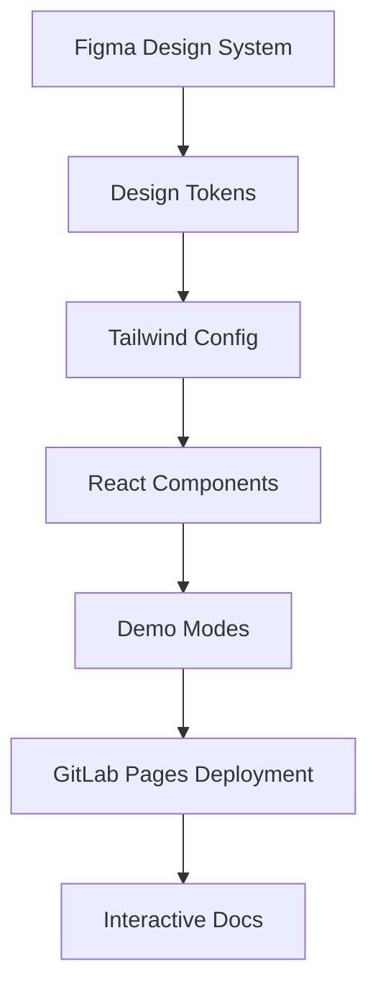

# Design System Integration

## Overview

Integration strategy for Figma design systems and GitLab Pages deployment with demo-based development methodology.

> **Current Status**: The project currently uses GitLab Pages for experimental proof-of-concept demos. This document outlines the planned enhancement to a more powerful Figma-based design system with GitLab Pages deployment for enhanced interactive rapid prototyping capabilities.

## Current Implementation vs. Future Vision

### Current (Proof of Concept)

- **Platform**: GitLab Pages deployment
- **Demo**: Basic interactive demo with sample data
- **URL**: https://boost-edu-tools.github.io/gitinspectorgui/
- **Purpose**: Validate core functionality and user experience concepts

### Future (Figma-Enhanced Design System)

- **Platform**: GitLab Pages (extended with Figma integration)
- **Design**: Figma-integrated design tokens and components
- **Demos**: Advanced interactive prototyping with realistic scenarios
- **Purpose**: Rapid iteration with design consistency and comprehensive user feedback

## GitLab Pages + Figma Integration Strategy

The current GitLab Pages deployment can be enhanced with Figma-based rapid prototyping without requiring Vercel:

### Enhanced CI/CD Pipeline

The deployment uses a trigger-based architecture where gitinspectorgui triggers edu-boost.gitlab.io for actual deployment:

```yaml
# gitinspectorgui/.gitlab-ci.yml - Enhanced with Figma sync
stages:
  - design-sync
  - deploy

sync-figma-tokens:
  stage: design-sync
  image: node:lts-slim
  script:
    - npm install -g @figma/design-tokens-cli
    - figma-tokens export --token $FIGMA_TOKEN --file-id $FIGMA_FILE_ID
    - cp figma-tokens.json src/design-tokens/
  artifacts:
    paths:
      - src/design-tokens/figma-tokens.json
  only:
    - main

trigger_group_pages:
  stage: deploy
  image: alpine:latest
  dependencies:
    - sync-figma-tokens
  before_script:
    - apk add --no-cache curl
  script:
    - echo "Triggering group pages rebuild with Figma tokens..."
    - |
      if curl -f -X POST \
          -F token=$DOCS_TRIGGER_TOKEN \
          -F ref=main \
          "https://gitlab.com/api/v4/projects/edu-boost%2Fedu-boost.gitlab.io/trigger/pipeline"; then
          echo "Group pages deployment triggered successfully"
          echo "Changes will be available at: https://boost-edu-tools.github.io/gitinspectorgui/"
      else
          echo "Failed to trigger deployment"
          exit 1
      fi
  rules:
    - if: $CI_COMMIT_REF_NAME == $CI_DEFAULT_BRANCH
```

### Design Token Integration

```typescript
// src/design-tokens/figma-integration.ts
import figmaTokens from "./figma-tokens.json";

export const generateTailwindConfig = () => ({
  theme: {
    colors: figmaTokens.colors,
    spacing: figmaTokens.spacing,
    typography: figmaTokens.typography,
    // Auto-generated from Figma
  },
});
```

## Architecture



## Design Token Pipeline

### Figma Integration

```javascript
// Auto-sync Figma tokens to Tailwind
const { figmaToTailwind } = require("@figma/design-tokens");

async function syncDesignTokens() {
  const tokens = await fetchFigmaTokens();
  const tailwindConfig = figmaToTailwind(tokens);
  await updateTailwindConfig(tailwindConfig);
}
```

### Component Development

```typescript
interface ComponentProps {
  data?: RealData;
  demoMode?: boolean;
  figmaVariant?: "default" | "compact" | "detailed";
}

export const DesignSystemComponent = ({
  data,
  demoMode,
  figmaVariant = "default",
}: ComponentProps) => {
  const styles = useFigmaTokens(figmaVariant);
  const displayData = demoMode ? generateDemoData() : data;

  return <div className={styles.container}>{/* Implementation */}</div>;
};
```

## GitLab Pages Multi-Environment Strategy

### Deployment Configuration

```yaml
# Enhanced edu-boost.gitlab.io/.gitlab-ci.yml
pages:
  image: node:lts-slim
  before_script:
    - apt-get update && apt-get install -y git python3 python3-pip python3-venv
    - npm install -g pnpm
  script:
    # Create public directory structure
    - mkdir -p public
    - cp index.html public/

    # Clone gitinspectorgui repository
    - |
      if [ -d "temp-gitinspectorgui/.git" ]; then
        echo "Repository exists, fetching latest changes..."
        cd temp-gitinspectorgui
        git fetch origin --depth=1
        git reset --hard origin/main
      else
        echo "Cloning repository..."
        git clone --depth 1 https://gitlab.com/edu-boost/gitinspectorgui.git temp-gitinspectorgui
        cd temp-gitinspectorgui
      fi

    # Check for Figma tokens and integrate if available
    - |
      if [ -f "src/design-tokens/figma-tokens.json" ]; then
        echo "Figma tokens found, building with design system integration..."
        pnpm install
        pnpm build:figma --base="/gitinspectorgui/demo/"
      else
        echo "No Figma tokens found, building with standard configuration..."
        pnpm install
        pnpm build --base="/gitinspectorgui/demo/"
      fi

    # Build documentation
    - echo "Building documentation..."
    - python3 -m venv venv
    - source venv/bin/activate
    - pip install mkdocs mkdocs-material mkdocs-mermaid2-plugin
    - mkdocs build

    # Deploy to public directory
    - cd ..
    - mkdir -p public/gitinspectorgui
    - cp -r temp-gitinspectorgui/site/* public/gitinspectorgui/
    - mkdir -p public/gitinspectorgui/demo
    - cp -r temp-gitinspectorgui/dist/* public/gitinspectorgui/demo/

    # Deploy structure:
    # /gitinspectorgui/          -> Documentation
    # /gitinspectorgui/demo/     -> Interactive demo (with Figma integration if available)
```

### Repository Structure

```
gitinspectorgui/
├── src/
│   ├── components/        # React components
│   ├── design-tokens/     # Figma exports
│   │   ├── figma-tokens.json
│   │   └── tailwind-config.ts
│   └── demo-data/         # Sample data
├── docs/                  # MkDocs documentation
├── storybook/            # Component showcase
└── figma/
    ├── design-system.fig  # Figma file reference
    └── export-config.json # Token export settings
```

## Development Workflow

### Enhanced AI Development

```typescript
// AI prompt with Figma context
const aiPrompt = `
Build ${componentName} using:
- Design tokens from figma-tokens.json
- Flowbite patterns for ${componentType}
- Demo modes with realistic data
- Auto-deploy to GitLab Pages for testing
`;
```

### Feedback Loop


## Benefits

### Development

- **Design consistency** - Single source of truth from Figma
- **Rapid iteration** - Auto-deploy demos for testing
- **User feedback** - Real usage data drives improvements
- **Component reuse** - Shared design system across apps

### User Experience

- **Try before install** - Full app simulation in browser
- **Configuration wizard** - Visual setup matching desktop
- **Interactive tutorials** - Learn with realistic data
- **Settings export** - Download JSON for desktop app

## Implementation Phases

### Phase 1: Foundation

- Set up Figma design token export
- Configure Tailwind with Figma tokens
- Create AI prompts referencing design specs
- Build components with Figma constraints

### Phase 2: Deployment

- Enhance GitLab Pages with Figma integration
- Create auto-deployment pipeline with design tokens
- Build interactive demo framework
- Implement settings export

### Phase 3: Feedback Integration

- Add analytics to demos
- Create user behavior feedback loop
- Implement A/B testing
- Build performance monitoring

## Repository Analysis Tool Benefits

### Interactive Features

- **Sample repository demos** - Try with curated examples
- **Blame analysis previews** - See output before running
- **Visual configuration** - Settings builder with preview
- **Performance testing** - Try different repository sizes

### Academic Integration

- **Course embedding** - Interactive demos in curricula
- **Student onboarding** - Progressive learning path
- **Configuration sharing** - Teachers share via URLs
- **Results comparison** - Compare analysis settings

## Summary

Design system integration creates a comprehensive ecosystem where Figma designs, React components, and GitLab Pages deployment work together through AI automation. This produces consistent user experiences while enabling rapid iteration and user feedback collection.

The GitLab Pages approach provides all the benefits of rapid prototyping and design system integration without requiring external services like Vercel, maintaining consistency with the existing development workflow while adding powerful Figma-based design capabilities.
