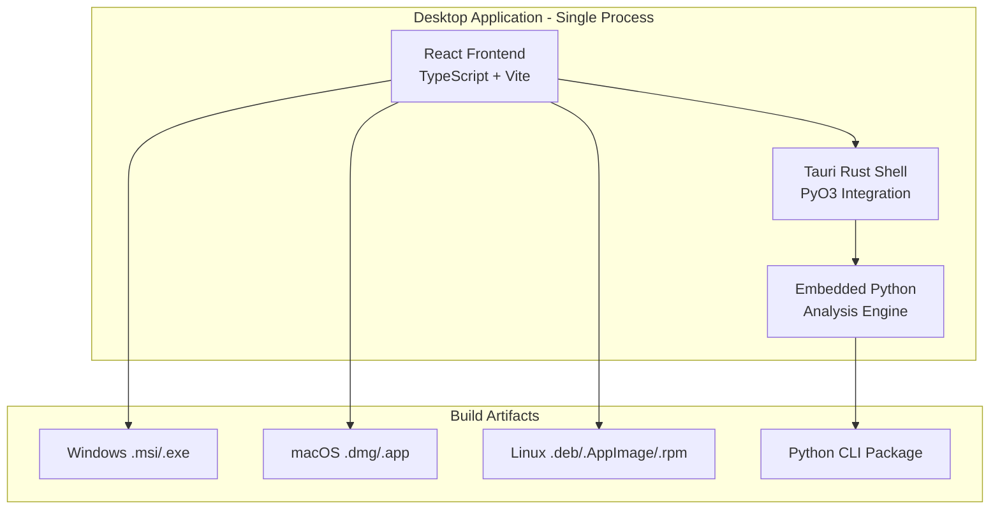
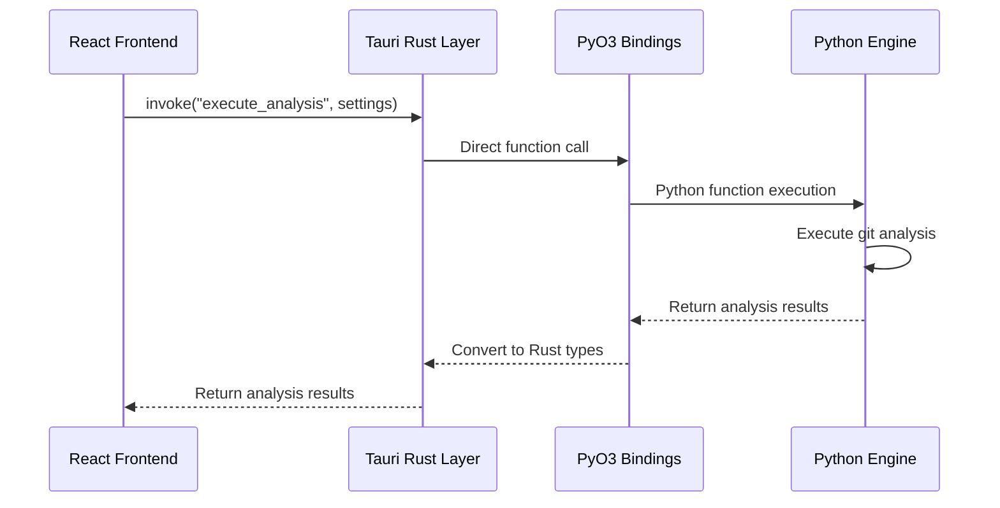

# Build Process

This document provides a comprehensive overview of the GitInspectorGUI build process, explaining how the React frontend and embedded Python backend are integrated via PyO3 to create cross-platform desktop applications.

## Table of Contents

1. [Architecture Overview](#architecture-overview)
2. [Component Integration](#component-integration)
3. [Build Process Steps](#build-process-steps)
4. [Cross-Platform Building](#cross-platform-building)
5. [Build Artifacts](#build-artifacts)
6. [Application Structure](#application-structure)
7. [Build Configuration Files](#build-configuration-files)
8. [Development vs Production](#development-vs-production-builds)
9. [Build Optimization](#build-optimization)
10. [Troubleshooting](#troubleshooting-build-issues)
11. [Continuous Integration](#continuous-integration)
12. [Next Steps](#next-steps)

## Architecture Overview

GitInspectorGUI is a **Tauri-based desktop application** with PyO3 embedded Python that combines three main components:

-   **React + TypeScript frontend** (UI layer)
-   **Rust Tauri wrapper** (native desktop shell with PyO3 integration)
-   **Embedded Python backend** (git analysis engine via PyO3)



## Component Integration

### Frontend Integration

The React frontend is built using Vite and embedded directly into the Tauri application:

-   **Build Command**: `pnpm build` (runs `tsc && vite build`)
-   **Output**: `dist/` directory with compiled React app
-   **Integration**: Tauri configuration `frontendDist: "../dist"` embeds the built app

### PyO3 Backend Integration

The Python backend is embedded directly into the Rust Tauri application via PyO3:

-   **Embedded Python**: Python interpreter embedded in Rust binary via PyO3
-   **Direct Function Calls**: No separate process or HTTP communication
-   **Python Code Bundling**: Python source code bundled as Tauri resources
-   **CLI Package**: Separate Python wheel for command-line usage

### Communication Architecture

The components communicate through direct PyO3 function calls:



**Communication Flow:**

1. **Frontend to Tauri**: Uses Tauri's `invoke()` function for type-safe communication
2. **Tauri to PyO3 Helpers**: Simplified helper function calls
3. **PyO3 Helpers to Python**: Direct Python function invocation via embedded interpreter
4. **Error Handling**: Automatic error conversion through helper functions

## Build Process Steps

### 1. Dependency Installation

The build process begins by installing all required dependencies:

```bash
# Frontend dependencies (React, TypeScript, Vite)
pnpm install

# Python dependencies for CLI package
cd python && uv sync

# Tauri CLI (if not present)
pnpm add -g @tauri-apps/cli
```

### 2. Python CLI Package Build

The Python CLI package is built separately for command-line usage:

**Key Files:**

-   `python/pyproject.toml` - Python project configuration
-   `python/gigui/` - Python analysis engine
-   `python/gitinspectorcli_main.py` - CLI entry point

**Build Process:**

```bash
cd python
uv build
# Creates: dist/*.whl (Python wheel for CLI distribution)
```

The Python package provides:

-   Command-line interface for git analysis
-   Python library for programmatic usage
-   Same analysis engine used in desktop app

### 3. React Frontend Build

The frontend is built using Vite with TypeScript compilation:

```bash
pnpm run build  # Runs: tsc && vite build
# Creates: dist/ directory with compiled React app
```

**Build Configuration:**

-   `package.json` - Dependencies and build scripts
-   `vite.config.ts` - Vite build configuration
-   `tsconfig.json` - TypeScript compilation settings

### 4. PyO3 Integration & Tauri Build

The Tauri build process integrates all components via PyO3:

**Key Configuration (`src-tauri/Cargo.toml`):**

```toml
[dependencies]
pyo3 = { version = "0.22", features = ["auto-initialize"] }
tauri = { version = "2.0", features = ["shell-open"] }
serde = { version = "1.0", features = ["derive"] }
serde_json = "1.0"

[build-dependencies]
tauri-build = { version = "2.0" }
```

**Critical Integration Points:**

1. **Frontend Integration**: `frontendDist: "../dist"` - Tauri embeds the built React app
2. **Python Integration**: PyO3 helper functions provide simplified Python integration
3. **Python Code Bundling**: Python source bundled as Tauri resources
4. **Build Hooks**: `beforeBuildCommand` ensures frontend is built before packaging

### 5. Final Build Execution

The final step combines all components using Tauri's build system with PyO3:

```bash
# Complete build process
pnpm tauri build

# This executes:
# 1. beforeBuildCommand: pnpm build (frontend)
# 2. PyO3 compilation with embedded Python
# 3. Tauri compilation with bundled resources
# 4. Platform-specific packaging
```

## Cross-Platform Building

### Build Script Usage

The main build script (`scripts/build-gui-all-platforms.sh`) handles cross-platform compilation:

```bash
# Current platform only
./scripts/build-gui-all-platforms.sh --current

# All supported platforms
./scripts/build-gui-all-platforms.sh --all

# With clean build cache
./scripts/build-gui-all-platforms.sh --current --clean
```

### Platform-Specific Targets

#### Linux Targets

```bash
# x86_64 Linux
build_target "x86_64-unknown-linux-gnu" "Linux-x64"

# ARM64 Linux (if cross-compilation is set up)
build_target "aarch64-unknown-linux-gnu" "Linux-ARM64"
```

**Linux Artifacts:**

-   `.deb` packages (Debian/Ubuntu)
-   `.AppImage` (Universal Linux)
-   `.rpm` packages (Red Hat/Fedora)

#### macOS Targets

```bash
# Intel macOS
build_target "x86_64-apple-darwin" "macOS-Intel"

# Apple Silicon macOS
build_target "aarch64-apple-darwin" "macOS-Apple-Silicon"
```

**macOS Artifacts:**

-   `.dmg` disk images
-   `.app` application bundles
-   `.app.tar.gz` compressed bundles

#### Windows Targets

```bash
# x86_64 Windows
build_target "x86_64-pc-windows-msvc" "Windows-x64"
```

**Windows Artifacts:**

-   `.msi` installers
-   `.exe` NSIS installers

## Build Artifacts

### Artifact Organization

All build artifacts are organized in the `dist/releases/` directory:

```
dist/releases/
├── GitInspectorGUI_0.1.0_amd64.deb           # Linux Debian package
├── GitInspectorGUI_0.1.0_amd64.AppImage      # Linux AppImage
├── GitInspectorGUI_0.1.0_x86_64.rpm          # Linux RPM package
├── GitInspectorGUI_0.1.0_x64.msi             # Windows installer
├── GitInspectorGUI_0.1.0_x64_en-US.msi       # Windows localized installer
├── GitInspectorGUI_0.1.0_x64-setup.exe       # Windows NSIS installer
├── GitInspectorGUI_0.1.0_universal.dmg       # macOS disk image
├── GitInspectorGUI-aarch64-apple-darwin.app.tar.gz  # macOS Apple Silicon
├── GitInspectorGUI-x86_64-apple-darwin.app.tar.gz   # macOS Intel
├── gitinspectorgui-0.5.0-py3-none-any.whl    # Python CLI wheel
└── checksums.sha256                          # Verification checksums
```

### Artifact Verification

Each build includes checksums for integrity verification:

```bash
# Verify artifact integrity
sha256sum -c checksums.sha256

# Individual file verification
sha256sum GitInspectorGUI_0.1.0_x64.msi
```

## Application Structure

### Final Application Layout

The resulting desktop application contains all components in a unified package:

```
GitInspectorGUI/
├── gitinspectorgui                           # Main executable (Tauri + PyO3)
├── resources/
│   ├── python/                               # Python source code (bundled)
│   │   ├── gigui/                           # Python analysis engine
│   │   ├── pyproject.toml                   # Python project configuration
│   │   └── ...                              # All Python source files
│   └── frontend/                            # Built React app (embedded in Tauri)
│       ├── index.html
│       ├── assets/
│       │   ├── index-[hash].js              # Compiled JavaScript
│       │   ├── index-[hash].css             # Compiled CSS
│       │   └── ...
│       └── ...
├── icons/                                   # Application icons
└── _up_                                     # Tauri updater files (if enabled)
```

### Integration Mechanisms

#### PyO3 Helper Function Integration

-   **Embedded Python**: Python interpreter embedded directly in Rust binary via PyO3 helpers
-   **Direct Function Calls**: No IPC overhead, simplified function calls through helpers
-   **Python Code Access**: Python source bundled as Tauri resources
-   **GIL Management**: Automatic Global Interpreter Lock handling via helper functions

#### Resource Bundling

-   **Python Source**: Bundled as resources via Tauri configuration
-   **React Frontend**: Embedded directly into Tauri executable
-   **Static Assets**: Icons, configuration files included in bundle

#### Runtime Communication

-   **Tauri Commands**: Rust functions exposed to frontend via `invoke()`
-   **PyO3 Helper Integration**: Simplified Python function calls through helper functions
-   **Type Safety**: Automatic type conversion and error handling via helpers
-   **Memory Management**: Automatic Python object lifecycle management through helpers

#### Process Management

-   **Single Process**: All components run within one Tauri application
-   **Embedded Python**: Python interpreter runs within main process
-   **No Background Processes**: No separate server or sidecar processes
-   **Auto-updater**: Built-in update mechanism for seamless updates

## Build Configuration Files

### Frontend Configuration

-   `package.json` - Node.js dependencies and scripts
-   `vite.config.ts` - Vite build configuration
-   `tsconfig.json` - TypeScript compiler options
-   `tailwind.config.js` - Tailwind CSS configuration
-   `postcss.config.js` - PostCSS processing

### PyO3 Helper Function Configuration

-   `src-tauri/Cargo.toml` - Rust and PyO3 dependencies
-   `src-tauri/build.rs` - Rust build script
-   `src-tauri/src/main.rs` - PyO3 helper function integration
-   `src-tauri/src/commands.rs` - Tauri commands using PyO3 helpers

### Python Configuration

-   `pyproject.toml` - Python project and dependencies (CLI package)
-   `python/gigui/` - Python analysis engine source code

### Tauri Configuration

-   `src-tauri/tauri.conf.json` - Main Tauri configuration
-   `src-tauri/tauri.conf.dev.json` - Development-specific configuration

### Build Scripts

-   `scripts/build-gui-all-platforms.sh` - Main cross-platform build script
-   `scripts/build-cli-all-platforms.sh` - CLI package build script
-   `scripts/prepare-release.sh` - Release preparation automation
-   `scripts/test-release.sh` - Release testing automation

## Development vs Production Builds

### Development Build

```bash
# Frontend development server with PyO3 helper function backend
pnpm run tauri dev

# This starts:
# 1. Vite dev server for frontend hot reload
# 2. Tauri application with embedded Python via PyO3 helpers
# 3. Simplified Python function calls through helper functions (no separate server)
```

### Production Build

```bash
# Complete production build
./scripts/build-gui-all-platforms.sh --current

# With clean build cache
./scripts/build-gui-all-platforms.sh --current --clean

# Verbose output for debugging
./scripts/build-gui-all-platforms.sh --current --verbose
```

## Build Optimization

### Performance Optimizations

-   **Frontend**: Vite's optimized bundling with tree-shaking
-   **PyO3 Helpers**: Simplified function calls with zero IPC overhead
-   **Tauri**: Rust's zero-cost abstractions and optimized compilation
-   **Python**: Embedded interpreter with optimized module loading

### Size Optimizations

-   **Frontend**: Code splitting and lazy loading
-   **Python**: Only necessary Python modules bundled
-   **Bundle**: Resource compression and deduplication
-   **Icons**: Multiple resolutions for different platforms

### PyO3 Helper Function Optimizations

-   **GIL Management**: Efficient Global Interpreter Lock usage handled by helpers
-   **Memory Management**: Automatic Python object cleanup through helpers
-   **Type Conversion**: Optimized Python ↔ Rust type conversion via helpers
-   **Error Handling**: Automatic error conversion without manual serialization

## Troubleshooting Build Issues

### Common Issues

#### Frontend Build Failures

```bash
# Clear node_modules and reinstall
rm -rf node_modules pnpm-lock.yaml
pnpm install

# TypeScript compilation errors
pnpm run build --verbose
```

#### PyO3 Helper Function Build Failures

```bash
# Clear Rust build cache
rm -rf src-tauri/target

# Check PyO3 Python compatibility
python --version  # Should be 3.8+

# Rebuild with verbose output
cd src-tauri && cargo build --verbose
```

#### Python Integration Issues

```bash
# Test Python modules independently
cd python
python -c "from gigui.analysis import execute_analysis; print('OK')"

# Check Python environment
uv sync
```

#### Tauri Build Failures

```bash
# Clear all caches
rm -rf src-tauri/target dist node_modules

# Full clean rebuild
pnpm install
pnpm run tauri build --verbose
```

### Platform-Specific Issues

#### Linux

-   Ensure required system libraries are installed
-   Check Python development headers: `python3-dev`
-   Verify PyO3 compilation requirements

#### macOS

-   Code signing requirements for distribution
-   Python framework compatibility
-   Universal binary considerations for PyO3

#### Windows

-   Visual Studio Build Tools requirements
-   Python installation compatibility
-   PyO3 Windows-specific compilation

### PyO3 Helper Function Issues

#### Python Version Compatibility

```bash
# Check Python version (3.8+ required)
python --version

# Verify PyO3 helpers can find Python (see Rust Logging in Environment Setup)
RUST_LOG=pyo3=debug cargo build
```

#### GIL and Threading Issues

```bash
# Debug GIL-related issues (handled automatically by helpers)
RUST_LOG=pyo3=debug pnpm run tauri dev

# Check for deadlocks or performance issues
```

#### Memory Issues

```bash
# Monitor memory usage during build
top -p $(pgrep cargo)

# Check for memory leaks in Python integration
valgrind --tool=memcheck ./target/debug/gitinspectorgui
```

## Continuous Integration

The build process is automated through GitHub Actions:

-   **Automated Builds**: Triggered on commits and tags
-   **Multi-Platform**: Builds for all supported platforms
-   **PyO3 Helper Testing**: Automated testing of simplified Python integration
-   **Release**: Automatic release creation and artifact upload

See the [Operations documentation](../operations/deployment.md) for detailed CI/CD configuration.

## Next Steps

After successful build:

1. **Test the Applications**: Use `./scripts/test-release.sh`
2. **Test PyO3 Helper Integration**: Verify Python functions work correctly through helpers
3. **Create Release Tag**: `git tag vX.Y.Z && git push origin vX.Y.Z`
4. **Upload to Releases**: `glab release create vX.Y.Z dist/releases/*`
5. **Update Auto-updater**: Configure update endpoints
6. **Publish Python CLI**: `cd python && uv publish`

For version management, use `./scripts/prepare-release.sh X.Y.Z` to prepare version updates across all components.

## PyO3 Helper Function Build Architecture Summary

The PyO3 helper function build architecture provides:

-   **Single Process**: All components embedded in one Tauri application
-   **Simplified Integration**: Python functions called through clean helper function abstractions
-   **Simplified Deployment**: No separate server processes to manage
-   **Better Performance**: Zero IPC overhead with simplified function calls
-   **Type Safety**: Helper functions provide safe Python-Rust integration with automatic error handling
-   **Cross-Platform**: Consistent architecture across all platforms

This architecture eliminates the complexity of both multi-process coordination and PyO3 boilerplate while maintaining all the functionality of the original system through clean, simplified abstractions.
