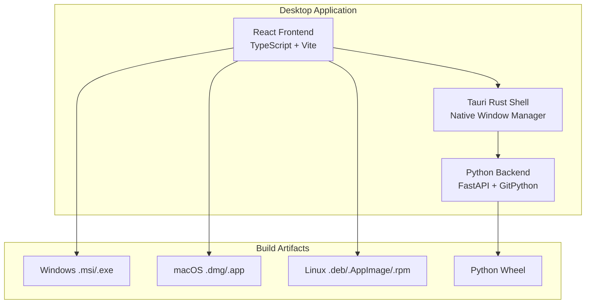
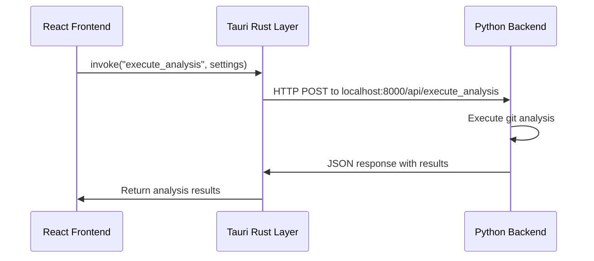

# Build Process

This document provides a comprehensive overview of the GitInspectorGUI build process, explaining how the React frontend, Python FastAPI backend, and Tauri wrapper are integrated to create cross-platform desktop applications.

## Table of Contents

1. [Architecture Overview](#architecture-overview)
2. [Component Integration](#component-integration)
3. [Build Process Steps](#build-process-steps)
4. [Cross-Platform Building](#cross-platform-building)
5. [Build Artifacts](#build-artifacts)
6. [Application Structure](#application-structure)
7. [Build Configuration Files](#build-configuration-files)
8. [Development vs Production](#development-vs-production-builds)
9. [Build Optimization](#build-optimization)
10. [Troubleshooting](#troubleshooting-build-issues)
11. [Continuous Integration](#continuous-integration)
12. [Next Steps](#next-steps)

## Architecture Overview

GitInspectorGUI is a **Tauri-based desktop application** that combines three main components:

-   **React + TypeScript frontend** (UI layer)
-   **Rust Tauri wrapper** (native desktop shell)
-   **Python FastAPI backend** (git analysis engine)



## Component Integration

### Frontend Integration

The React frontend is built using Vite and embedded directly into the Tauri application:

-   **Build Command**: `pnpm build` (runs `tsc && vite build`)
-   **Output**: `dist/` directory with compiled React app
-   **Integration**: Tauri configuration `frontendDist: "../dist"` embeds the built app

### Backend Integration

The Python backend is packaged as both a bundled resource and standalone executable:

-   **Bundled Resource**: Entire `python/` directory included in app resources
-   **Standalone Executable**: PyInstaller creates `gitinspector-api-sidecar` binary
-   **Integration**: Tauri configuration `resources: {"../python": "./"}` bundles Python code

### Communication Architecture

The components communicate through a well-defined API layer:



**Communication Flow:**

1. **Frontend to Tauri**: Uses Tauri's `invoke()` function for type-safe communication
2. **Tauri to Python**: HTTP requests to local FastAPI server on `localhost:8000`
3. **Python API**: FastAPI server handling analysis requests with JSON responses

## Build Process Steps

### 1. Dependency Installation

The build process begins by installing all required dependencies:

```bash
# Frontend dependencies (React, TypeScript, Vite)
pnpm install

# Python dependencies (FastAPI, GitPython, etc.)
uv sync

# Tauri CLI (if not present)
pnpm add -g @tauri-apps/cli
```

### 2. Python Backend Build

The Python backend is built as a standalone executable using PyInstaller:

**Key Files:**

-   `python/build-api-sidecar.sh` - Build script
-   `python/api-sidecar.spec` - PyInstaller configuration
-   `python/gigui/api.py` - Main API entry point

**Build Process:**

```bash
cd python
uv run pyinstaller api-sidecar.spec --clean --noconfirm
# Creates: dist/gitinspector-api-sidecar (executable)
```

The PyInstaller spec creates a **single-file executable** that includes:

-   FastAPI server
-   Git analysis engine (legacy engine wrapper)
-   All Python dependencies
-   Command-line interface for JSON communication

**Python Package Build:**

```bash
cd python
uv build
# Creates: dist/*.whl (Python wheel for distribution)
```

### 3. React Frontend Build

The frontend is built using Vite with TypeScript compilation:

```bash
pnpm run build  # Runs: tsc && vite build
# Creates: dist/ directory with compiled React app
```

**Build Configuration:**

-   `package.json` - Dependencies and build scripts
-   `vite.config.ts` - Vite build configuration
-   `tsconfig.json` - TypeScript compilation settings

### 4. Tauri Integration & Packaging

The Tauri configuration defines how all components are integrated:

**Key Configuration (`src-tauri/tauri.conf.json`):**

```json
{
    "build": {
        "beforeBuildCommand": "pnpm build",
        "frontendDist": "../dist"
    },
    "bundle": {
        "resources": {
            "../python": "./"
        }
    }
}
```

**Critical Integration Points:**

1. **Frontend Integration**: `frontendDist: "../dist"` - Tauri embeds the built React app
2. **Backend Integration**: `"../python": "./"` - Tauri bundles the entire Python directory
3. **Build Hooks**: `beforeBuildCommand` ensures frontend is built before packaging

### 5. Final Build Execution

The final step combines all components using Tauri's build system:

```bash
# Complete build process
pnpm tauri build

# This executes:
# 1. beforeBuildCommand: pnpm build (frontend)
# 2. Tauri compilation with bundled resources
# 3. Platform-specific packaging
```

## Cross-Platform Building

### Build Script Usage

The main build script (`scripts/build-all-platforms.sh`) handles cross-platform compilation:

```bash
# Current platform only
./scripts/build-all-platforms.sh --current

# All supported platforms
./scripts/build-all-platforms.sh --all

# With clean build cache
./scripts/build-all-platforms.sh --current --clean
```

### Platform-Specific Targets

#### Linux Targets

```bash
# x86_64 Linux
build_target "x86_64-unknown-linux-gnu" "Linux-x64"

# ARM64 Linux (if cross-compilation is set up)
build_target "aarch64-unknown-linux-gnu" "Linux-ARM64"
```

**Linux Artifacts:**

-   `.deb` packages (Debian/Ubuntu)
-   `.AppImage` (Universal Linux)
-   `.rpm` packages (Red Hat/Fedora)

#### macOS Targets

```bash
# Intel macOS
build_target "x86_64-apple-darwin" "macOS-Intel"

# Apple Silicon macOS
build_target "aarch64-apple-darwin" "macOS-Apple-Silicon"
```

**macOS Artifacts:**

-   `.dmg` disk images
-   `.app` application bundles
-   `.app.tar.gz` compressed bundles

#### Windows Targets

```bash
# x86_64 Windows
build_target "x86_64-pc-windows-msvc" "Windows-x64"
```

**Windows Artifacts:**

-   `.msi` installers
-   `.exe` NSIS installers

## Build Artifacts

### Artifact Organization

All build artifacts are organized in the `dist/releases/` directory:

```
dist/releases/
├── GitInspectorGUI_0.1.0_amd64.deb           # Linux Debian package
├── GitInspectorGUI_0.1.0_amd64.AppImage      # Linux AppImage
├── GitInspectorGUI_0.1.0_x86_64.rpm          # Linux RPM package
├── GitInspectorGUI_0.1.0_x64.msi             # Windows installer
├── GitInspectorGUI_0.1.0_x64_en-US.msi       # Windows localized installer
├── GitInspectorGUI_0.1.0_x64-setup.exe       # Windows NSIS installer
├── GitInspectorGUI_0.1.0_universal.dmg       # macOS disk image
├── GitInspectorGUI-aarch64-apple-darwin.app.tar.gz  # macOS Apple Silicon
├── GitInspectorGUI-x86_64-apple-darwin.app.tar.gz   # macOS Intel
├── gitinspectorgui-0.5.0-py3-none-any.whl    # Python wheel
└── checksums.sha256                          # Verification checksums
```

### Artifact Verification

Each build includes checksums for integrity verification:

```bash
# Verify artifact integrity
sha256sum -c checksums.sha256

# Individual file verification
sha256sum GitInspectorGUI_0.1.0_x64.msi
```

## Application Structure

### Final Application Layout

The resulting desktop application contains all components in a unified package:

```
GitInspectorGUI/
├── gitinspectorgui                           # Main executable (Tauri)
├── resources/
│   ├── python/                               # Complete Python backend
│   │   ├── gigui/                           # Python analysis engine
│   │   ├── dist/
│   │   │   └── gitinspector-api-sidecar     # Standalone Python executable
│   │   ├── pyproject.toml                   # Python project configuration
│   │   └── ...                              # All Python source files
│   └── frontend/                            # Built React app (embedded in Tauri)
│       ├── index.html
│       ├── assets/
│       │   ├── index-[hash].js              # Compiled JavaScript
│       │   ├── index-[hash].css             # Compiled CSS
│       │   └── ...
│       └── ...
├── icons/                                   # Application icons
└── _up_                                     # Tauri updater files (if enabled)
```

### Integration Mechanisms

#### Resource Bundling

-   **Python Backend**: Bundled as resources via Tauri configuration
-   **React Frontend**: Embedded directly into Tauri executable
-   **Static Assets**: Icons, configuration files included in bundle

#### Runtime Communication

-   **Tauri Commands**: Rust functions exposed to frontend via `invoke()`
-   **HTTP API**: Python FastAPI server for analysis operations
-   **JSON Protocol**: Structured data exchange between all layers
-   **Type Safety**: TypeScript interfaces ensure type-safe communication

#### Process Management

-   **Main Process**: Tauri manages the desktop window and UI rendering
-   **Background Process**: Python API server runs as needed for analysis
-   **Sidecar Process**: Standalone Python executable for CLI operations
-   **Auto-updater**: Built-in update mechanism for seamless updates

## Build Configuration Files

### Frontend Configuration

-   `package.json` - Node.js dependencies and scripts
-   `vite.config.ts` - Vite build configuration
-   `tsconfig.json` - TypeScript compiler options
-   `tailwind.config.js` - Tailwind CSS configuration
-   `postcss.config.js` - PostCSS processing

### Backend Configuration

-   `pyproject.toml` - Python project and dependencies
-   `python/api-sidecar.spec` - PyInstaller executable specification
-   `python/build-api-sidecar.sh` - Python build script

### Tauri Configuration

-   `src-tauri/tauri.conf.json` - Main Tauri configuration
-   `src-tauri/tauri.conf.dev.json` - Development-specific configuration
-   `src-tauri/Cargo.toml` - Rust dependencies
-   `src-tauri/build.rs` - Rust build script

### Build Scripts

-   `scripts/build-all-platforms.sh` - Main cross-platform build script
-   `scripts/prepare-release.sh` - Release preparation automation
-   `scripts/test-release.sh` - Release testing automation

## Development vs Production Builds

### Development Build

```bash
# Frontend development server
pnpm dev

# Tauri development mode
pnpm tauri:dev

# Python development server
cd python && uv run python dev_api.py
```

### Production Build

```bash
# Complete production build
./scripts/build-all-platforms.sh --current

# With clean build cache
./scripts/build-all-platforms.sh --current --clean

# Verbose output for debugging
./scripts/build-all-platforms.sh --current --verbose
```

## Build Optimization

### Performance Optimizations

-   **Frontend**: Vite's optimized bundling with tree-shaking
-   **Backend**: PyInstaller single-file executable with minimal dependencies
-   **Tauri**: Rust's zero-cost abstractions and optimized compilation
-   **Assets**: Automatic compression and optimization

### Size Optimizations

-   **Frontend**: Code splitting and lazy loading
-   **Backend**: Excluded unnecessary Python packages in PyInstaller spec
-   **Bundle**: Resource compression and deduplication
-   **Icons**: Multiple resolutions for different platforms

## Troubleshooting Build Issues

### Common Issues

#### Frontend Build Failures

```bash
# Clear node_modules and reinstall
rm -rf node_modules pnpm-lock.yaml
pnpm install

# TypeScript compilation errors
pnpm run build --verbose
```

#### Python Build Failures

```bash
# Clear Python cache and rebuild
rm -rf python/dist python/build
cd python && uv build

# PyInstaller issues
cd python && uv run pyinstaller api-sidecar.spec --clean --noconfirm
```

#### Tauri Build Failures

```bash
# Clear Rust build cache
rm -rf src-tauri/target

# Rebuild with verbose output
cargo tauri build --verbose
```

### Platform-Specific Issues

#### Linux

-   Ensure required system libraries are installed
-   Check AppImage FUSE requirements
-   Verify package manager compatibility

#### macOS

-   Code signing requirements for distribution
-   Notarization for App Store distribution
-   Universal binary considerations

#### Windows

-   Visual Studio Build Tools requirements
-   Windows SDK compatibility
-   Antivirus false positives

## Continuous Integration

The build process is automated through GitLab CI/CD:

-   **Automated Builds**: Triggered on commits and tags
-   **Multi-Platform**: Builds for all supported platforms
-   **Testing**: Automated testing of build artifacts
-   **Release**: Automatic release creation and artifact upload

See the [Operations documentation](../operations/deployment.md) for detailed CI/CD configuration.

## Next Steps

After successful build:

1. **Test the Applications**: Use `./scripts/test-release.sh`
2. **Create Release Tag**: `git tag vX.Y.Z && git push origin vX.Y.Z`
3. **Upload to Releases**: `glab release create vX.Y.Z dist/releases/*`
4. **Update Auto-updater**: Configure update endpoints
5. **Publish Python Package**: `cd python && uv publish`

For version management, use `./scripts/prepare-release.sh X.Y.Z` to prepare version updates across all components.
