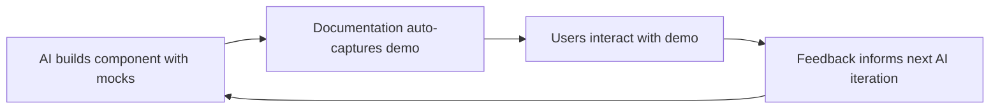

# Demo-Based Documentation-GUI Development

## Overview

This document describes a unified development methodology where components are built with integrated demo modes that serve both GUI development and interactive documentation simultaneously. This approach leverages AI's natural tendency to build with mock data and incremental testing to create a powerful development-documentation pipeline.

## Core Methodology

### Unified Component Development Philosophy

The key insight is that AI naturally builds components with mock data and realistic test scenarios. Instead of discarding this during development, we formalize and leverage it to create components that are:

- **Self-documenting** through their demo states
- **Battle-tested** with realistic scenarios from day one
- **Interactive** for both development and user education
- **Consistent** between development testing and user documentation

### The Demo-Based Approach

Every component gets developed with built-in demo capabilities:

```typescript
// AI-friendly component pattern
interface ComponentProps {
    data?: RealData;
    demoMode?: boolean;
    demoScenario?: "basic" | "complex" | "error" | "loading";
}

// AI naturally builds this way
export const AnalysisChart = ({
    data,
    demoMode,
    demoScenario,
}: ComponentProps) => {
    const chartData = demoMode ? generateDemoData(demoScenario) : data;
    
    // Component logic remains the same
    // Demo modes provide realistic data for development and documentation
    return (
        <div className="analysis-chart">
            {/* Chart implementation */}
        </div>
    );
};
```

## Technical Implementation

### Smart Component Architecture

Components are designed to seamlessly switch between real data and demo modes:

- **Real Data Mode**: Production usage with actual repository data
- **Demo Mode**: Development and documentation with realistic mock data
- **Scenario Support**: Multiple demo scenarios (success, loading, error, edge cases)
- **Automatic Extraction**: Demo scenarios automatically become documentation examples

### Development-Documentation Feedback Loop



This creates a virtuous cycle where:
1. AI builds components with realistic mock data
2. Documentation automatically captures these demo modes
3. Users interact with live demos in documentation
4. User feedback improves both AI prompts and component design

### Repository Structure

```
project/
├── src/
│   ├── components/
│   │   ├── Chart.tsx           # AI builds with demo modes
│   │   └── Chart.stories.tsx   # Auto-generated from demo modes
├── docs/
│   ├── interactive/            # Auto-deployed demos
│   └── api/                    # Generated from AI's mock implementations
├── ai-context/
│   ├── demo-data/              # Formalized from AI testing
│   ├── scenarios/              # AI test scenarios → user tutorials
│   └── prompts/                # Reusable AI development prompts
```

## AI Development Workflow Integration

### Enhanced AI Prompting Pattern

```
"Build component X with:
1. Real data interface for production use
2. Demo mode with realistic mock data
3. Multiple scenarios (success, loading, error, edge cases)
4. Export demo scenarios for automatic documentation generation"
```

### Auto-Documentation Pipeline

The methodology includes automatic documentation generation:

- **Component Analysis**: Extract demo modes from components automatically
- **Scenario Documentation**: Generate documentation examples from AI's test scenarios
- **Interactive Playgrounds**: Create interactive demos from AI's development iterations
- **Mock Data Reuse**: Use the same realistic data AI uses for testing

## Benefits

### For Development

- **Realistic Testing**: Components are tested with realistic scenarios from the start
- **Edge Case Coverage**: Demo modes naturally catch edge cases early
- **Natural Boundaries**: Component boundaries emerge naturally through demo scenarios
- **Faster Iteration**: Immediate visual feedback through demo modes

### For Documentation

- **Always Current**: Interactive examples are always up-to-date with code
- **Realistic Scenarios**: User scenarios match actual development testing
- **Rich Demo Data**: Demo data feels real and representative
- **Progressive Complexity**: Natural progression from basic to advanced scenarios

### For Users

- **Hands-on Learning**: Try functionality before installation
- **Real-world Understanding**: See actual usage patterns and capabilities
- **Risk-free Testing**: Test configurations and scenarios safely
- **Smooth Transition**: Easy progression from demo to real usage

## Implementation Workflow

### Component Development Process

1. **AI Builds Component**: With real data interface and demo modes
2. **Demo Scenarios**: Multiple realistic scenarios for different use cases
3. **Automatic Extraction**: Demo modes extracted for documentation
4. **Interactive Deployment**: Demos deployed as interactive documentation
5. **User Feedback**: Real user interaction data feeds back to development

### Development Prompt Enhancement

```typescript
// Enhanced AI development pattern
interface ComponentMeta {
    realDataInterface: DataInterface;
    demoScenarios: DemoScenario[];
    documentationExamples: DocExample[];
    userInteractionData?: InteractionMetrics[];
}

// AI builds with full context
export const EnhancedComponent = ({
    data,
    demoMode,
    demoScenario = "default"
}: ComponentProps) => {
    // Uses realistic demo data that becomes documentation
    const displayData = demoMode ? generateDemoData(demoScenario) : data;
    
    return <ComponentImplementation data={displayData} />;
};
```

## Integration with Development Tools

### Storybook Integration

Demo modes automatically generate Storybook stories:

```typescript
// Auto-generated from demo modes
export default {
    title: 'Components/AnalysisChart',
    component: AnalysisChart,
};

export const Basic = () => <AnalysisChart demoMode demoScenario="basic" />;
export const Complex = () => <AnalysisChart demoMode demoScenario="complex" />;
export const Error = () => <AnalysisChart demoMode demoScenario="error" />;
```

### Testing Integration

Demo scenarios become the foundation for comprehensive testing:

```typescript
// Tests use the same demo data as documentation
describe('AnalysisChart', () => {
    it('handles basic scenario', () => {
        const demoData = generateDemoData('basic');
        render(<AnalysisChart data={demoData} />);
        // Test assertions
    });
});
```

## Quality Assurance

### Consistency Benefits

- **Single Source of Truth**: Demo data used across development, testing, and documentation
- **Realistic Scenarios**: All scenarios based on actual development testing
- **Automatic Updates**: Documentation updates automatically with code changes
- **User-Tested Patterns**: Demo scenarios validated through user interaction

### Maintenance Advantages

- **Reduced Duplication**: No separate mock data for different purposes
- **Automatic Synchronization**: Documentation always matches current implementation
- **Comprehensive Coverage**: All component states documented through demo modes
- **Feedback Integration**: User feedback directly improves development quality

## Related Documents

This methodology integrates with:
- [Design System Integration](design-system-integration.md) - For advanced design system integration
- [Technology Stack](../architecture/technology-stack.md) - For the underlying technology choices
- [Development Mode](development-mode.md) - For development environment setup

## Summary

The demo-based documentation-GUI development methodology creates a unified approach where AI development practices directly enhance user experience, and user feedback improves AI development quality. Your documentation becomes a living, interactive representation of your application's capabilities, while your development process becomes more robust and user-focused.

This approach transforms the traditional separation between development and documentation into an integrated workflow that benefits developers, users, and the overall quality of the application.