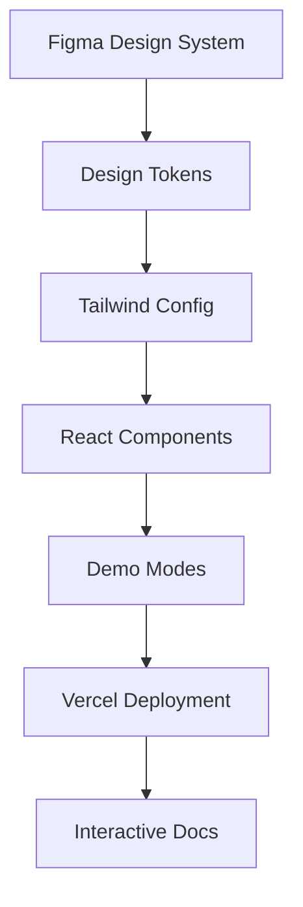
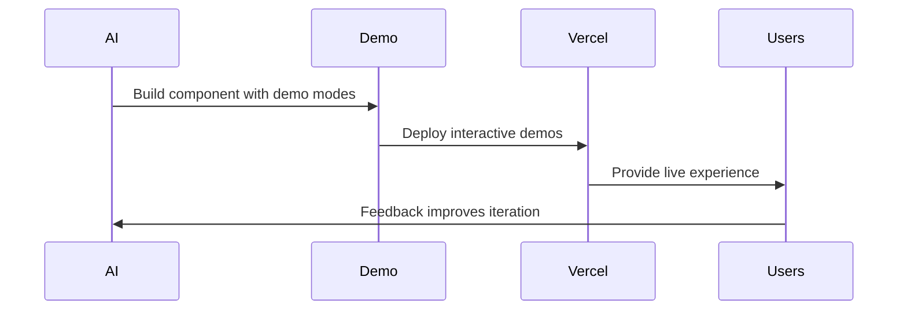

# Design System Integration

## Overview

Integration strategy for Figma design systems and Vercel deployment with demo-based development methodology.

## Architecture



## Design Token Pipeline

### Figma Integration

```javascript
// Auto-sync Figma tokens to Tailwind
const { figmaToTailwind } = require("@figma/design-tokens");

async function syncDesignTokens() {
    const tokens = await fetchFigmaTokens();
    const tailwindConfig = figmaToTailwind(tokens);
    await updateTailwindConfig(tailwindConfig);
}
```

### Component Development

```typescript
interface ComponentProps {
    data?: RealData;
    demoMode?: boolean;
    figmaVariant?: "default" | "compact" | "detailed";
}

export const DesignSystemComponent = ({
    data,
    demoMode,
    figmaVariant = "default",
}: ComponentProps) => {
    const styles = useFigmaTokens(figmaVariant);
    const displayData = demoMode ? generateDemoData() : data;

    return <div className={styles.container}>{/* Implementation */}</div>;
};
```

## Vercel Multi-Environment Strategy

### Deployment Configuration

```json
{
    "projects": [
        {
            "name": "docs",
            "source": "apps/docs",
            "domain": "docs.yourapp.com"
        },
        {
            "name": "playground",
            "source": "apps/playground",
            "domain": "try.yourapp.com"
        },
        {
            "name": "storybook",
            "source": "packages/ui",
            "domain": "components.yourapp.com"
        }
    ]
}
```

### Repository Structure

```
project/
├── apps/
│   ├── desktop/           # Tauri app
│   ├── docs/              # Documentation site
│   └── playground/        # Interactive demos
├── packages/
│   ├── ui/                # Shared components
│   ├── design-tokens/     # Figma exports
│   └── mock-data/         # Demo data
└── figma/
    ├── tokens.json        # Design tokens
    └── components.json    # Component specs
```

## Development Workflow

### Enhanced AI Development

```typescript
// AI prompt with Figma context
const aiPrompt = `
Build ${componentName} using:
- Design tokens from figma-tokens.json
- Flowbite patterns for ${componentType}
- Demo modes with realistic data
- Auto-deploy to Vercel for testing
`;
```

### Feedback Loop



## Benefits

### Development

-   **Design consistency** - Single source of truth from Figma
-   **Rapid iteration** - Auto-deploy demos for testing
-   **User feedback** - Real usage data drives improvements
-   **Component reuse** - Shared design system across apps

### User Experience

-   **Try before install** - Full app simulation in browser
-   **Configuration wizard** - Visual setup matching desktop
-   **Interactive tutorials** - Learn with realistic data
-   **Settings export** - Download JSON for desktop app

## Implementation Phases

### Phase 1: Foundation

-   Set up Figma design token export
-   Configure Tailwind with Figma tokens
-   Create AI prompts referencing design specs
-   Build components with Figma constraints

### Phase 2: Deployment

-   Set up Vercel multi-app deployment
-   Create auto-deployment pipeline
-   Build interactive demo framework
-   Implement settings export

### Phase 3: Feedback Integration

-   Add analytics to demos
-   Create user behavior feedback loop
-   Implement A/B testing
-   Build performance monitoring

## Repository Analysis Tool Benefits

### Interactive Features

-   **Sample repository demos** - Try with curated examples
-   **Blame analysis previews** - See output before running
-   **Visual configuration** - Settings builder with preview
-   **Performance testing** - Try different repository sizes

### Academic Integration

-   **Course embedding** - Interactive demos in curricula
-   **Student onboarding** - Progressive learning path
-   **Configuration sharing** - Teachers share via URLs
-   **Results comparison** - Compare analysis settings

## Summary

Design system integration creates a comprehensive ecosystem where Figma designs, React components, and Vercel deployment work together through AI automation. This produces consistent user experiences while enabling rapid iteration and user feedback collection.
