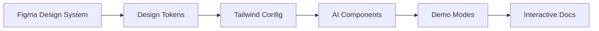
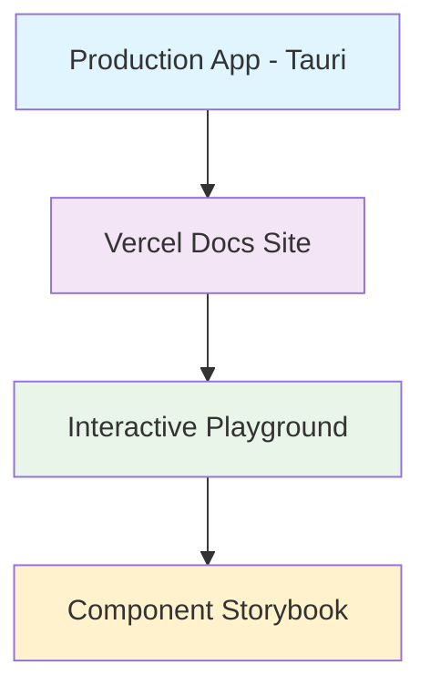
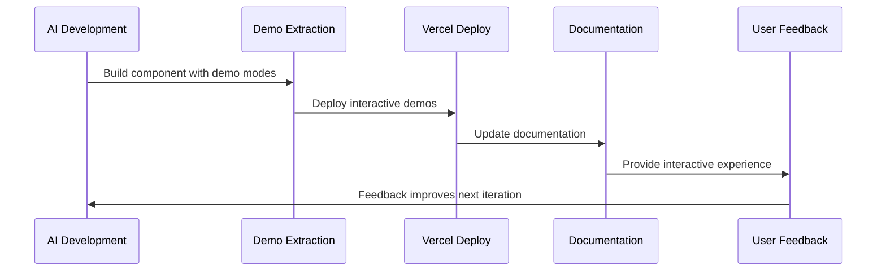
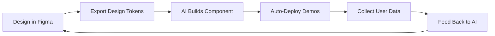

# Design System Integration

## Overview

This document describes how to integrate Figma design systems and Vercel deployment pipelines with the [Demo-Based Documentation-GUI Development](demo-based-documentation-gui-development.md) methodology to create a comprehensive AI-driven development ecosystem.

## Integration Strategy

The key insight is creating a **design-to-deployment pipeline** where:

1. **Figma provides design consistency** across your desktop app and web documentation
2. **Vercel enables rapid iteration** of your interactive documentation 
3. **AI bridges the gap** between design specs and working code
4. **User feedback from web demos** informs your desktop app development

For your specific repository analysis tool, this means academic users can:
- Try the tool with sample repositories before installing
- Visually configure complex settings through an interactive web interface
- Export their configurations as JSON files for the desktop app
- See live previews of blame analysis and change detection output

## Figma Integration Strategy

### Design Token Pipeline



**Implementation Approach:**
- Use Figma's **Design Tokens** plugin to export design system as JSON
- Configure **Tailwind CSS** to consume these tokens automatically
- AI components inherit consistent design language from Figma source
- Flowbite Figma Kit becomes your single source of truth

### AI-Enhanced Figma Workflow

```typescript
// AI prompt enhancement with Figma context
const aiPrompt = `
Build a ${componentName} component using:
- Design tokens from figma-tokens.json
- Flowbite design patterns for ${componentType}
- Demo modes with realistic data
- Export scenarios for interactive documentation
`;
```

### Component-Design Synchronization

- Use **Figma Dev Mode** to inspect spacing, colors, and interactions
- AI references Figma component specs during development
- Create Figma component → AI builds React equivalent → Auto-document
- Demo modes reflect actual Figma design specifications

## Vercel Integration Architecture

### Multi-Environment Strategy



**Three Vercel Deployments:**
1. **Main Documentation** (`docs.yourapp.com`) - Comprehensive documentation
2. **Interactive Playground** (`try.yourapp.com`) - Live demo environment
3. **Component Storybook** (`components.yourapp.com`) - Design system showcase

### Auto-Deployment Pipeline



## Technical Implementation

### Repository Structure

```
project/
├── apps/
│   ├── desktop/           # Tauri app
│   ├── docs/              # Next.js docs site
│   └── playground/        # Interactive demo app
├── packages/
│   ├── ui/                # Shared components
│   ├── design-tokens/     # Figma exports
│   └── mock-data/         # AI-generated test data
├── figma/
│   ├── tokens.json        # Exported design tokens
│   └── components.json    # Component specifications
└── vercel.json            # Multi-app deployment config
```

### Design Token Automation

```javascript
// scripts/sync-figma-tokens.js
const { figmaToTailwind } = require('@figma/design-tokens');

// Auto-sync Figma tokens to Tailwind config
async function syncDesignTokens() {
  const tokens = await fetchFigmaTokens();
  const tailwindConfig = figmaToTailwind(tokens);
  
  // Update shared Tailwind config
  await updateTailwindConfig(tailwindConfig);
  
  // Trigger AI component updates
  await triggerAIComponentSync();
}
```

### AI-Enhanced Component Development

```typescript
// Enhanced AI development pattern
interface ComponentMeta {
  figmaSpec: FigmaComponentSpec;
  demoScenarios: DemoScenario[];
  deployUrl?: string;
  feedbackData?: UserInteraction[];
}

// AI builds with Figma context
export const EnhancedComponent = ({
  data,
  demoMode,
  figmaVariant = "default"
}: ComponentProps) => {
  // Uses Figma design tokens automatically
  const styles = useFigmaTokens(figmaVariant);
  const chartData = demoMode ? generateDemoData() : data;
  
  return <div className={styles.container}>
    {/* Component implementation using Figma specs */}
  </div>;
};
```

## Vercel Deployment Strategy

### Multi-App Configuration

```json
// vercel.json
{
  "projects": [
    {
      "name": "docs",
      "source": "apps/docs",
      "domain": "docs.yourapp.com"
    },
    {
      "name": "playground", 
      "source": "apps/playground",
      "domain": "try.yourapp.com"
    },
    {
      "name": "storybook",
      "source": "packages/ui",
      "domain": "components.yourapp.com"
    }
  ]
}
```

### Interactive Documentation Features

- **Try Before Download**: Full app simulation using demo modes
- **Configuration Generator**: Interactive settings that export to JSON
- **Live Code Examples**: Edit and preview components instantly
- **Performance Metrics**: Real user data feeding back to development

## AI Workflow Integration

### Enhanced Development Cycle



### Figma-AI Prompting Strategy

```
"Build a data table component that:
- Follows Figma design spec at figma-spec.json
- Uses design tokens from tokens.json  
- Includes demo modes for: empty state, loading, error, large dataset
- Matches Flowbite table patterns
- Exports interactive demos for Vercel deployment"
```

## User Experience Benefits

### For Academic Users

- **Try Before Install**: Full app experience in browser
- **Configuration Wizard**: Visual setup matching desktop app
- **Tutorial Playground**: Learn with realistic repository data
- **Export Settings**: Download JSON config for desktop app

### For Student Developers  

- **Component Library**: Live examples with code
- **Design System**: Figma components → React components
- **Deployment Pipeline**: See changes live instantly
- **Feedback Loop**: Real usage data drives development

## Implementation Phases

### Phase 1: Design System Foundation

- Set up Figma design token export
- Configure Tailwind with Figma tokens
- Create AI prompts that reference design specs
- Build first components with Figma constraints

### Phase 2: Vercel Multi-Deployment

- Set up three Vercel apps (docs, playground, storybook)
- Create auto-deployment from AI component generation
- Build interactive demo framework
- Implement settings export to JSON

### Phase 3: Feedback Integration

- Add analytics to interactive demos
- Create feedback loop: User behavior → AI prompts
- Implement A/B testing for component variations
- Build performance monitoring dashboard

### Phase 4: Advanced AI Features

- AI generates components from Figma designs automatically
- User interaction data trains better AI prompts
- Dynamic demo scenarios based on popular use cases
- Automated design system updates

## Specific Benefits for Repository Analysis Tool

### Interactive Git Repository Browser

- **Sample Repository Demos**: Try with curated example repositories
- **Blame Analysis Previews**: See output tables before running analysis
- **Settings Configuration**: Visual builder for JSON configuration
- **Performance Testing**: Try with different repository sizes and complexity

### Academic User Experience

- **Course Integration**: Embed interactive demos in curricula
- **Student Onboarding**: Progressive learning before installation
- **Configuration Sharing**: Teachers share settings via URLs
- **Results Comparison**: Compare analysis across different settings

## Integration with Demo-Based Development

This design system integration builds directly upon the [Demo-Based Documentation-GUI Development](demo-based-documentation-gui-development.md) methodology by:

- **Enhancing Demo Modes**: Figma design specs make demos more visually consistent
- **Streamlining Deployment**: Vercel automatically deploys demo modes as interactive docs
- **Improving Feedback**: Real user interaction data from deployed demos improves AI development
- **Scaling Documentation**: Multi-environment deployment supports different user needs

## Related Documents

- [Demo-Based Documentation-GUI Development](demo-based-documentation-gui-development.md) - Core methodology this builds upon
- [Technology Stack](../architecture/technology-stack.md) - Underlying technology choices
- [Development Mode](development-mode.md) - Development environment setup

## Summary

This integrated approach transforms your desktop app into a comprehensive ecosystem where design, development, documentation, and user experience work together seamlessly through AI automation. The combination of Figma design consistency, Vercel deployment automation, and demo-based development creates a powerful feedback loop that continuously improves both the development process and user experience.

The result is a development methodology that produces better software faster while creating exceptional documentation and user onboarding experiences.