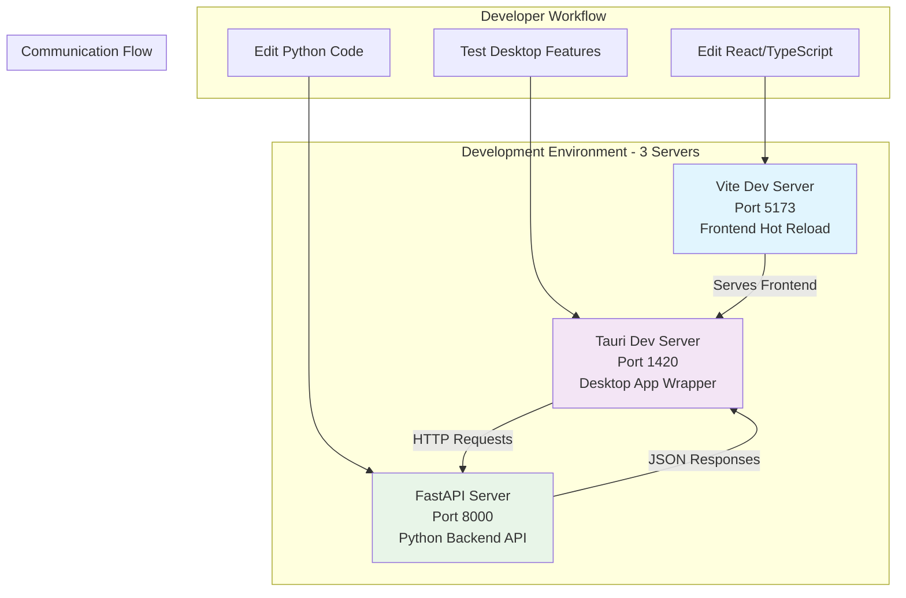
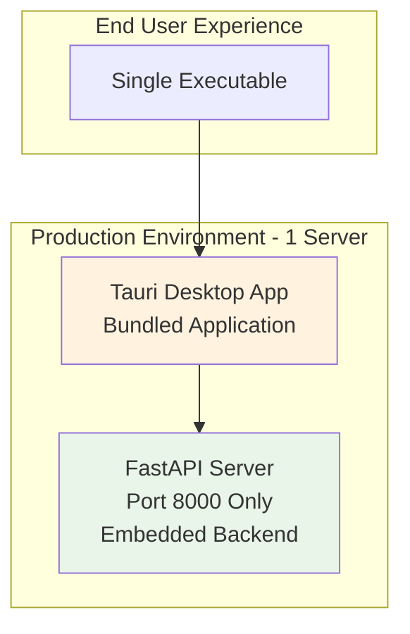
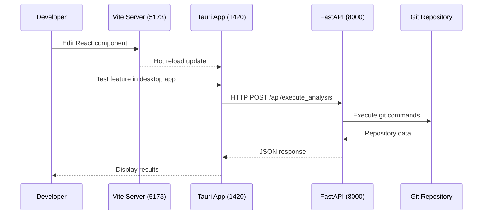
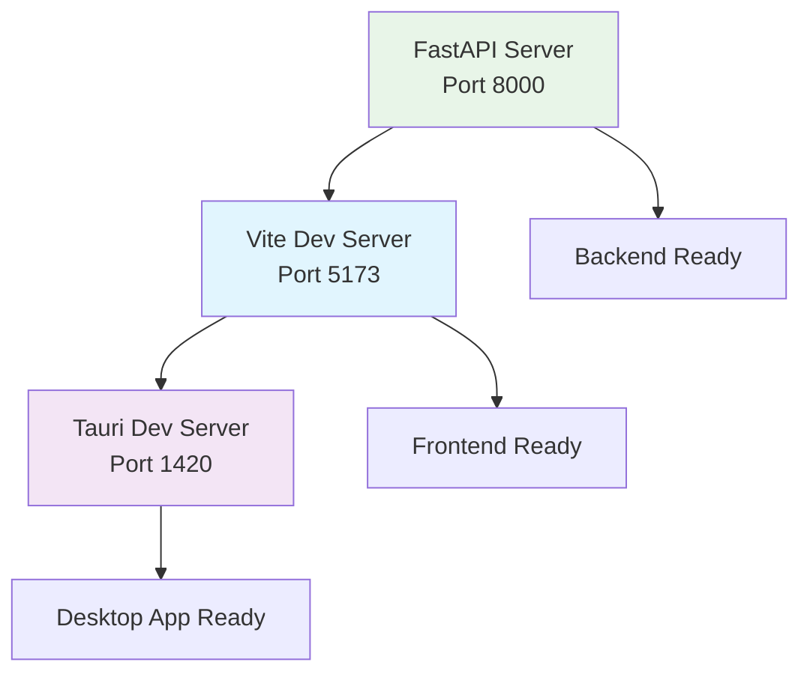
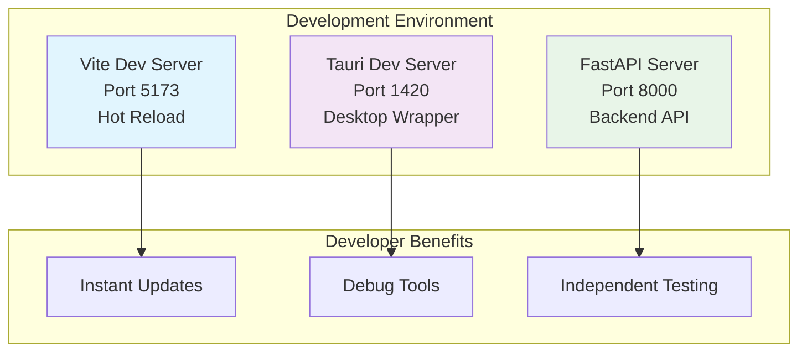
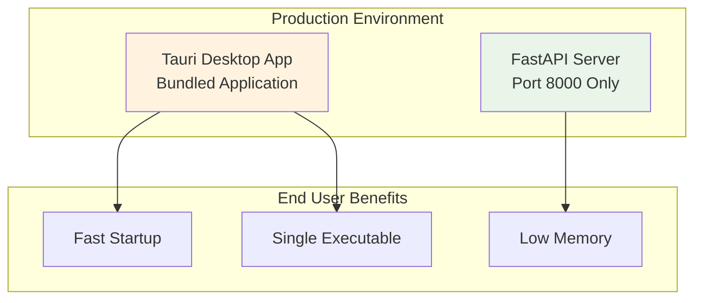

# Development Architecture

Comprehensive guide to GitInspectorGUI's development architecture, explaining the multi-server setup and port usage.

## Overview

GitInspectorGUI uses a **multi-server development architecture** that separates concerns and enables fast iteration with hot reloading. This differs significantly from the production build, which bundles everything into a single desktop application.

**Key Concept**: Development mode runs **3 separate servers** on different ports, while production mode uses only **1 bundled server**.

### Why Multi-Server Development?

-   **Hot Reloading**: Instant updates for frontend changes
-   **Independent Development**: Backend and frontend can be developed separately
-   **Better Debugging**: Each service has dedicated debugging tools
-   **Fast Iteration**: No need to rebuild the entire application for changes

## Development Mode Architecture



### Port Usage in Development

| Port     | Service          | Purpose                                          | Auto-reload      | Debug Access            |
| -------- | ---------------- | ------------------------------------------------ | ---------------- | ----------------------- |
| **5173** | Vite Dev Server  | Frontend development with hot module replacement | ✅ Instant       | Browser DevTools        |
| **1420** | Tauri Dev Server | Desktop application wrapper for testing          | ✅ Auto-restart  | Webview Inspector       |
| **8000** | FastAPI Server   | Python backend API with auto-restart             | ✅ File watching | Debug logs, breakpoints |

## Production Mode Architecture



### Port Usage in Production

| Port     | Service        | Purpose               | Notes                     |
| -------- | -------------- | --------------------- | ------------------------- |
| **8000** | FastAPI Server | Single bundled server | Only port exposed to user |

## Service Interaction Flow

### Development Request Flow



### Communication Details

**Frontend ↔ Backend Communication**:

-   **Protocol**: HTTP/JSON over localhost
-   **Base URL**: `http://localhost:8000`
-   **Request Format**: JSON with analysis settings
-   **Response Format**: Structured JSON with repository data

**Development vs Production**:

-   **Development**: Cross-origin requests between ports (5173/1420 → 8000)
-   **Production**: Internal communication within bundled app

## Service Startup Architecture

### Startup Dependencies



**Startup Order**: FastAPI → Vite → Tauri (each service depends on the previous)

**Service Dependencies**:

-   Tauri connects to both Vite (frontend) and FastAPI (backend)
-   Vite can run independently but needs FastAPI for data
-   FastAPI runs completely independently

## Development Features by Service

### Vite Dev Server (Port 5173)

**Features**:

-   Hot Module Replacement (HMR) for React components
-   TypeScript compilation with error reporting
-   CSS hot reloading with Tailwind
-   Fast refresh preserving component state

**Access**:

-   **Browser**: `http://localhost:5173`
-   **DevTools**: Full browser debugging capabilities
-   **Network Tab**: Monitor API requests to port 8000

### Tauri Dev Server (Port 1420)

**Features**:

-   Desktop application wrapper
-   Native OS integration testing
-   File system access capabilities
-   Auto-restart on Rust code changes

**Access**:

-   **Desktop App**: Automatically opens
-   **Webview Inspector**: Right-click → "Inspect Element"
-   **Console Logs**: Visible in terminal and webview

### FastAPI Server (Port 8000)

**Features**:

-   Auto-restart on Python file changes
-   Debug logging with configurable levels
-   Interactive API documentation
-   Request/response validation

**Access**:

-   **API Docs**: `http://localhost:8000/docs` (Swagger UI)
-   **Alternative Docs**: `http://localhost:8000/redoc`
-   **Health Check**: `http://localhost:8000/health`
-   **Direct Testing**: Use curl or Postman

## Debugging Each Service

### Frontend Debugging (Ports 5173/1420)

```bash
# Start with source maps for better debugging
pnpm dev:frontend --sourcemap

# Access browser DevTools
# - Open http://localhost:5173 in browser
# - Or right-click in Tauri app → "Inspect Element"
```

**Debug Techniques**:

-   **Console Logging**: `console.log()` statements
-   **React DevTools**: Component state inspection
-   **Network Tab**: Monitor API calls to port 8000
-   **Breakpoints**: Set in browser DevTools

### Backend Debugging (Port 8000)

```bash
# Start with debug logging
python -m gigui.start_server --reload --log-level DEBUG

# Start with Python debugger
python -m debugpy --listen 5678 --wait-for-client -m gigui.start_server
```

**Debug Techniques**:

-   **Breakpoints**: `breakpoint()` in Python code
-   **Logging**: Structured logging with levels
-   **API Testing**: Direct HTTP requests with curl
-   **Performance Monitoring**: Request timing and memory usage

## Troubleshooting Port Issues

### Port Conflicts

**Check what's using ports**:

```bash
# Check specific ports
lsof -i :5173  # Vite
lsof -i :1420  # Tauri
lsof -i :8000  # FastAPI

# Kill processes if needed
kill -9 $(lsof -t -i:5173)
kill -9 $(lsof -t -i:1420)
kill -9 $(lsof -t -i:8000)
```

**Common Port Conflicts**:

-   **Port 5173**: Other Vite projects, development servers
-   **Port 1420**: Other Tauri applications
-   **Port 8000**: Other web servers, Django dev servers

### Service Connection Issues

**Frontend can't reach backend**:

```bash
# Verify backend is running
curl http://localhost:8000/health

# Check CORS configuration
# Should return: {"status": "healthy"}
```

**Tauri app won't start**:

```bash
# Clear Tauri cache
rm -rf src-tauri/target/debug

# Rebuild Tauri
pnpm tauri build --debug
```

**Hot reload not working**:

```bash
# Clear all caches
pnpm clean
rm -rf node_modules/.vite
rm -rf .next

# Restart development
pnpm dev
```

## Configuration Files

### Development-Specific Configs

**Tauri Development Config** (`src-tauri/tauri.conf.dev.json`):

```json
{
    "build": {
        "devPath": "http://localhost:1420",
        "beforeDevCommand": "pnpm dev:frontend"
    },
    "app": {
        "windows": [
            {
                "title": "GitInspectorGUI (Development)",
                "width": 1200,
                "height": 800
            }
        ]
    }
}
```

**Vite Config** (`vite.config.ts`):

```typescript
export default defineConfig({
    server: {
        port: 5173,
        strictPort: true,
    },
    // ... other config
});
```

## Testing the Architecture

### Integration Testing

**Test all services are running**:

```bash
# Check each service
curl http://localhost:8000/health     # FastAPI
curl http://localhost:5173           # Vite (should return HTML)
# Tauri app should open automatically

# Test API integration
curl -X POST http://localhost:8000/api/execute_analysis \
  -H "Content-Type: application/json" \
  -d '{"input_fstrs": ["/path/to/test/repo"], "n_files": 10}'
```

**Test hot reloading**:

1. **Frontend**: Edit a React component, see instant update
2. **Backend**: Edit Python code, see server restart
3. **Desktop**: Test native features work correctly

## Summary

The development architecture uses **3 separate servers** to enable fast iteration and comprehensive debugging:

-   **Port 5173 (Vite)**: Frontend development with hot reload
-   **Port 1420 (Tauri)**: Desktop application wrapper
-   **Port 8000 (FastAPI)**: Python backend API

This multi-server setup provides excellent developer experience with instant feedback, while production uses a single bundled application for optimal end-user performance.

## Development vs Production Comparison

### Architecture Comparison

#### Development Mode (3 Servers)



#### Production Mode (1 Server)



### Debugging Capabilities

#### Development Mode Debugging

**Frontend Debugging**:

-   Browser DevTools (Chrome/Firefox)
-   React DevTools extension
-   Network tab for API monitoring
-   Console logging and breakpoints

**Backend Debugging**:

-   Python debugger (`breakpoint()`)
-   IDE debugging support
-   Live API documentation
-   Request/response logging

#### Production Mode Debugging

**Limited Debugging**:

-   No browser DevTools access
-   No source maps available
-   Minimal logging output
-   No live API documentation
-   Error reporting only

### Switching Between Modes

#### Starting Development Mode

```bash
# Option 1: All services at once (recommended)
pnpm dev

# Option 2: Individual services
# Terminal 1: Backend
python -m gigui.start_server --reload --log-level DEBUG

# Terminal 2: Frontend + Desktop
pnpm tauri dev
```

**What happens**:

1. FastAPI server starts on port 8000
2. Vite dev server starts on port 5173
3. Tauri desktop app opens on port 1420
4. File watchers activate for hot reload

#### Starting Production Mode

```bash
# Build and run production version
pnpm tauri build

# Or run production preview
pnpm build && pnpm preview
```

**What happens**:

1. Frontend builds to optimized bundle
2. Backend packages with application
3. Single executable created
4. Only port 8000 used internally

### Troubleshooting Mode-Specific Issues

#### Development Mode Issues

**Port Conflicts**:

```bash
# Check what's using development ports
lsof -i :5173 :1420 :8000

# Kill conflicting processes
kill -9 $(lsof -t -i:5173)
```

**Hot Reload Not Working**:

```bash
# Clear development caches
rm -rf node_modules/.vite
rm -rf .next
pnpm clean
```

#### Production Mode Issues

**Build Failures**:

```bash
# Clean build artifacts
rm -rf dist/
rm -rf src-tauri/target/

# Rebuild from scratch
pnpm clean
pnpm install
pnpm build
```

## Related Documentation

-   **[Development Commands](development-commands.md)** - Complete command reference
-   **[Development Workflow](development-workflow.md)** - Development processes and commands
-   **[Environment Setup](environment-setup.md)** - Initial development setup
-   **[Build Process](build-process.md)** - Production build configuration
-   **[Troubleshooting](troubleshooting.md)** - Common issues and solutions
-   **[API Reference](../api/reference.md)** - Backend API documentation
