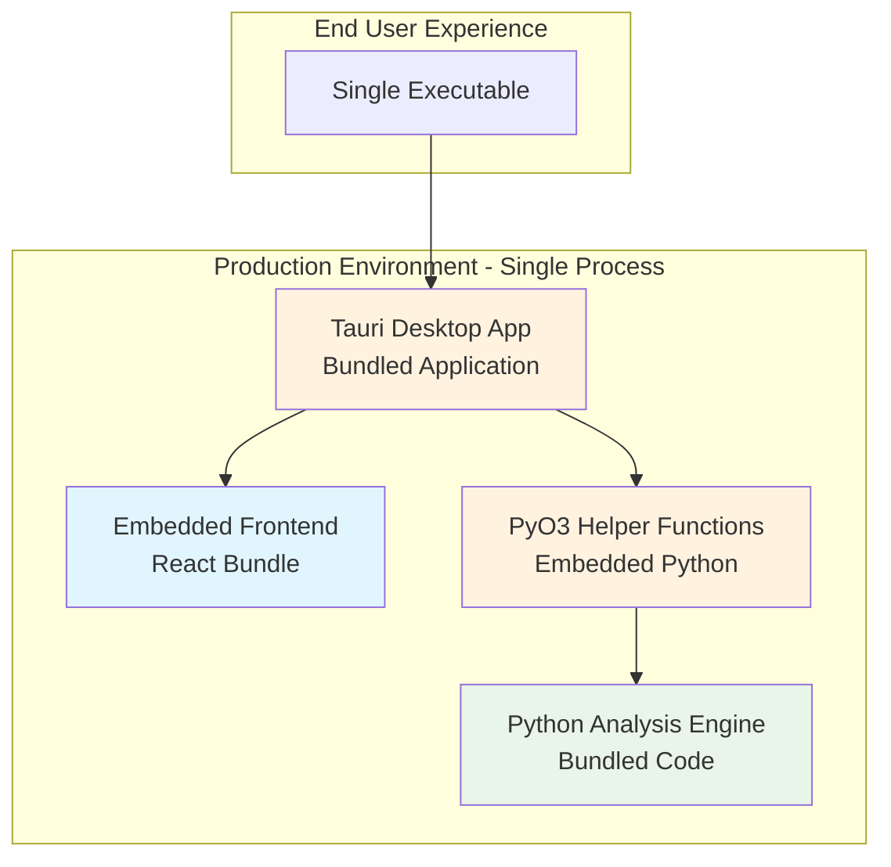
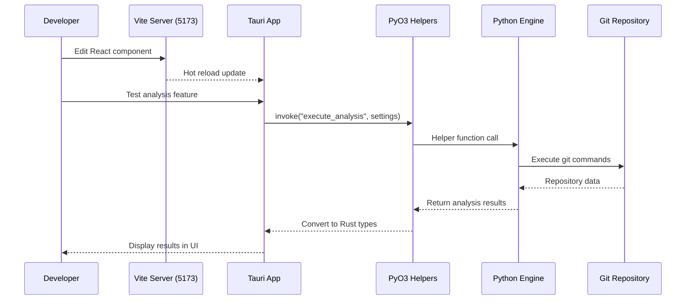
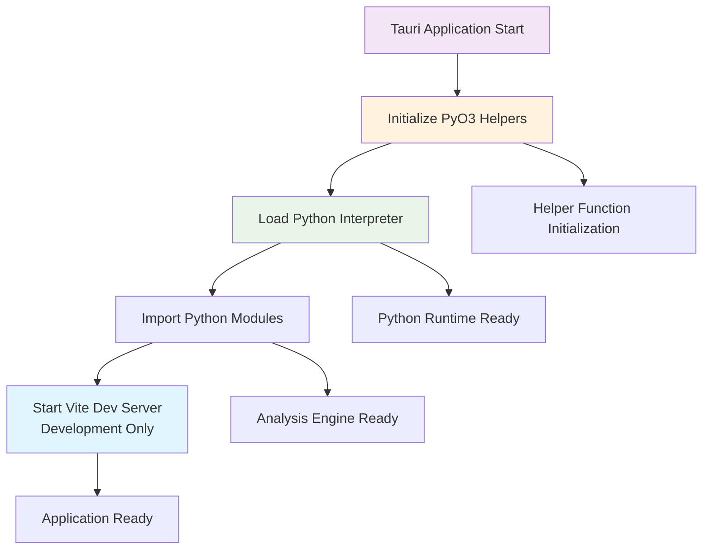
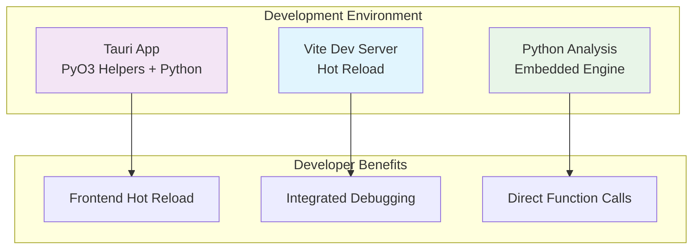
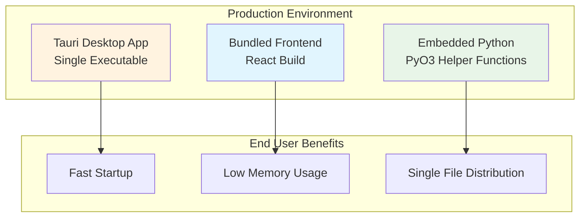

# Development Architecture

Comprehensive guide to GitInspectorGUI's simplified PyO3 helper function architecture with embedded Python integration.

## Overview

GitInspectorGUI uses a **single-process architecture with PyO3 helper functions** that embed Python directly within the Rust Tauri application. This provides excellent performance and simplifies both development and deployment.

**Key Concept**: Both development and production modes use the **same single-process architecture** with embedded Python via our simplified PyO3 helper functions.

### Why Simplified PyO3 Helper Function Architecture?

-   **Direct Integration**: Python functions called through clean helper function abstractions (no IPC overhead)
-   **Simplified Development**: Single command starts complete development environment
-   **Better Performance**: No network communication between frontend and backend
-   **Easier Deployment**: Single executable with embedded Python interpreter
-   **Clean Abstractions**: Helper functions eliminate PyO3 boilerplate complexity

## Development Mode Architecture

```mermaid
graph TB
    subgraph "Development Environment - Single Process"
        A[Tauri Desktop App<br/>Main Process]
        B[Vite Dev Server<br/>Port 5173<br/>Frontend Hot Reload]
        C[PyO3 Helper Functions<br/>Embedded Python Engine]
        D[Python Analysis Engine<br/>Git Operations]
    end

    subgraph "Developer Workflow"
        E[Edit React/TypeScript] --> B
        F[Edit Python Code] --> D
        G[Edit Rust/Helper Code] --> C
    end

    subgraph "Communication Flow"
        B -->|Serves Frontend| A
        A -->|invoke() calls| C
        C -->|Helper Functions| D
    end

    style A fill:#f3e5f5
    style B fill:#e1f5fe
    style C fill:#fff3e0
    style D fill:#e8f5e8
```

### Development Components

| Component                  | Purpose                                    | Hot Reload          | Debug Access         |
| -------------------------- | ------------------------------------------ | ------------------- | -------------------- |
| **Tauri Desktop App**      | Main application process with PyO3        | ✅ Auto-restart     | Webview Inspector    |
| **Vite Dev Server**        | Frontend development with HMR              | ✅ Instant          | Browser DevTools     |
| **PyO3 Helper Functions**  | Simplified Rust-Python integration layer  | ❌ Requires restart | Rust debugging tools |
| **Python Engine**          | Embedded analysis engine                   | ❌ Requires restart | Python debugging     |

## Production Mode Architecture



### Production Characteristics

-   **Single Executable**: All components bundled into one desktop application
-   **Embedded Python**: Python interpreter embedded via PyO3 helper functions
-   **No Network Communication**: Direct function calls through helper functions
-   **Cross-Platform**: Single codebase builds for Windows, macOS, and Linux

## PyO3 Helper Function Integration Flow

### Development Request Flow



### Communication Details

**Frontend ↔ Backend Communication**:

-   **Protocol**: Tauri IPC (Inter-Process Communication)
-   **Method**: `invoke()` function calls
-   **Data Format**: JSON serialization via Tauri
-   **Error Handling**: Native Rust Result types

**PyO3 Helper Function Integration**:

-   **Python Calls**: Direct function invocation via helper functions
-   **Type Conversion**: Automatic Python ↔ Rust type conversion via helpers
-   **Error Propagation**: Automatic error handling through helper functions
-   **Memory Management**: Automatic GIL management handled by helpers

## Service Startup Architecture

### Startup Flow



**Startup Order**: Tauri → PyO3 Helpers → Python → Vite (dev only) → Ready

**Component Dependencies**:

-   Tauri application manages all other components
-   PyO3 helpers require Python interpreter initialization
-   Python modules must be importable at startup
-   Vite dev server is optional (development only)

## Development Features by Component

### Tauri Desktop App

**Features**:

-   PyO3 helper function integration
-   Native OS integration
-   File system access
-   Auto-restart on Rust code changes

**Development Access**:

-   **Desktop App**: Automatically opens
-   **Webview Inspector**: Right-click → "Inspect Element"
-   **Console Logs**: Visible in terminal and webview
-   **Rust Debugging**: Standard Rust debugging tools

### Vite Dev Server (Development Only)

**Features**:

-   Hot Module Replacement (HMR) for React components
-   TypeScript compilation with error reporting
-   CSS hot reloading with Tailwind
-   Fast refresh preserving component state

**Access**:

-   **Integrated**: Served within Tauri app
-   **DevTools**: Full browser debugging capabilities
-   **Network Tab**: Monitor Tauri IPC calls

### PyO3 Helper Functions

**Features**:

-   Simplified Python function calls from Rust
-   Clean abstractions over PyO3 complexity
-   Automatic GIL management
-   Native error propagation

**Development Considerations**:

-   **No Hot Reload**: Changes require application restart
-   **Rust Debugging**: Use standard Rust debugging tools
-   **Python Integration**: Debug Python code through helper functions

### Python Analysis Engine

**Features**:

-   Git repository analysis
-   Embedded within Rust process
-   Clean function call interface via helpers
-   Native exception handling

**Development Access**:

-   **Python Debugging**: Use `breakpoint()` in Python code
-   **Logging**: Python logging integrated with Rust
-   **Testing**: Test Python functions independently

## Debugging Each Component

### Frontend Debugging

```bash
# Start development mode
pnpm run tauri dev

# Access debugging tools:
# - Right-click in app → "Inspect Element"
# - Console logging: console.log()
# - React DevTools: Install browser extension
```

**Debug Techniques**:

-   **Console Logging**: `console.log()` statements
-   **React DevTools**: Component state inspection
-   **Tauri DevTools**: Monitor IPC calls
-   **Breakpoints**: Set in browser DevTools

### PyO3 Helper Function Debugging

```bash
# Start with Rust debug logging
RUST_LOG=debug pnpm run tauri dev

# Debug helper functions specifically
RUST_LOG=gitinspectorgui=debug pnpm run tauri dev
```

**Debug Techniques**:

-   **Rust Debugging**: Standard Rust debugger (lldb/gdb)
-   **Helper Function Logging**: Enable application-specific logging
-   **Error Handling**: Monitor helper function error conversion
-   **Performance Monitoring**: Track helper function call times

### Python Engine Debugging

```bash
# Test Python functions independently
cd python
python -c "
from gigui.analysis import execute_analysis, Settings
settings = Settings(input_fstrs=['.'], n_files=10)
result = execute_analysis(settings)
print(result)
"
```

**Debug Techniques**:

-   **Breakpoints**: `breakpoint()` in Python code
-   **Logging**: Python logging integrated with application
-   **Independent Testing**: Test Python functions outside Tauri
-   **Performance Monitoring**: Monitor memory and CPU usage

## Troubleshooting Common Issues

### PyO3 Helper Function Issues

**Python Import Errors**:

```bash
# Verify Python environment
cd python
uv sync

# Test Python modules
python -c "from gigui.analysis import execute_analysis; print('OK')"
```

**Helper Function Compilation Issues**:

```bash
# Clean and rebuild
cd src-tauri
cargo clean
cargo build

# Check PyO3 version compatibility
cargo tree | grep pyo3
```

### Application Startup Issues

**Tauri Won't Start**:

```bash
# Clear Tauri cache
rm -rf src-tauri/target/debug

# Rebuild with verbose output
cd src-tauri
cargo build --verbose
```

**Python Integration Failures**:

```bash
# Check Python path
python -c "import sys; print(sys.executable)"

# Verify helper functions can find Python
RUST_LOG=debug pnpm run tauri dev
```

### Development Workflow Issues

**Hot Reload Not Working**:

```bash
# Clear frontend caches
rm -rf node_modules/.vite
rm -rf dist/

# Restart development
pnpm clean
pnpm install
pnpm run tauri dev
```

**Python Changes Not Reflected**:

-   **Restart Required**: Python code changes require application restart
-   **Module Reload**: Python modules are loaded once at startup
-   **Testing**: Test Python changes independently first

## Configuration Files

### PyO3 Helper Function Configuration

**Cargo.toml** (`src-tauri/Cargo.toml`):

```toml
[dependencies]
pyo3 = { version = "0.22", features = ["auto-initialize"] }
tauri = { version = "2.0", features = ["shell-open"] }
serde = { version = "1.0", features = ["derive"] }
serde_json = "1.0"

[build-dependencies]
tauri-build = { version = "2.0" }
```

**Tauri Configuration** (`src-tauri/tauri.conf.json`):

```json
{
    "build": {
        "beforeBuildCommand": "pnpm run build",
        "beforeDevCommand": "pnpm run dev",
        "devPath": "http://localhost:5173",
        "distDir": "../dist"
    },
    "app": {
        "windows": [
            {
                "title": "GitInspectorGUI",
                "width": 1200,
                "height": 800
            }
        ]
    }
}
```

### Python Configuration

**pyproject.toml** (`python/pyproject.toml`):

```toml
[project]
name = "gigui"
dependencies = [
    "gitpython>=3.1.40",
    "psutil>=7.0.0",
]

[tool.uv]
dev-dependencies = [
    "pytest>=7.0.0",
    "black>=23.0.0",
]
```

## Testing the Architecture

### Integration Testing

**Test Complete System**:

```bash
# Start development mode
pnpm run tauri dev

# Test PyO3 helper function integration
# - Open application
# - Select a git repository
# - Run analysis
# - Verify results display correctly
```

**Test Python Functions Independently**:

```bash
cd python
python -c "
from gigui.analysis import execute_analysis, Settings
settings = Settings(input_fstrs=['.'], n_files=10)
try:
    result = execute_analysis(settings)
    print('Python analysis OK')
except Exception as e:
    print(f'Error: {e}')
"
```

### Performance Testing

**Monitor Resource Usage**:

```bash
# Monitor application performance
top -p $(pgrep gitinspectorgui)

# Check memory usage
ps aux | grep gitinspectorgui
```

**Profile Python Performance**:

```bash
# Profile Python code
python -m cProfile -o analysis.prof your_analysis_script.py

# Analyze profile
python -c "
import pstats
p = pstats.Stats('analysis.prof')
p.sort_stats('cumulative').print_stats(10)
"
```

## Summary

The PyO3 helper function development architecture provides:

-   **Single Process**: All components run within one Tauri application
-   **Simplified Integration**: Python functions called through clean helper function abstractions
-   **Simplified Development**: One command starts complete environment
-   **Better Performance**: No network overhead between components
-   **Clean Abstractions**: Helper functions eliminate PyO3 boilerplate complexity

## Development vs Production Comparison

### Architecture Comparison

#### Development Mode



#### Production Mode



### Key Differences

| Aspect            | Development Mode                   | Production Mode           |
| ----------------- | ---------------------------------- | ------------------------- |
| **Frontend**      | Vite dev server with hot reload    | Bundled React build       |
| **Python**        | Embedded via PyO3 helpers          | Embedded via PyO3 helpers |
| **Debugging**     | Full debugging tools available     | Limited debugging         |
| **Performance**   | Slower (dev tools overhead)        | Optimized for performance |
| **File Watching** | Frontend files watched for changes | No file watching          |
| **Startup Time**  | Slower (dev server startup)        | Fast (optimized bundle)   |

### Switching Between Modes

#### Development Mode

```bash
# Start development environment
pnpm run tauri dev

# What happens:
# 1. Tauri application starts with PyO3 helpers
# 2. Python interpreter initializes
# 3. Vite dev server starts for frontend
# 4. Hot reload activates for frontend changes
```

#### Production Mode

```bash
# Build production version
pnpm run tauri build

# What happens:
# 1. Frontend builds to optimized bundle
# 2. Python code bundled with application
# 3. Single executable created with embedded Python
# 4. No development servers needed
```

## Related Documentation

-   **[Development Commands](development-commands.md)** - Complete command reference
-   **[Development Workflow](development-workflow.md)** - Development processes
-   **[Environment Setup](environment-setup.md)** - Initial development setup
-   **[Build Process](build-process.md)** - Production build configuration
-   **[Troubleshooting](troubleshooting.md)** - Common issues and solutions
-   **[API Examples](../api/examples.md)** - PyO3 helper function integration examples
