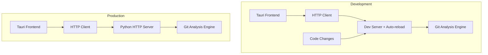

# Development Mode

## Overview

Optimized development workflow with hot reloading, debugging, and fast iteration.

## For Python Developers

If you're unfamiliar with the frontend technologies, see the **[Technology Primer](../technology-primer.md)** and **[Python-Focused Development](python-focused-development.md)** guides first.

**Key concept**: You can develop the Python backend independently by starting only the API server and testing with curl. The frontend integration is optional during development.

## Architecture

### Development vs Production



## Quick Start

### Start Development Environment

**Option 1: Python Backend Only (Recommended for Python developers)**

```bash
# Start only the Python API server for backend development
python -m gigui.start_server --reload --log-level DEBUG

# Test your changes with curl (in another terminal)
curl http://127.0.0.1:8080/health
```

**Option 2: Full Development Environment**

```bash
# Terminal 1: Start Python API server with auto-reload
python -m gigui.start_server --reload --log-level DEBUG

# Terminal 2: Start desktop frontend with hot reload
pnpm run tauri dev
```

**What each option does**:

-   **Option 1**: Only runs the Python backend, perfect for API development and testing
-   **Option 2**: Runs both backend and frontend, needed for UI testing and integration

### Development Commands

```bash
# API Server Options
python -m gigui.start_server --reload                    # Basic auto-reload
python -m gigui.start_server --reload --log-level DEBUG  # With debug logging
python -m gigui.start_server --reload --port 8081        # Custom port

# Frontend Options
pnpm run tauri dev                                        # Full development
pnpm run dev                                             # Frontend only
pnpm run tauri build --debug                            # Debug build
```

## Hot Reloading

### Python Changes

-   **Auto-restart** - Server detects file changes and restarts
-   **Preserved connections** - Existing HTTP connections maintained
-   **Instant feedback** - Changes visible immediately

### Frontend Changes

-   **Hot Module Replacement** - Components update without page refresh
-   **State preservation** - React state maintained when possible
-   **Automatic refresh** - Full reload if HMR fails

### Rust Changes

-   **Auto-recompile** - Cargo rebuilds on file changes
-   **Full restart** - Tauri app restarts completely

## Debugging

### Python API Debugging

```python
import logging
logger = logging.getLogger(__name__)

def analyze_repository(settings):
    logger.debug(f"Starting analysis with: {settings}")
    breakpoint()  # Python 3.7+ debugger
    # Implementation
```

### Frontend Debugging

```typescript
// Browser DevTools available in Tauri
console.log("Debug info:", data);

// React DevTools for component inspection
const store = useResultsStore();
console.log("Store state:", store);
```

### API Testing

```bash
# Health check
curl http://127.0.0.1:8080/health

# Test analysis endpoint
curl -X POST http://127.0.0.1:8080/api/execute_analysis \
  -H "Content-Type: application/json" \
  -d '{"repository_path": "/path/to/repo"}'
```

## Configuration

### VS Code Setup

```json
// .vscode/launch.json
{
    "configurations": [
        {
            "name": "Debug API Server",
            "type": "python",
            "request": "launch",
            "module": "gigui.start_server",
            "args": ["--host", "127.0.0.1", "--port", "8080"]
        }
    ]
}
```

## Development Workflow

### Typical Session

1. **Start backend** - `python -m gigui.start_server --reload`
2. **Start frontend** - `pnpm run tauri dev`
3. **Make changes** - Edit files and see immediate results
4. **Test integration** - Use GUI and API testing
5. **Debug issues** - Use breakpoints and logging

### File Change Behavior

-   **Python files** → Server auto-restarts
-   **React/TypeScript** → Hot module replacement
-   **Rust files** → Full Tauri rebuild
-   **Config files** → Manual restart required

## Performance Optimization

### Faster Development

```bash
# Skip validation checks
export GIGUI_SKIP_VALIDATION=true

# Reduce logging overhead
python -m gigui.start_server --reload --log-level INFO

# Watch specific directories only
python -m gigui.start_server --reload --reload-dir python/gigui
```

## Testing

### API Testing

```bash
# Run test suite
python -m pytest

# Test specific modules
python -m pytest -k "test_api"

# With coverage
python -m pytest --cov=gigui --cov-report=html
```

### Integration Testing

```bash
# Test HTTP endpoints
curl http://127.0.0.1:8080/health
curl -X GET http://127.0.0.1:8080/api/settings

# Frontend testing
pnpm run test
pnpm run test:e2e
```

## Troubleshooting

### Common Issues

**Server won't restart**

```bash
# Kill existing processes
pkill -f "gigui.start_server"
python -m gigui.start_server --reload
```

**Frontend connection issues**

```bash
# Verify server running
curl http://127.0.0.1:8080/health

# Check CORS settings
export GIGUI_CORS_ENABLED=true
```

**Hot reload not working**

```bash
# Clear caches
pnpm store prune
rm -rf node_modules/.vite

# Restart development
pnpm run tauri dev
```

**Import errors**

```bash
# Reinstall dependencies
uv sync

# Verify Python path
python -c "import gigui; print(gigui.__file__)"
```

### Debug Information

```bash
# Environment check
python --version
node --version
rustc --version

# Package versions
uv pip list | grep gigui
pnpm list --depth=0
```

## Summary

Development mode provides hot reloading, comprehensive debugging, and fast iteration cycles. The HTTP API architecture enables independent frontend and backend development with immediate feedback on changes.
