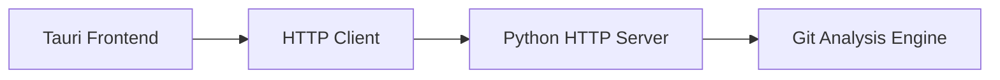
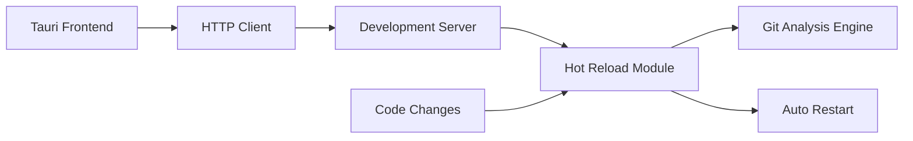

# Development Mode

Learn how to use GitInspectorGUI's development mode for rapid iteration and debugging.

## Overview

Development mode provides an optimized workflow for active development with:

-   ✅ **Hot Reloading**: Instant feedback on code changes
-   ✅ **Full Debugging**: Breakpoints and step-through debugging
-   ✅ **Fast Iteration**: No build steps required for Python changes
-   ✅ **Same Interface**: Uses the production Tauri frontend

## Architecture Comparison

### Production Mode



### Development Mode



## Quick Start

### 1. Start Development Server

```bash
# Start the HTTP API with auto-reload
python -m gigui.start_server --reload --log-level DEBUG
```

### 2. Start Frontend Development

```bash
# In a new terminal
pnpm run tauri dev
```

### 3. Make Changes and See Results

Edit any Python file in `python/gigui/` and see changes immediately!

## Development Commands

### HTTP Server Commands

```bash
# Basic development server
python -m gigui.start_server --reload

# With debug logging
python -m gigui.start_server --reload --log-level DEBUG

# Custom host/port
python -m gigui.start_server --reload --host 0.0.0.0 --port 8081

# With specific configuration
python -m gigui.start_server --reload --config config.json
```

### Frontend Commands

```bash
# Standard development
pnpm run tauri dev

# With specific Tauri config
pnpm run tauri dev -- --config src-tauri/tauri.conf.dev.json

# Frontend only (for UI development)
pnpm run dev

# Build for testing
pnpm run tauri build --debug
```

### Testing Commands

```bash
# Test Python API directly
python -m gigui.cli --help

# Run API tests
python -m pytest python/test_*.py

# Test HTTP endpoints
curl http://127.0.0.1:8080/health
curl -X POST http://127.0.0.1:8080/api/settings -H "Content-Type: application/json" -d '{}'
```

## Development Workflow

### Typical Development Session

1. **Start Backend**:

    ```bash
    python -m gigui.start_server --reload --log-level DEBUG
    ```

2. **Start Frontend**:

    ```bash
    pnpm run tauri dev
    ```

3. **Make Changes**:

    - Edit Python files → Server auto-restarts
    - Edit React/TypeScript files → Frontend hot-reloads
    - Edit Rust files → Tauri rebuilds automatically

4. **Test Changes**:
    - Use the GUI for integration testing
    - Use curl for API testing
    - Use browser DevTools for frontend debugging

### Hot Reloading Behavior

**Python Changes**:

-   Server detects file changes
-   Automatically restarts the server
-   Preserves existing connections where possible
-   Logs restart events

**Frontend Changes**:

-   Vite detects file changes
-   Hot Module Replacement (HMR) updates components
-   State is preserved when possible
-   Browser automatically refreshes if needed

**Rust Changes**:

-   Cargo detects file changes
-   Recompiles and restarts Tauri app
-   Full application restart required

## Debugging Features

### Python API Debugging

**Console Logging**:

```python
import logging
logger = logging.getLogger(__name__)

def my_function():
    logger.debug("Debug information")
    logger.info("General information")
    logger.warning("Warning message")
    logger.error("Error occurred")
```

**Breakpoint Debugging**:

```python
# Add breakpoint in VS Code or use debugger
import pdb; pdb.set_trace()  # Python debugger
breakpoint()  # Python 3.7+ built-in
```

**Request/Response Logging**:

```bash
# Enable detailed HTTP logging
python -m gigui.start_server --reload --log-level DEBUG
```

### Frontend Debugging

**Browser DevTools**:

-   Right-click in Tauri window → "Inspect Element"
-   Console tab for JavaScript errors
-   Network tab for HTTP requests
-   Sources tab for breakpoints

**React DevTools**:

```bash
# Install React DevTools browser extension
# Available in the browser DevTools when debugging
```

**State Debugging**:

```typescript
// Zustand store debugging
import { useResultsStore } from "../stores/resultsStore";

function MyComponent() {
    const store = useResultsStore();
    console.log("Current state:", store);
    // ...
}
```

## Configuration

### Development Environment Variables

Create `.env` file in project root:

```bash
# API Configuration
GIGUI_DEBUG=true
GIGUI_LOG_LEVEL=DEBUG
GIGUI_API_HOST=127.0.0.1
GIGUI_API_PORT=8080

# Development Features
GIGUI_AUTO_RELOAD=true
GIGUI_CORS_ENABLED=true
GIGUI_DETAILED_ERRORS=true

# Paths
GIGUI_DATA_DIR=./dev-data
GIGUI_LOG_DIR=./dev-logs
GIGUI_CACHE_DIR=./dev-cache
```

### VS Code Configuration

**Launch Configuration** (`.vscode/launch.json`):

```json
{
    "version": "0.2.0",
    "configurations": [
        {
            "name": "Debug API Server",
            "type": "python",
            "request": "launch",
            "module": "gigui.start_server",
            "args": ["--reload", "--log-level", "DEBUG"],
            "console": "integratedTerminal",
            "cwd": "${workspaceFolder}",
            "env": {
                "GIGUI_DEBUG": "true"
            }
        },
        {
            "name": "Debug CLI",
            "type": "python",
            "request": "launch",
            "module": "gigui.cli",
            "args": ["--repository", "/path/to/test/repo"],
            "console": "integratedTerminal"
        }
    ]
}
```

**Tasks Configuration** (`.vscode/tasks.json`):

```json
{
    "version": "2.0.0",
    "tasks": [
        {
            "label": "Start Dev Server",
            "type": "shell",
            "command": "python",
            "args": [
                "-m",
                "gigui.start_server",
                "--reload",
                "--log-level",
                "DEBUG"
            ],
            "group": "build",
            "presentation": {
                "echo": true,
                "reveal": "always",
                "focus": false,
                "panel": "new"
            }
        },
        {
            "label": "Start Tauri Dev",
            "type": "shell",
            "command": "pnpm",
            "args": ["run", "tauri", "dev"],
            "group": "build",
            "presentation": {
                "echo": true,
                "reveal": "always",
                "focus": false,
                "panel": "new"
            }
        }
    ]
}
```

## Performance Optimization

### Development Performance Tips

**Faster Startup**:

```bash
# Skip unnecessary checks in development
export GIGUI_SKIP_VALIDATION=true
python -m gigui.start_server --reload
```

**Reduced Logging**:

```bash
# Use INFO level for better performance
python -m gigui.start_server --reload --log-level INFO
```

**Selective Reloading**:

```bash
# Watch specific directories only
python -m gigui.start_server --reload --reload-dir python/gigui
```

### Memory Management

Monitor memory usage during development:

```bash
# Python memory profiling
uv add memory-profiler
python -m memory_profiler -m gigui.start_server

# Monitor with htop/top
htop -p $(pgrep -f "gigui.start_server")
```

## Testing in Development Mode

### API Testing

```bash
# Health check
curl http://127.0.0.1:8080/health

# Settings endpoint
curl -X GET http://127.0.0.1:8080/api/settings

# Analysis endpoint (with test data)
curl -X POST http://127.0.0.1:8080/api/execute_analysis \
  -H "Content-Type: application/json" \
  -d '{"repository_path": "/path/to/test/repo"}'
```

### Integration Testing

```bash
# Run full test suite
python -m pytest

# Run specific test categories
python -m pytest -k "test_api"
python -m pytest -k "test_integration"

# Run with coverage
python -m pytest --cov=gigui --cov-report=html
```

## Troubleshooting

### Common Development Issues

**Server won't restart on changes**:

```bash
# Check file permissions
ls -la python/gigui/

# Restart manually
pkill -f "gigui.start_server"
python -m gigui.start_server --reload
```

**Frontend not connecting to API**:

```bash
# Verify server is running
curl http://127.0.0.1:8080/health

# Check CORS settings
# Add to .env: GIGUI_CORS_ENABLED=true
```

**Hot reload not working**:

```bash
# Clear pnpm cache
pnpm store prune

# Restart development server
pnpm run tauri dev
```

**Import errors after changes**:

```bash
# Reinstall in development mode
uv sync

# Check Python path
python -c "import gigui; print(gigui.__file__)"
```

### Debug Information

**System Information**:

```bash
# Python environment
python --version
uv pip list | grep gigui

# Node.js environment
node --version
pnpm list --depth=0

# Rust environment
rustc --version
cargo --version
```

**Log Locations**:

-   **API Logs**: Console output or `./dev-logs/`
-   **Frontend Logs**: Browser DevTools Console
-   **Tauri Logs**: Terminal running `pnpm run tauri dev`

## Next Steps

After mastering development mode:

1. **[Enhanced Settings](enhanced-settings.md)** - Configure advanced options
2. **[Troubleshooting](troubleshooting.md)** - Solve common issues
3. **[API Reference](../api/reference.md)** - Understand the API in detail
4. **[Architecture](../architecture/overview.md)** - Learn the system design
