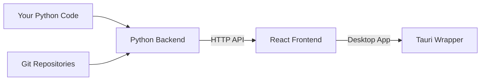

# Development Workflow

Comprehensive guide for GitInspectorGUI development workflows.

## Overview

Optimized development workflow with hot reloading, debugging, and fast iteration. The GitInspectorGUI codebase has a **clear separation** between backend and frontend development through an HTTP API boundary.

## For Python Developers

If you're unfamiliar with the frontend technologies, see the **[Technology Primer](../technology-primer.md)** first.

**Key concept**: You can develop the Python backend independently by starting only the API server and testing with curl. The frontend integration is optional during development.

### Development Architecture



**Your focus area**: The Python backend (`python/` directory)
**What you can ignore**: Most of the React/TypeScript/Rust details

### Key Principle

You can develop and test the Python backend **independently** of the frontend. The HTTP API acts as a clean boundary.

## Development Environment

**Prerequisites**: Complete the **[Prerequisites](../getting-started/01-prerequisites.md)** first.

### Development Server Commands (Single Source of Truth)

**Python Backend Server**:

```bash
# Basic development server
python -m gigui.start_server

# Development with auto-reload (recommended for development)
python -m gigui.start_server --reload

# Development with debug logging
python -m gigui.start_server --reload --log-level DEBUG

# Custom host and port
python -m gigui.start_server --host 127.0.0.1 --port 8001

# Production mode
python -m gigui.start_server --host 0.0.0.0 --port 8000
```

**Frontend Development**:

```bash
# Full desktop development (recommended)
pnpm run tauri dev

# Frontend only (web browser, no desktop wrapper)
pnpm run dev

# Debug build
pnpm run tauri build --debug

# Production build
pnpm run tauri build
```

### Development Workflow Options

**Option 1: Python Backend Only (Recommended for Python developers)**

```bash
# Start only the Python API server for backend development
python -m gigui.start_server --reload --log-level DEBUG

# Test your changes with curl (in another terminal)
curl http://127.0.0.1:8000/health
```

**Option 2: Full Development Environment**

```bash
# Terminal 1: Start Python API server with auto-reload
python -m gigui.start_server --reload --log-level DEBUG

# Terminal 2: Start desktop frontend with hot reload
pnpm run tauri dev
```

**What each option does**:

-   **Option 1**: Only runs the Python backend, perfect for API development and testing
-   **Option 2**: Runs both backend and frontend, needed for UI testing and integration

## Python-First Development

### 1. Backend Development Workflow

Start by working on the Python backend in isolation:

```bash
# Start only the Python server
python -m gigui.start_server --reload --log-level DEBUG

# Test your changes directly with curl
curl -X POST http://127.0.0.1:8000/api/execute_analysis \
  -H "Content-Type: application/json" \
  -d '{"input_fstrs": ["/path/to/test/repo"], "n_files": 50}'
```

**Benefits**:

-   Fast iteration (no frontend compilation)
-   Direct testing of your Python logic
-   Clear error messages and logging
-   No need to understand React/TypeScript

### 2. Python Backend Structure

**Key Files You'll Work With**:

```
python/
├── gigui/
│   ├── api.py              # Main API logic (your primary focus)
│   ├── http_server.py      # FastAPI server setup
│   ├── repo_data.py        # Git repository analysis
│   ├── repo_blame.py       # Git blame analysis
│   └── start_server.py     # Server startup
├── pyproject.toml          # Python dependencies
└── test_*.py              # Python tests
```

**Main Development Areas**:

1. **API Endpoints** (`gigui/api.py`) - Add new analysis features, modify existing logic
2. **Git Analysis** (`gigui/repo_*.py`) - Implement new algorithms, optimize performance
3. **Data Processing** (`gigui/data.py`) - Transform data, add aggregation methods

### 3. HTTP API Contract

**Request Format** (what the frontend sends):

```json
{
    "input_fstrs": ["/path/to/repo"],
    "n_files": 100,
    "extensions": [".py", ".js"],
    "ex_files": ["*.test.*"],
    "since": "2024-01-01",
    "processes": 4
}
```

**Response Format** (what you return):

```json
{
    "repositories": [
        {
            "name": "repo-name",
            "path": "/path/to/repo",
            "authors": [...],
            "files": [...],
            "commits": [...]
        }
    ],
    "summary": {
        "total_commits": 156,
        "analysis_duration": 2.34
    }
}
```

## Hot Reloading

### Python Changes

-   **Auto-restart** - Server detects file changes and restarts
-   **Preserved connections** - Existing HTTP connections maintained
-   **Instant feedback** - Changes visible immediately

### Frontend Changes

-   **Hot Module Replacement** - Components update without page refresh
-   **State preservation** - React state maintained when possible
-   **Automatic refresh** - Full reload if HMR fails

### Rust Changes

-   **Auto-recompile** - Cargo rebuilds on file changes
-   **Full restart** - Tauri app restarts completely

## Debugging & Testing

### Python API Debugging

```python
import logging
logger = logging.getLogger(__name__)

def analyze_repository(settings):
    logger.debug(f"Starting analysis with: {settings}")
    breakpoint()  # Python 3.7+ debugger
    # Implementation
```

### Frontend Debugging

```typescript
// Browser DevTools available in Tauri
console.log("Debug info:", data);

// React DevTools for component inspection
const store = useResultsStore();
console.log("Store state:", store);
```

### Direct API Testing

```bash
# Start server with debug logging
python -m gigui.start_server --reload --log-level DEBUG

# Test health endpoint
curl http://127.0.0.1:8000/health

# Test analysis with a small repository
curl -X POST http://127.0.0.1:8000/api/execute_analysis \
  -H "Content-Type: application/json" \
  -d '{
    "input_fstrs": ["/path/to/small/repo"],
    "n_files": 10,
    "file_formats": ["json"]
  }' | jq '.'
```

### Python Unit Tests

```bash
# Run Python tests
python -m pytest python/test_*.py -v

# Run specific test
python -m pytest python/test_api.py::test_execute_analysis -v

# Run with coverage
python -m pytest --cov=gigui python/test_*.py
```

### Integration Testing

```bash
# Test HTTP endpoints
curl http://127.0.0.1:8000/health
curl -X GET http://127.0.0.1:8000/api/settings

# Frontend testing
pnpm run test
pnpm run test:e2e

# Test the complete system
python -m gigui.start_server --reload &
pnpm run tauri dev
# Use the GUI to test your changes
```

## Common Development Tasks

### Adding a New Analysis Type

1. **Implement the analysis logic**:

```python
# In gigui/repo_data.py
def analyze_file_complexity(repo_path: str) -> List[Dict]:
    """Analyze code complexity per file"""
    # Your implementation
    return [{"file": "main.py", "complexity": 8.2}]
```

2. **Add it to the API**:

```python
# In gigui/api.py
def execute_analysis(settings: Settings) -> AnalysisResult:
    # Existing code...

    # Add your new analysis
    if settings.include_complexity:
        result.complexity = analyze_file_complexity(repo_path)

    return result
```

3. **Test it**:

```bash
curl -X POST http://127.0.0.1:8000/api/execute_analysis \
  -d '{"input_fstrs": ["/test/repo"], "include_complexity": true}'
```

### Adding Configuration Options

1. **Add to settings model**:

```python
# In gigui/api_types.py
class Settings(BaseModel):
    # Existing fields...
    new_option: bool = False
    complexity_threshold: float = 5.0
```

2. **Use in your analysis**:

```python
def execute_analysis(settings: Settings):
    if settings.new_option:
        # Your new feature logic
        pass
```

### Optimizing Performance

```python
# Use async for I/O operations
async def analyze_repository_async(repo_path: str):
    # Your async implementation
    pass

# Use multiprocessing for CPU-intensive tasks
from concurrent.futures import ProcessPoolExecutor

def analyze_large_repository(repo_path: str, processes: int = 4):
    with ProcessPoolExecutor(max_workers=processes) as executor:
        # Your parallel processing
        pass
```

## Frontend Integration

### When You Need Frontend Changes

Sometimes you'll need frontend modifications (new UI elements, different data display). Here's how to handle this:

**Option 1: Use AI Tools (Recommended)**

Since your team uses AI development tools:

1. **Make your Python changes first** and test them with curl
2. **Use your AI tools** to make the corresponding frontend changes
3. **Focus on the API contract** - ensure your Python output matches what the frontend expects

**Option 2: Minimal Frontend Understanding**

Key files to know about:

-   `src/lib/api.ts` - Frontend API calls (mirrors your Python endpoints)
-   `src/components/SettingsForm.tsx` - Settings UI (if you add new options)
-   `src/components/ResultsTables.tsx` - Results display (if you change output format)

Simple changes you can make:

```typescript
// In src/lib/api.ts - add a new API call
export async function analyzeComplexity(settings: Settings) {
    const response = await fetch("/api/analyze_complexity", {
        method: "POST",
        headers: { "Content-Type": "application/json" },
        body: JSON.stringify(settings),
    });
    return response.json();
}
```

### Integration Testing

Once your Python changes work, test with the full application:

```bash
# Keep your Python server running, then in another terminal:
pnpm run tauri dev
```

The frontend will automatically connect to your Python server.

## Configuration

### VS Code Setup

```json
// .vscode/launch.json
{
    "configurations": [
        {
            "name": "Debug API Server",
            "type": "python",
            "request": "launch",
            "module": "gigui.start_server",
            "args": ["--host", "127.0.0.1", "--port", "8000"]
        }
    ]
}
```

### Typical Development Session

1. **Start backend** - `python -m gigui.start_server --reload`
2. **Start frontend** - `pnpm run tauri dev`
3. **Make changes** - Edit files and see immediate results
4. **Test integration** - Use GUI and API testing
5. **Debug issues** - Use breakpoints and logging

### File Change Behavior

-   **Python files** → Server auto-restarts
-   **React/TypeScript** → Hot module replacement
-   **Rust files** → Full Tauri rebuild
-   **Config files** → Manual restart required

## Performance Optimization

### Faster Development

```bash
# Skip validation checks
export GIGUI_SKIP_VALIDATION=true

# Reduce logging overhead
python -m gigui.start_server --reload --log-level INFO

# Watch specific directories only
python -m gigui.start_server --reload --reload-dir python/gigui
```

## Troubleshooting

### Common Issues

**Server won't restart**

```bash
# Kill existing processes
pkill -f "gigui.start_server"
python -m gigui.start_server --reload
```

**Frontend connection issues**

```bash
# Verify server running
curl http://127.0.0.1:8000/health

# Check CORS settings
export GIGUI_CORS_ENABLED=true
```

**Hot reload not working**

```bash
# Clear caches
pnpm store prune
rm -rf node_modules/.vite

# Restart development
pnpm run tauri dev
```

**Import errors**

```bash
# Reinstall dependencies
uv sync

# Verify Python path
python -c "import gigui; print(gigui.__file__)"
```

### Debug Information

```bash
# Environment check
python --version
node --version
rustc --version

# Package versions
uv pip list | grep gigui
pnpm list --depth=0
```

### Server Debugging

```bash
# Start with maximum logging
python -m gigui.start_server --reload --log-level DEBUG

# Check server logs for errors
# Logs appear in the terminal where you started the server
```

### API Debugging

```bash
# Test API endpoints directly
curl -v http://127.0.0.1:8000/health
curl -v -X POST http://127.0.0.1:8000/api/execute_analysis \
  -H "Content-Type: application/json" \
  -d '{"input_fstrs": ["/test/repo"]}'

# Use jq to format JSON responses
curl -s http://127.0.0.1:8000/api/settings | jq '.'
```

## Summary

**Your development focus**:

1. **Python backend development** - This is your expertise area
2. **HTTP API design** - Clean interface between backend and frontend
3. **Direct testing** - Use curl and Python tests for fast iteration
4. **Let AI handle frontend** - Use your team's AI tools for React/TypeScript changes

**Key principle**: The HTTP API boundary lets you work primarily in Python while still contributing to a modern desktop application.

Development mode provides hot reloading, comprehensive debugging, and fast iteration cycles. The HTTP API architecture enables independent frontend and backend development with immediate feedback on changes.

## Related Documentation

-   **[Environment Setup](environment-setup.md)** - Development configuration
-   **[Package Management](package-management.md)** - Dependencies and tools
-   **[API Reference](../api/reference.md)** - Full API documentation
-   **[Technology Primer](../technology-primer.md)** - Understanding the full stack when needed
