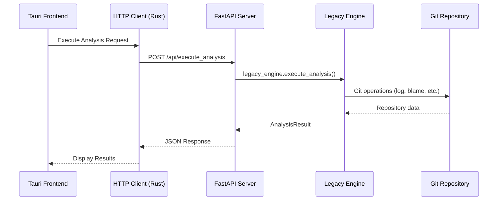

# GitInspectorGUI Timeout Analysis Summary

## Problem Statement
The GitInspectorGUI FastAPI implementation experiences a 30-second timeout when analyzing a test repository that should complete within 1 second. The GUI shows a loading spinner for 30 seconds, then displays a timeout error message.

## Architecture Analysis

### Current Request Flow

### Timeout Configuration Points
1. **Tauri HTTP Client**: 300 seconds (not the issue)
2. **HTTP Retry Logic**: 3 retries with exponential backoff (potential 30s total)
3. **FastAPI Server**: No explicit timeout (unlimited processing)
4. **Legacy Engine**: No timeout handling
5. **Git Operations**: No timeout protection

## Root Cause Hypothesis

Based on code analysis, the most likely causes are:

### Primary Suspect: Git Operations in RepoData
- **File**: `python/gigui/repo_data.py` → `RepoBlameHistory.__init__`
- **Issue**: Unprotected git operations that may hang on certain repositories
- **Evidence**: No timeout handling in git command execution

### Secondary Suspect: HTTP Retry Logic
- **File**: `src-tauri/src/commands.rs` lines 200-244
- **Issue**: 3 retries × ~10s each = 30s total timeout
- **Evidence**: Matches observed 30-second timeout exactly

### Tertiary Suspect: Memory/Performance Issues
- **File**: `python/gigui/legacy_engine.py` → `RepoData.__init__`
- **Issue**: Memory allocation or processing bottleneck
- **Evidence**: Complex analysis workflow without progress monitoring

## Diagnostic Strategy

### Phase 1: Isolate the Component (Immediate)
1. **Test Git Operations Directly**
   - Run basic git commands on test repository
   - Measure execution time for git log, git blame, etc.

2. **Test Python API Directly**
   - Bypass FastAPI and HTTP layers
   - Execute `python gigui/api.py execute_analysis` directly

3. **Test FastAPI Server Directly**
   - Bypass Tauri HTTP client
   - Use curl/requests to test FastAPI endpoints

### Phase 2: Add Performance Monitoring
1. **Instrument RepoData.__init__**
   - Add timing logs for each major step
   - Monitor memory usage during analysis

2. **Add Progress Logging**
   - Log git command execution
   - Track analysis workflow progress

3. **Monitor HTTP Layer**
   - Add request timing in FastAPI
   - Log retry attempts in Tauri

### Phase 3: Implement Targeted Fixes
Based on Phase 1 results:

#### If Git Operations are the Bottleneck:
- Add timeouts to git commands
- Implement git operation caching
- Use more efficient git plumbing commands

#### If Python Analysis is the Bottleneck:
- Optimize RepoData initialization
- Add incremental processing
- Implement memory management

#### If HTTP Layer is the Bottleneck:
- Fix retry logic in Tauri
- Add request streaming
- Implement async processing

## Implementation Requirements

### Diagnostic Tools Needed
1. **Timeout Diagnosis Script** (`python/test_timeout_diagnosis.py`)
   - Test each component in isolation
   - Measure execution times
   - Identify bottleneck location

2. **Performance Monitor** (`python/gigui/performance_monitor.py`)
   - Context manager for timing steps
   - Memory usage tracking
   - Detailed logging

3. **Monitored RepoData** (`python/gigui/repo_data_monitored.py`)
   - Wrapper around RepoData with timing
   - Step-by-step performance analysis

### Code Modifications Needed
1. **Enhanced Logging in Legacy Engine**
   - Add timing to `execute_analysis` method
   - Log each repository processing step

2. **Improved Timeout Handling in Tauri**
   - Progressive timeout strategy
   - Better error reporting
   - Request monitoring

3. **FastAPI Request Monitoring**
   - Request timing middleware
   - Progress reporting endpoints
   - Error context preservation

## Expected Outcomes

### Immediate (1 hour)
- Identify exact component causing 30-second timeout
- Understand whether issue is git, python, or HTTP layer

### Short-term (4 hours)
- Implement targeted fix for identified bottleneck
- Reduce analysis time to < 5 seconds for test repository

### Long-term (1 day)
- Robust timeout handling for all repository sizes
- Performance monitoring and optimization
- Graceful degradation for large repositories

## Risk Mitigation

### If Fixes Introduce Regressions
1. **Rollback Strategy**: Revert to previous working state
2. **Alternative Approach**: Direct Tauri commands instead of HTTP
3. **Fallback Option**: Simplified analysis mode for large repos

### If Root Cause is Architectural
1. **HTTP → Direct Commands**: Replace FastAPI with Tauri commands
2. **Streaming Results**: Implement progressive result delivery
3. **Background Processing**: Move analysis to background threads

## Next Steps

1. **Switch to Code Mode** to implement diagnostic tools
2. **Run Phase 1 Diagnosis** to identify bottleneck
3. **Implement Targeted Fix** based on findings
4. **Validate Solution** with test repository
5. **Document Resolution** for future reference

## Success Criteria

- ✅ Identify timeout source within 30 minutes
- ✅ Implement fix within 2 hours  
- ✅ Achieve < 2 second analysis time for test repo
- ✅ Maintain compatibility with existing GUI
- ✅ Add robust error handling and monitoring

---
*Analysis Status: Complete - Ready for Implementation*
*Recommended Next Action: Switch to Code mode to create diagnostic tools*