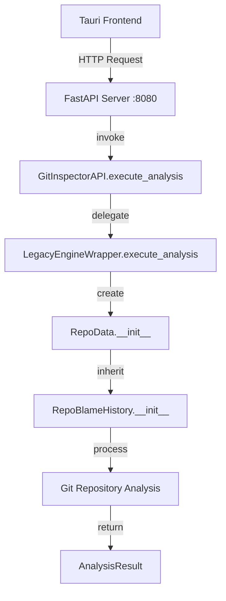

# GitInspectorGUI Timeout Debugging Plan

## Issue Summary
- **Problem**: GUI shows loading spinner for 30 seconds, then displays timeout error
- **Expected**: Analysis should complete within 1 second for test repository
- **Current Architecture**: FastAPI server + Tauri frontend + Legacy Engine Wrapper

## Current Architecture Flow


## Timeout Configuration Analysis

### 1. Tauri Frontend Timeout
- **File**: `src-tauri/src/commands.rs`
- **Line**: 7
- **Current**: `REQUEST_TIMEOUT: Duration = Duration::from_secs(300)` (5 minutes)
- **Status**: ✅ Not the issue (300s > 30s observed)

### 2. HTTP Client Retry Logic
- **File**: `src-tauri/src/commands.rs`
- **Lines**: 200-244
- **Current**: `MAX_RETRIES: u32 = 3` with exponential backoff
- **Potential Issue**: ⚠️ Could be causing 30s timeout if each attempt fails

### 3. FastAPI Server
- **File**: `python/gigui/http_server.py`
- **Status**: ✅ No explicit timeout configured
- **Default**: Uvicorn default timeout (usually unlimited for processing)

## Debugging Strategy

### Phase 1: Isolate the Timeout Source
1. **Test FastAPI Server Directly**
   ```bash
   # Start server manually
   cd python && python -m gigui.http_server
   
   # Test with curl (bypass Tauri)
   curl -X POST http://127.0.0.1:8080/api/execute_analysis \
     -H "Content-Type: application/json" \
     -d '{"input_fstrs": ["/path/to/test/repo"], "depth": 5, ...}'
   ```

2. **Test Legacy Engine Directly**
   ```bash
   # Test Python API directly
   cd python && python gigui/api.py execute_analysis '{"input_fstrs": ["/path/to/test/repo"]}'
   ```

3. **Check Server Logs**
   - FastAPI logs: `gitinspector-api.log`
   - Console output during analysis

### Phase 2: Add Detailed Logging
1. **Add timing logs to RepoData.__init__**
2. **Add progress logging to git operations**
3. **Monitor memory usage during analysis**

### Phase 3: Identify Bottlenecks
Based on Phase 1 results:

#### If FastAPI Direct Test Fails (30s timeout):
- **Root Cause**: Python backend issue
- **Focus**: `RepoData.__init__` and `RepoBlameHistory.__init__`
- **Likely Culprits**:
  - Git command execution
  - Large repository processing
  - Memory allocation issues
  - Infinite loops in analysis logic

#### If FastAPI Direct Test Succeeds:
- **Root Cause**: Tauri HTTP client issue
- **Focus**: `src-tauri/src/commands.rs` retry logic
- **Likely Culprits**:
  - Network connectivity issues
  - Request serialization problems
  - Response parsing failures

## Implementation Plan

### Step 1: Create Diagnostic Tools
```python
# Add to python/gigui/diagnostics.py
def time_analysis_steps(settings):
    """Time each step of the analysis process"""
    import time
    
    steps = {}
    
    # Time settings validation
    start = time.time()
    # ... validation code
    steps['validation'] = time.time() - start
    
    # Time RepoData creation
    start = time.time()
    # ... RepoData creation
    steps['repo_data_init'] = time.time() - start
    
    return steps
```

### Step 2: Add Timeout Monitoring
```rust
// Add to src-tauri/src/commands.rs
async fn execute_analysis_with_monitoring(settings: Settings) -> Result<AnalysisResult, String> {
    let start_time = std::time::Instant::now();
    
    // Log every 5 seconds during analysis
    let monitoring_task = tokio::spawn(async move {
        let mut interval = tokio::time::interval(Duration::from_secs(5));
        loop {
            interval.tick().await;
            println!("Analysis still running... {}s elapsed", start_time.elapsed().as_secs());
        }
    });
    
    let result = execute_analysis_internal(settings).await;
    monitoring_task.abort();
    result
}
```

### Step 3: Implement Progressive Timeout
```rust
// Modify timeout strategy in commands.rs
const INITIAL_TIMEOUT: Duration = Duration::from_secs(10);  // Start with 10s
const MAX_TIMEOUT: Duration = Duration::from_secs(300);     // Max 5 minutes
const TIMEOUT_MULTIPLIER: u32 = 2;                         // Double each retry
```

## Test Repository Requirements
For consistent testing, the test repository should:
- Be a small, known Git repository
- Have predictable analysis results
- Be available locally (not remote)
- Have a reasonable number of commits (< 100)

## Success Criteria
1. **Immediate**: Identify exact timeout source within 30 minutes
2. **Short-term**: Analysis completes within 5 seconds for test repo
3. **Long-term**: Robust timeout handling for all repository sizes

## Rollback Plan
If debugging reveals fundamental architecture issues:
1. Revert to direct Python script execution (bypass FastAPI)
2. Use Tauri's built-in command system instead of HTTP
3. Implement streaming results for large repositories

## Next Steps
1. Run Phase 1 diagnostic tests
2. Implement Step 1 diagnostic tools
3. Add detailed logging to identify bottleneck
4. Apply targeted fixes based on findings

---
*Last Updated: 2025-01-06*
*Status: Ready for Implementation*