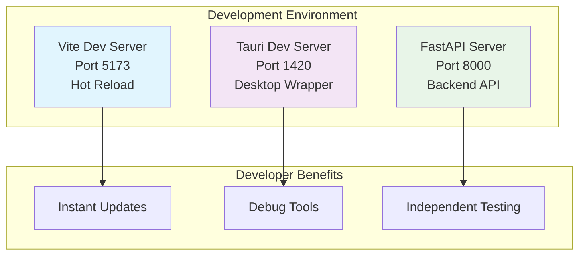
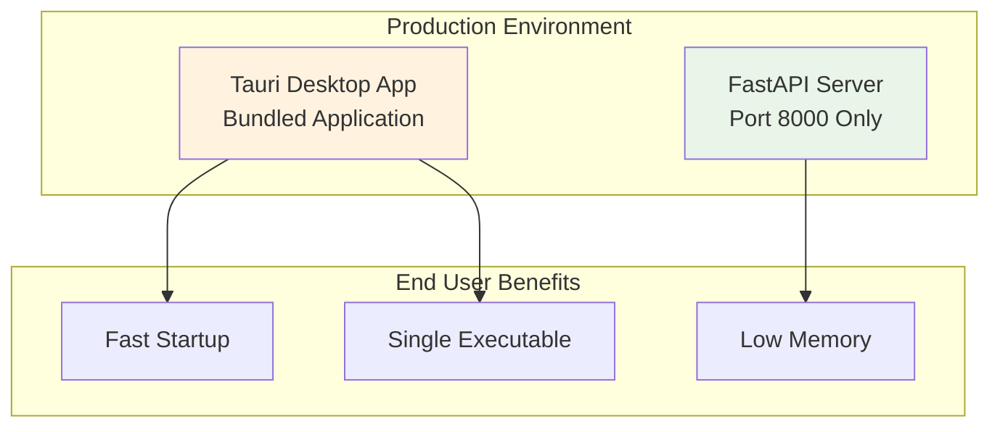

# Development vs Production Modes

Comprehensive comparison of GitInspectorGUI's development and production modes, helping you choose the right mode for your needs.

## Architecture Comparison

### Development Mode (3 Servers)



### Production Mode (1 Server)



## Detailed Feature Comparison

### Port Usage

#### Development Mode Ports

| Port     | Service          | Purpose                       | Access                  |
| -------- | ---------------- | ----------------------------- | ----------------------- |
| **5173** | Vite Dev Server  | Frontend development with HMR | `http://localhost:5173` |
| **1420** | Tauri Dev Server | Desktop app wrapper           | Desktop application     |
| **8000** | FastAPI Server   | Python backend API            | `http://localhost:8000` |

#### Production Mode Ports

| Port     | Service        | Purpose               | Access        |
| -------- | -------------- | --------------------- | ------------- |
| **8000** | FastAPI Server | Single bundled server | Internal only |

### Debugging Capabilities

#### Development Mode Debugging

**Frontend Debugging**:

-   Browser DevTools (Chrome/Firefox)
-   React DevTools extension
-   Network tab for API monitoring
-   Console logging and breakpoints

**Backend Debugging**:

-   Python debugger (`breakpoint()`)
-   IDE debugging support
-   Live API documentation
-   Request/response logging

#### Production Mode Debugging

**Limited Debugging**:

-   No browser DevTools access
-   No source maps available
-   Minimal logging output
-   No live API documentation
-   Error reporting only

## Switching Between Modes

### Starting Development Mode

```bash
# Option 1: All services at once (recommended)
pnpm dev

# Option 2: Individual services
# Terminal 1: Backend
python -m gigui.start_server --reload --log-level DEBUG

# Terminal 2: Frontend + Desktop
pnpm tauri dev
```

**What happens**:

1. FastAPI server starts on port 8000
2. Vite dev server starts on port 5173
3. Tauri desktop app opens on port 1420
4. File watchers activate for hot reload

### Starting Production Mode

```bash
# Build and run production version
pnpm tauri build

# Or run production preview
pnpm build && pnpm preview
```

**What happens**:

1. Frontend builds to optimized bundle
2. Backend packages with application
3. Single executable created
4. Only port 8000 used internally

## Troubleshooting Mode-Specific Issues

### Development Mode Issues

**Port Conflicts**:

```bash
# Check what's using development ports
lsof -i :5173 :1420 :8000

# Kill conflicting processes
kill -9 $(lsof -t -i:5173)
```

**Hot Reload Not Working**:

```bash
# Clear development caches
rm -rf node_modules/.vite
rm -rf .next
pnpm clean
```

### Production Mode Issues

**Build Failures**:

```bash
# Clean build artifacts
rm -rf dist/
rm -rf src-tauri/target/

# Rebuild from scratch
pnpm clean
pnpm install
pnpm build
```

## Related Documentation

-   **[Development Architecture](development-architecture.md)** - Detailed architecture explanation
-   **[Development Workflow](development-workflow.md)** - Development processes and commands
-   **[Environment Setup](environment-setup.md)** - Initial setup for both modes
-   **[Build Process](build-process.md)** - Production build configuration
-   **[Troubleshooting](troubleshooting.md)** - Mode-specific issue resolution
