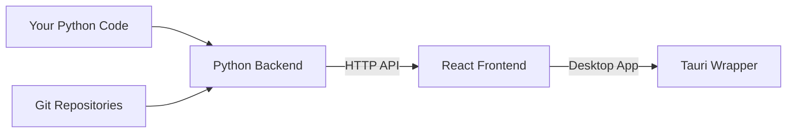

# Python-Focused Development Guide

This guide is for Python developers contributing to GitInspectorGUI who want to focus on the Python backend development while understanding how the frontend integration works.

**Note**: This focuses on development workflow. For GitInspectorGUI application features, see [gitinspectorgui.readthedocs.io](https://gitinspectorgui.readthedocs.io/en/latest/).

## Development Architecture

### Development Separation

The GitInspectorGUI codebase has a **clear separation** between backend and frontend development:



**Your focus area**: The Python backend (`python/` directory)
**What you can ignore**: Most of the React/TypeScript/Rust details

### Key Principle

You can develop and test the Python backend **independently** of the frontend. The HTTP API acts as a clean boundary.

## Development Workflow

### 1. Python-First Development

Start by working on the Python backend in isolation:

```bash
# Start only the Python server
python -m gigui.start_server --reload --log-level DEBUG

# Test your changes directly with curl
curl -X POST http://127.0.0.1:8080/api/execute_analysis \
  -H "Content-Type: application/json" \
  -d '{"input_fstrs": ["/path/to/test/repo"], "n_files": 50}'
```

**Benefits**:

-   Fast iteration (no frontend compilation)
-   Direct testing of your Python logic
-   Clear error messages and logging
-   No need to understand React/TypeScript

### 2. Integration Testing

Once your Python changes work, test with the full application:

```bash
# Keep your Python server running, then in another terminal:
pnpm run tauri dev
```

The frontend will automatically connect to your Python server.

## Python Backend Structure

### Key Files You'll Work With

```
python/
├── gigui/
│   ├── api.py              # Main API logic (your primary focus)
│   ├── http_server.py      # FastAPI server setup
│   ├── repo_data.py        # Git repository analysis
│   ├── repo_blame.py       # Git blame analysis
│   └── start_server.py     # Server startup
├── pyproject.toml          # Python dependencies
└── test_*.py              # Python tests
```

### Main Development Areas

**1. API Endpoints** (`gigui/api.py`)

-   Add new analysis features
-   Modify existing analysis logic
-   Handle request/response processing

**2. Git Analysis** (`gigui/repo_*.py`)

-   Implement new git analysis algorithms
-   Optimize performance for large repositories
-   Add new data extraction methods

**3. Data Processing** (`gigui/data.py`)

-   Transform git data for frontend consumption
-   Add new data aggregation methods
-   Implement caching strategies

## HTTP API Contract

### Understanding the Interface

The frontend sends JSON requests to your Python server. Here's what you need to know:

**Request Format** (what the frontend sends):

```json
{
    "input_fstrs": ["/path/to/repo"],
    "n_files": 100,
    "extensions": [".py", ".js"],
    "ex_files": ["*.test.*"],
    "since": "2024-01-01",
    "processes": 4
}
```

**Response Format** (what you return):

```json
{
    "repositories": [
        {
            "name": "repo-name",
            "path": "/path/to/repo",
            "authors": [...],
            "files": [...],
            "commits": [...]
        }
    ],
    "summary": {
        "total_commits": 156,
        "analysis_duration": 2.34
    }
}
```

### Adding New Features

**To add a new analysis feature**:

1. **Add the logic** in `gigui/api.py` or related modules
2. **Test with curl** to verify it works
3. **The frontend will automatically use it** (if it follows the existing patterns)

Example:

```python
# In gigui/api.py
def analyze_code_complexity(repo_path: str) -> Dict:
    """Add new analysis feature"""
    # Your analysis logic here
    return {"complexity_score": 7.5, "files_analyzed": 45}

# The frontend can immediately use this via the existing API
```

## Testing Your Python Changes

### 1. Direct API Testing

```bash
# Start server with debug logging
python -m gigui.start_server --reload --log-level DEBUG

# Test health endpoint
curl http://127.0.0.1:8080/health

# Test analysis with a small repository
curl -X POST http://127.0.0.1:8080/api/execute_analysis \
  -H "Content-Type: application/json" \
  -d '{
    "input_fstrs": ["/path/to/small/repo"],
    "n_files": 10,
    "file_formats": ["json"]
  }' | jq '.'
```

### 2. Python Unit Tests

```bash
# Run Python tests
python -m pytest python/test_*.py -v

# Run specific test
python -m pytest python/test_api.py::test_execute_analysis -v

# Run with coverage
python -m pytest --cov=gigui python/test_*.py
```

### 3. Integration Testing

```bash
# Test the complete system
python -m gigui.start_server --reload &
pnpm run tauri dev
# Use the GUI to test your changes
```

## Common Development Tasks

### Adding a New Analysis Type

1. **Implement the analysis logic**:

```python
# In gigui/repo_data.py
def analyze_file_complexity(repo_path: str) -> List[Dict]:
    """Analyze code complexity per file"""
    # Your implementation
    return [{"file": "main.py", "complexity": 8.2}]
```

2. **Add it to the API**:

```python
# In gigui/api.py
def execute_analysis(settings: Settings) -> AnalysisResult:
    # Existing code...

    # Add your new analysis
    if settings.include_complexity:
        result.complexity = analyze_file_complexity(repo_path)

    return result
```

3. **Test it**:

```bash
curl -X POST http://127.0.0.1:8080/api/execute_analysis \
  -d '{"input_fstrs": ["/test/repo"], "include_complexity": true}'
```

### Optimizing Performance

```python
# Use async for I/O operations
async def analyze_repository_async(repo_path: str):
    # Your async implementation
    pass

# Use multiprocessing for CPU-intensive tasks
from concurrent.futures import ProcessPoolExecutor

def analyze_large_repository(repo_path: str, processes: int = 4):
    with ProcessPoolExecutor(max_workers=processes) as executor:
        # Your parallel processing
        pass
```

### Adding Configuration Options

1. **Add to settings model**:

```python
# In gigui/api_types.py
class Settings(BaseModel):
    # Existing fields...
    new_option: bool = False
    complexity_threshold: float = 5.0
```

2. **Use in your analysis**:

```python
def execute_analysis(settings: Settings):
    if settings.new_option:
        # Your new feature logic
        pass
```

## Debugging

### Python-Specific Debugging

```python
# Add breakpoints in your code
import pdb; pdb.set_trace()

# Or use logging
import logging
logger = logging.getLogger(__name__)

def your_function():
    logger.debug("Debug info here")
    logger.info("Important info")
    logger.error("Error details")
```

### Server Debugging

```bash
# Start with maximum logging
python -m gigui.start_server --reload --log-level DEBUG

# Check server logs for errors
# Logs appear in the terminal where you started the server
```

### API Debugging

```bash
# Test API endpoints directly
curl -v http://127.0.0.1:8080/health
curl -v -X POST http://127.0.0.1:8080/api/execute_analysis \
  -H "Content-Type: application/json" \
  -d '{"input_fstrs": ["/test/repo"]}'

# Use jq to format JSON responses
curl -s http://127.0.0.1:8080/api/settings | jq '.'
```

## When You Need Frontend Changes

Sometimes you'll need frontend modifications (new UI elements, different data display). Here's how to handle this:

### Option 1: Use AI Tools (Recommended)

Since your team uses AI development tools:

1. **Make your Python changes first** and test them with curl
2. **Use your AI tools** to make the corresponding frontend changes
3. **Focus on the API contract** - ensure your Python output matches what the frontend expects

### Option 2: Minimal Frontend Understanding

If you need to make simple frontend changes:

**Key files to know about**:

-   `src/lib/api.ts` - Frontend API calls (mirrors your Python endpoints)
-   `src/components/SettingsForm.tsx` - Settings UI (if you add new options)
-   `src/components/ResultsTables.tsx` - Results display (if you change output format)

**Simple changes you can make**:

```typescript
// In src/lib/api.ts - add a new API call
export async function analyzeComplexity(settings: Settings) {
    const response = await fetch("/api/analyze_complexity", {
        method: "POST",
        headers: { "Content-Type": "application/json" },
        body: JSON.stringify(settings),
    });
    return response.json();
}
```

## Summary

**Your development focus**:

1. **Python backend development** - This is your expertise area
2. **HTTP API design** - Clean interface between backend and frontend
3. **Direct testing** - Use curl and Python tests for fast iteration
4. **Let AI handle frontend** - Use your team's AI tools for React/TypeScript changes

**Key principle**: The HTTP API boundary lets you work primarily in Python while still contributing to a modern desktop application.

## Next Steps

-   **[Development Mode](development-mode.md)** - Complete development setup
-   **[API Reference](../api/reference.md)** - Full API documentation
-   **[Technology Primer](../technology-primer.md)** - Understanding the full stack when needed
