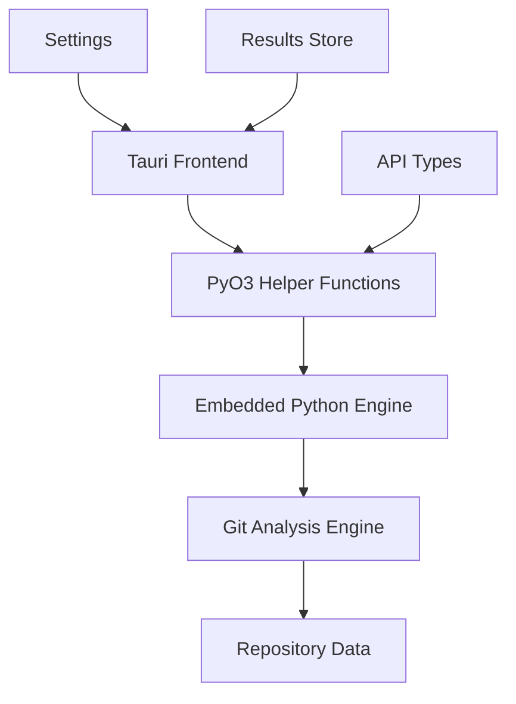

# GitInspectorGUI Developer Documentation

Development environment and tooling documentation for GitInspectorGUI contributors.

**Note**: For application usage and features, see the [User Documentation](user-docs/index.md) tab in the navigation bar above, or visit [gitinspectorgui.readthedocs.io](https://gitinspectorgui.readthedocs.io/en/latest/).

## Quick Navigation

### Try the Demo

- **[Interactive Demo](https://boost-edu-tools.github.io/gitinspectorgui/demo/)** - Try GitInspectorGUI in your browser without installation

### New to the Project?

- **[Technology Primer](technology-primer.md)** - Understanding the development tools
- **[Prerequisites](getting-started/01-prerequisites.md)** - System requirements and tool installation
- **[Installation Guide](getting-started/02-installation.md)** - Detailed setup
- **[Quick Start](getting-started/03-quick-start.md)** - Get running in 3 steps

### Development

- **[Development Workflow](development/development-workflow.md)** - Core development patterns
- **[Package Management](development/package-management.md)** - Dependencies and tools
- **[Build Process](development/build-process.md)** - Creating releases
- **[Publishing Guide](development/publishing.md)** - Package publishing to PyPI
- **[Environment Setup](development/environment-setup.md)** - Development configuration
- **[Troubleshooting](development/troubleshooting.md)** - Common issues

### Command Line Interface

- **[CLI Development Guide](development/cli-development-guide.md)** - Building and testing CLI

### API Development

- **[PyO3 API Reference](api/reference.md)** - Complete API documentation
- **[API Examples](api/examples.md)** - Usage patterns and code samples
- **[Error Handling](api/error-handling.md)** - Error codes and troubleshooting

### Architecture & Operations

- **[System Overview](architecture/overview.md)** - System architecture
- **[Technology Stack](architecture/technology-stack.md)** - Technology choices
- **[PyO3 Integration Architecture](architecture/pyo3-integration.md)** - Architectural rationale
- **[Release & Distribution](operations/deployment.md)** - Production deployment
- **[Server Management](operations/server-management.md)** - Operational procedures

## Features

- **PyO3 Helper Function Architecture** - Tauri desktop frontend with embedded Python backend
- **Cross-Platform** - Windows, macOS, Linux support
- **Git Analysis** - Comprehensive repository insights
- **Interactive UI** - React-based interface with filtering
- **Developer API** - Complete PyO3 API documentation

## Architecture

