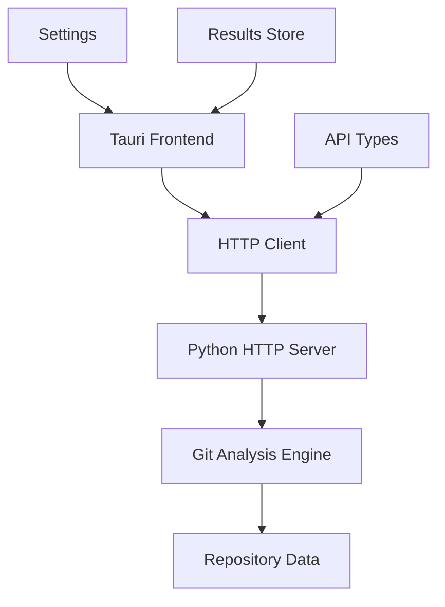

# GitInspectorGUI Documentation

Modern desktop application for git repository analysis. Built with Tauri + React + TypeScript frontend and Python HTTP API backend.

## Demo

-   **Live Demo** - Interactive demo available at the project root (`index.html`)

## Getting Started

-   **[Quick Start](getting-started/quick-start.md)** - Setup and first run
-   **[Installation](getting-started/installation.md)** - Detailed installation
-   **[First Analysis](getting-started/first-analysis.md)** - Repository analysis workflow

## Documentation

### AI Tools

-   **[Overview](ai-tools/overview.md)** - AI development ecosystem
-   **[Cline Guide](ai-tools/cline-guide.md)** - Direct coding assistance
-   **[Roo Code Guide](ai-tools/roo-code-guide.md)** - Multi-agent workflows

### Development

-   **[Environment Setup](development/environment-setup.md)** - Development configuration
-   **[Development Mode](development/development-mode.md)** - Local workflow
-   **[Package Management (pnpm)](development/package-management-pnpm.md)** - Frontend dependencies
-   **[Python Management (uv)](development/python-management-uv.md)** - Backend dependencies
-   **[Enhanced Settings](development/enhanced-settings.md)** - Configuration options
-   **[Troubleshooting](development/troubleshooting.md)** - Common issues

### API

-   **[Reference](api/reference.md)** - HTTP API endpoints
-   **[Examples](api/examples.md)** - Code examples
-   **[Error Handling](api/error-handling.md)** - Error codes

### Architecture

-   **[Overview](architecture/overview.md)** - System architecture
-   **[Technology Stack](architecture/technology-stack.md)** - Technology choices
-   **[Legacy Integration](architecture/legacy-integration.md)** - Legacy compatibility
-   **[Design Decisions](architecture/design-decisions.md)** - Architectural rationale

### Operations

-   **[Deployment](operations/deployment.md)** - Production setup
-   **[Monitoring](operations/monitoring.md)** - System monitoring
-   **[Maintenance](operations/maintenance.md)** - Maintenance procedures

## Features

-   **HTTP API Architecture** - Tauri desktop frontend with Python backend
-   **Cross-Platform** - Windows, macOS, Linux support
-   **Git Analysis** - Comprehensive repository insights
-   **Interactive UI** - React-based interface with filtering
-   **Developer API** - Complete HTTP API documentation

## Architecture

