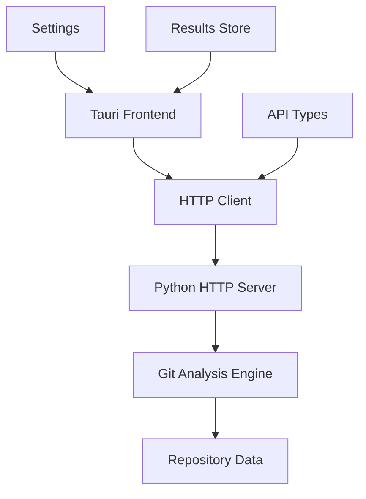

# GitInspectorGUI Documentation

Welcome to the comprehensive documentation for GitInspectorGUI - a modern desktop application for git repository analysis with a Tauri + React + TypeScript frontend and Python HTTP API backend.

## 🚀 Quick Start

New to GitInspectorGUI? Start here:

-   **[Quick Start Guide](getting-started/quick-start.md)** - Get up and running in minutes
-   **[Installation](getting-started/installation.md)** - Detailed setup instructions
-   **[First Analysis](getting-started/first-analysis.md)** - Run your first repository analysis

## 📚 Documentation Sections

### 🛠️ Development

Everything you need for development and customization:

-   **[Environment Setup](development/environment-setup.md)** - Development environment configuration
-   **[Development Mode](development/development-mode.md)** - Local development workflow
-   **[Demo-Based Documentation-GUI Development](development/demo-based-documentation-gui-development.md)** - Unified development methodology
-   **[Design System Integration](development/design-system-integration.md)** - Figma and Vercel integration
-   **[Node.js Package Management (pnpm)](development/package-management-pnpm.md)** - Frontend dependency management
-   **[Python Package Management (uv)](development/python-management-uv.md)** - Backend dependency management
-   **[Enhanced Settings](development/enhanced-settings.md)** - Advanced configuration options
-   **[Blame Tabs Implementation](development/blame-tabs-implementation.md)** - UI implementation details
-   **[Troubleshooting](development/troubleshooting.md)** - Common issues and solutions

### 🔌 API Reference

Complete API documentation for integration:

-   **[HTTP API Reference](api/reference.md)** - Comprehensive endpoint documentation
-   **[Examples](api/examples.md)** - Practical code examples
-   **[Error Handling](api/error-handling.md)** - Error codes and troubleshooting

### 🏗️ Architecture

Understanding the system design:

-   **[System Overview](architecture/overview.md)** - High-level architecture
-   **[Legacy Integration](architecture/legacy-integration.md)** - Legacy system compatibility
-   **[Design Decisions](architecture/design-decisions.md)** - Architectural rationale
-   **[Demo-Based Documentation-GUI Development](development/demo-based-documentation-gui-development.md)** - Unified development methodology
-   **[Technology Stack](architecture/technology-stack.md)** - Technology stack selection and analysis

### 🚀 Operations

Production deployment and maintenance:

-   **[Production Deployment](operations/deployment.md)** - Production setup guide
-   **[Monitoring](operations/monitoring.md)** - System monitoring
-   **[Maintenance](operations/maintenance.md)** - Ongoing maintenance procedures

## 🎯 Key Features

-   **Modern Architecture**: HTTP API with Tauri desktop frontend
-   **Cross-Platform**: Windows, macOS, and Linux support
-   **Rich Analysis**: Comprehensive git repository insights
-   **Interactive UI**: Modern React-based interface with advanced filtering
-   **Developer-Friendly**: Comprehensive API and documentation

## 🏗️ Architecture Overview

GitInspectorGUI uses a modern HTTP API architecture:

## 🤝 Contributing

This documentation is designed to help developers understand, use, and contribute to GitInspectorGUI. Each section provides practical, actionable information to support your development workflow.

For questions or contributions, please refer to the project repository and follow the established development practices outlined in the Development section.
