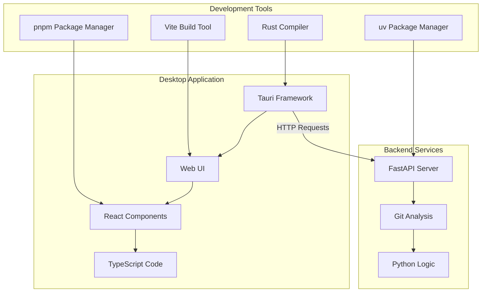
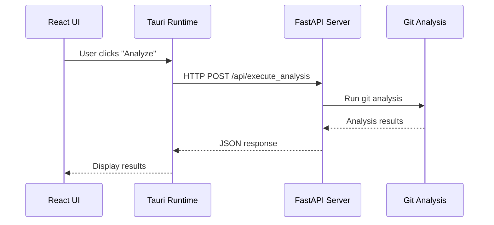

# Technology Stack Primer

This guide explains the development tools and technologies used in the GitInspectorGUI codebase for developers with computer science and Python backgrounds who may be unfamiliar with modern web/desktop development tools.

**Note**: This focuses on the development environment and tools. For GitInspectorGUI application features and usage, see [gitinspectorgui.readthedocs.io](https://gitinspectorgui.readthedocs.io/en/latest/).

## Development Stack Overview

The GitInspectorGUI codebase uses a modern multi-technology development stack. Here's what each technology does and why it's used for development:



## Core Technologies

### FastAPI (Python Web Framework)

**What it is**: A modern Python web framework for building HTTP APIs.

**Why we use it**:

-   Automatic API documentation generation
-   Built-in request/response validation
-   Async support for better performance
-   Type hints integration

**Think of it as**: A more modern version of Flask with automatic documentation and better type safety.

**Key files**: `python/gigui/http_server.py`, `python/gigui/api.py`

**Example**:

```python
from fastapi import FastAPI

app = FastAPI()

@app.post("/api/execute_analysis")
async def execute_analysis(settings: Settings) -> AnalysisResult:
    # Your analysis logic here
    return result
```

### Tauri (Desktop Application Framework)

**What it is**: A Rust-based framework that packages web applications as native desktop applications.

**Why we use it**:

-   Smaller bundle size than Electron
-   Better performance and security
-   Native OS integration
-   Cross-platform (Windows, macOS, Linux)

**Think of it as**: Like Electron (packages web apps as desktop apps) but written in Rust instead of Node.js, resulting in smaller, faster applications.

**Key files**: `src-tauri/src/main.rs`, `src-tauri/tauri.conf.json`

**What it does**: Takes the React web UI and wraps it in a native desktop window with system access.

### React (UI Library)

**What it is**: A JavaScript library for building user interfaces using components.

**Why we use it**:

-   Component-based architecture (reusable UI pieces)
-   Large ecosystem and community
-   Efficient UI updates through virtual DOM
-   Well-suited for complex interactive interfaces

**Think of it as**: A way to build UIs by combining small, reusable components (like functions that return HTML).

**Key files**: `src/App.tsx`, `src/components/*.tsx`

**Example**:

```tsx
function AnalysisButton({ onClick }: { onClick: () => void }) {
    return <button onClick={onClick}>Run Analysis</button>;
}
```

### TypeScript (Typed JavaScript)

**What it is**: JavaScript with static type checking, similar to Python type hints.

**Why we use it**:

-   Catches errors at compile time
-   Better IDE support (autocomplete, refactoring)
-   Self-documenting code through types
-   Easier refactoring of large codebases

**Think of it as**: JavaScript with Python-style type hints that are actually enforced.

**Example**:

```typescript
interface AnalysisSettings {
    repositoryPath: string;
    maxFiles: number;
    extensions: string[];
}

function analyzeRepository(
    settings: AnalysisSettings
): Promise<AnalysisResult> {
    // Implementation
}
```

## Development Tools

### pnpm (Package Manager)

**What it is**: A fast, disk-efficient package manager for JavaScript/TypeScript projects.

**Why we use it**:

-   Faster than npm
-   Uses hard links to save disk space
-   Better dependency resolution
-   Stricter dependency management

**Think of it as**: Like `pip` for Python, but for JavaScript packages. The `pnpm-lock.yaml` file is like `requirements.txt` but with exact version locking.

**Common commands**:

```bash
pnpm install          # Like pip install -r requirements.txt
pnpm add package      # Like pip install package
pnpm run script       # Run scripts defined in package.json
```

### Vite (Build Tool and Development Server)

**What it is**: A build tool and development server for frontend projects.

**Why we use it**:

-   Very fast hot module replacement (instant updates during development)
-   Optimized production builds
-   Built-in TypeScript support
-   Modern ES modules support

**Think of it as**: Like a combination of a development web server and a build system that compiles your TypeScript/React code into optimized JavaScript.

**What it does**:

-   Development: Serves your code with instant updates when you make changes
-   Production: Bundles and optimizes your code for deployment

### uv (Python Package Manager)

**What it is**: A fast Python package installer and resolver.

**Why we use it**:

-   Much faster than pip
-   Better dependency resolution
-   Built-in virtual environment management
-   Compatible with pip and requirements.txt

**Think of it as**: A drop-in replacement for pip that's significantly faster.

**Common commands**:

```bash
uv sync               # Install dependencies from pyproject.toml
uv add package        # Add a new dependency
uv run command        # Run command in the project environment
```

### Rust (Systems Programming Language)

**What it is**: A systems programming language focused on safety and performance.

**Why we use it**:

-   Required for Tauri framework
-   Memory safety without garbage collection
-   Excellent performance
-   Growing ecosystem for desktop applications

**Your involvement**: You typically won't write Rust code directly. Tauri handles the Rust parts, and you focus on the Python backend and web frontend.

**Key files**: `src-tauri/src/main.rs` (mostly boilerplate), `src-tauri/Cargo.toml` (dependencies)

## How They Work Together

### Development Flow

1. **Python Backend**: FastAPI server runs on `http://127.0.0.1:8080`
2. **Frontend Development**: Vite serves the React/TypeScript UI with hot reloading
3. **Desktop Packaging**: Tauri wraps everything in a native desktop application
4. **Package Management**: pnpm manages frontend dependencies, uv manages Python dependencies

### Communication Flow



### File Structure Logic

```
├── python/                 # Python backend (FastAPI server)
│   ├── gigui/             # Main Python package
│   └── pyproject.toml     # Python dependencies (managed by uv)
├── src/                   # React/TypeScript frontend
│   ├── components/        # React components
│   └── lib/              # Utility functions
├── src-tauri/            # Tauri desktop application
│   ├── src/              # Rust code (minimal)
│   └── tauri.conf.json   # Desktop app configuration
├── package.json          # Frontend dependencies (managed by pnpm)
└── vite.config.ts        # Build tool configuration
```

## Development Workflow

### Starting Development

```bash
# Terminal 1: Start Python API server
python -m gigui.start_server --reload

# Terminal 2: Start frontend with hot reloading
pnpm run tauri dev
```

### Making Changes

-   **Python changes**: Server auto-restarts (thanks to `--reload` flag)
-   **Frontend changes**: UI updates instantly (thanks to Vite hot reloading)
-   **Rust changes**: Tauri rebuilds and restarts the desktop app

### Testing

-   **Python API**: Test directly with curl or Python requests
-   **Frontend**: Use browser developer tools (available in Tauri)
-   **Integration**: Test the complete desktop application

## Next Steps

Now that you understand the technology stack:

1. **[Installation Guide](getting-started/installation.md)** - Set up all the tools
2. **[Quick Start](getting-started/quick-start.md)** - Get everything running
3. **[Development Mode](development/development-mode.md)** - Development workflow
4. **[Architecture Overview](architecture/overview.md)** - Deeper technical details

## Common Questions

**Q: Why not just use Python for everything?**
A: Desktop UI development in Python (tkinter, PyQt) is more limited than modern web technologies. This approach gives us a rich, modern UI while keeping the core logic in Python.

**Q: Why Tauri instead of Electron?**
A: Tauri produces smaller, faster applications with better security. The trade-off is learning some Rust concepts, but Tauri handles most of the complexity.

**Q: Do I need to learn all these technologies?**
A: No. Focus on the Python backend where your expertise lies. Use AI tools to help with frontend changes, and treat the other technologies as tools that "just work" once configured.

**Q: What if something breaks in the frontend/Rust parts?**
A: The architecture is designed so you can test and develop the Python API independently. Most issues can be resolved by restarting the development servers or using AI tools for frontend fixes.
